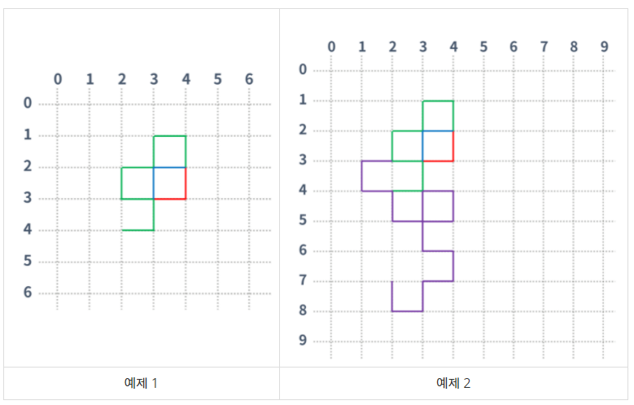

## 문제
https://www.acmicpc.net/problem/15685

드래곤 커브는 다음과 같은 세 가지 속성으로 이루어져 있으며, 이차원 좌표 평면 위에서 정의된다. 좌표 평면의 x축은 → 방향, y축은 ↓ 방향이다.  
1. 시작 점  
2. 시작 방향  
3. 세대  
0세대 드래곤 커브는 아래 그림과 같은 길이가 1인 선분이다. 아래 그림은 (0, 0)에서 시작하고, 시작 방향은 오른쪽인 0세대 드래곤 커브이다.  
  
1세대 드래곤 커브는 0세대 드래곤 커브를 끝 점을 기준으로 시계 방향으로 90도 회전시킨 다음 0세대 드래곤 커브의 끝 점에 붙인 것이다. 끝 점이란 시작 점에서 선분을 타고 이동했을 때, 가장 먼 거리에 있는 점을 의미한다.  
  
2세대 드래곤 커브도 1세대를 만든 방법을 이용해서 만들 수 있다. (파란색 선분은 새로 추가된 선분을 나타낸다)  
  
3세대 드래곤 커브도 2세대 드래곤 커브를 이용해 만들 수 있다. 아래 그림은 3세대 드래곤 커브이다.  
  
즉, K(K > 1)세대 드래곤 커브는 K-1세대 드래곤 커브를 끝 점을 기준으로 90도 시계 방향 회전 시킨 다음, 그것을 끝 점에 붙인 것이다.  

크기가 100×100인 격자 위에 드래곤 커브가 N개 있다. 이때, 크기가 1×1인 정사각형의 네 꼭짓점이 모두 드래곤 커브의 일부인 정사각형의 개수를 구하는 프로그램을 작성하시오. 격자의 좌표는 (x, y)로 나타내며, 0 ≤ x ≤ 100, 0 ≤ y ≤ 100만 유효한 좌표이다.  

---

## 입력  
첫째 줄에 드래곤 커브의 개수 N(1 ≤ N ≤ 20)이 주어진다. 둘째 줄부터 N개의 줄에는 드래곤 커브의 정보가 주어진다. 드래곤 커브의 정보는 네 정수 x, y, d, g로 이루어져 있다. x와 y는 드래곤 커브의 시작 점, d는 시작 방향, g는 세대이다. (0 ≤ x, y ≤ 100, 0 ≤ d ≤ 3, 0 ≤ g ≤ 10)  

입력으로 주어지는 드래곤 커브는 격자 밖으로 벗어나지 않는다. 드래곤 커브는 서로 겹칠 수 있다.  

방향은 0, 1, 2, 3 중 하나이고, 다음을 의미한다.  
- 0: x좌표가 증가하는 방향 (→)  
- 1: y좌표가 감소하는 방향 (↑)  
- 2: x좌표가 감소하는 방향 (←)  
- 3: y좌표가 증가하는 방향 (↓)  

---

## 출력  
첫째 줄에 크기가 1×1인 정사각형의 네 꼭짓점이 모두 드래곤 커브의 일부인 것의 개수를 출력한다.  

---

**예제 입력 1**  
```Python
3
3 3 0 1
4 2 1 3
4 2 2 1
```

**예제 출력 1**  
```Python
4
```

**예제 입력 2**  
```Python
4
3 3 0 1
4 2 1 3
4 2 2 1
2 7 3 4
```

**예제 출력 2**  
```Python
11
```

**예제 입력 3**  
```Python
10
5 5 0 0
5 6 0 0
5 7 0 0
5 8 0 0
5 9 0 0
6 5 0 0
6 6 0 0
6 7 0 0
6 8 0 0
6 9 0 0
```

**예제 출력 3**  
```Python
8
```

**예제 입력 4**  
```Python
4
50 50 0 10
50 50 1 10
50 50 2 10
50 50 3 10
```

**예제 출력 4**  
```Python
1992
```

**힌트**
  

---

## 🔍 Algorithm
**시뮬레이션**

## 💻 Logic

```Python
def draw_curve(x, y, d, g):
    # 0세대 드래곤 커브 그리기
    dir_list = [d]
    map[y][x] = 1
    next_x = x + dx[d]
    next_y = y + dy[d]
    map[next_y][next_x] = 1
    cur = [(next_x, next_y)]

    # g세대 드래곤 커브 그리기
    for _ in range(g):
        # 이전 세대 선분 방향 리스트 복사
        temp = dir_list.copy()
        for _ in range(len(dir_list)):
            x, y = cur.pop()
            d = dir_list.pop()
            # 방향 90도 회전 후 다음 위치 계산
            if d == 3: next_d = 0
            else: next_d = d + 1
            next_x = x + dx[next_d]
            next_y = y + dy[next_d]
            temp.append(next_d)
            map[next_y][next_x] = 1
            cur.append((next_x, next_y))
        # 현재 세대 선분 방향 리스트 저장
        dir_list = temp.copy()
```

- 주어진 정보에 맞게 드래곤 커브 그리는 함수  
  - **0세대 드래곤 커브 그리기**  
    시작 위치 `x, y`에 해당하는 `map` 값을 **1**로 변경  
    시작 방향 `d`에 맞게 다음 위치에 해당하는 `map` 값도 **1**로 바꿔주고, `cur` 리스트에 **append**  
  - **g세대 드래곤 커브 그리기**  
    주어진 세대 `g`에 맞게 반복문 진행  
  - **이전 세대 선분 방향 리스트 복사**  
    이전 세대 선분 방향 리스트인 `dir_list`를 `temp` 리스트에 **copy** 한 다음,  
    `dir_list`의 값을 **pop** 하면서 `dir_list`에 있던 만큼 반복문 진행  
  - **방향 90도 회전 후 다음 위치 계산**  
    `dir_list`에서 **pop**한 값 `d`를 **90도 회전**하기 위해 **+1** 해주고 (`d==3`이면 **0**으로), `next_d`는 `temp`에 **append**  
    다음 위치 계산하고 해당하는 `map` 값을 **1**로 바꾼 다음, `cur`에 **append**  
  - **현재 세대 선분 방향 리스트 저장**  
    `temp`에 저장된 현재 세대 선분 방향 리스트를 다시 `dir_list`에 **copy**하고 반복문 진행  

---

```Python
# 주어진 정보에 맞게 드래곤 커브 그리기
for x, y, d, g in curve_info:
    draw_curve(x, y, d, g)

# 네 꼭짓점이 모두 드래곤 커브의 일부인 정사각형 개수 구한 후, 출력
count = 0
for i in range(100):
        for j in range(100):
            if map[i][j] == 1 and map[i][j+1] == 1 and map[i+1][j] == 1 and map[i+1][j+1] == 1:
                count += 1
print(count)
```

- **주어진 정보에 맞게 드래곤 커브 그리기**  
  `curve_info`에 입력된 정보 `x, y, d, g` 를 이용해서 `draw_curve` 함수 실행  
- **네 꼭짓점이 모두 드래곤 커브의 일부인 정사각형 개수 구한 후, 출력**  
  100x100 격자를 이중 for문을 통해 네 꼭짓점이 모두 `map` 값이 **1**이면 `count`를 해주고  
  `count` 값 출력  

---

## 🧩 Code
<details><summary>전체 코드 확인</summary>

```Python
import sys
N = int(sys.stdin.readline())
curve_info = [[int(x) for x in sys.stdin.readline().split()] for _ in range(N)]
map = [[0 for _ in range(101)] for _ in range(101)]
dx = [1, 0, -1, 0]
dy = [0, -1, 0, 1]

def draw_curve(x, y, d, g):
    # 0세대 드래곤 커브 그리기
    dir_list = [d]
    map[y][x] = 1
    next_x = x + dx[d]
    next_y = y + dy[d]
    map[next_y][next_x] = 1
    cur = [(next_x, next_y)]

    # g세대 드래곤 커브 그리기
    for _ in range(g):
        # 이전 세대 선분 방향 리스트 복사
        temp = dir_list.copy()
        for _ in range(len(dir_list)):
            x, y = cur.pop()
            d = dir_list.pop()
            # 방향 90도 회전 후 다음 위치 계산
            if d == 3: next_d = 0
            else: next_d = d + 1
            next_x = x + dx[next_d]
            next_y = y + dy[next_d]
            temp.append(next_d)
            map[next_y][next_x] = 1
            cur.append((next_x, next_y))
        # 현재 세대 선분 방향 리스트 저장
        dir_list = temp.copy()

# 주어진 정보에 맞게 드래곤 커브 그리기
for x, y, d, g in curve_info:
    draw_curve(x, y, d, g)

# 네 꼭짓점이 모두 드래곤 커브의 일부인 정사각형 개수 구한 후, 출력
count = 0
for i in range(100):
        for j in range(100):
            if map[i][j] == 1 and map[i][j+1] == 1 and map[i+1][j] == 1 and map[i+1][j+1] == 1:
                count += 1
print(count)
```
</details>

## 📝 Review
주어진 방향이 규칙이 있을 것이라고 생각했고, 생각대로 주어진 방향을 이용하니 쉽게 90도 회전할 수 있었다.  
드래곤 커브를 그리는 과정도, 검사하는 과정도 쉬웠지만  
검사하는 과정에서 index를 하나씩 더 많게 계산해서 런타임 에러가 떴었다,,  
시뮬레이션은 주어진 문제대로만 풀면 되니까 문제를 더 열심히 다시 읽자..!  

```toc
```