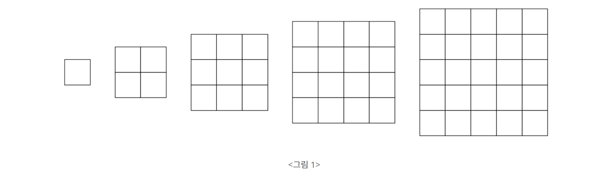

## 문제
https://www.acmicpc.net/problem/17136

<그림 1>과 같이 정사각형 모양을 한 다섯 종류의 색종이가 있다. 색종이의 크기는 1×1, 2×2, 3×3, 4×4, 5×5로 총 다섯 종류가 있으며, 각 종류의 색종이는 5개씩 가지고 있다.

  

색종이를 크기가 10×10인 종이 위에 붙이려고 한다. 종이는 1×1 크기의 칸으로 나누어져 있으며, 각각의 칸에는 0 또는 1이 적혀 있다. 1이 적힌 칸은 모두 색종이로 덮여져야 한다. 색종이를 붙일 때는 종이의 경계 밖으로 나가서는 안되고, 겹쳐도 안 된다. 또, 칸의 경계와 일치하게 붙여야 한다. 0이 적힌 칸에는 색종이가 있으면 안 된다.

종이가 주어졌을 때, 1이 적힌 모든 칸을 붙이는데 필요한 색종이의 최소 개수를 구해보자.

---

## 입력  
총 10개의 줄에 종이의 각 칸에 적힌 수가 주어진다.

---

## 출력  
모든 1을 덮는데 필요한 색종이의 최소 개수를 출력한다. 1을 모두 덮는 것이 불가능한 경우에는 -1을 출력한다.

---

## 🔍 Algorithm
**Brute Force, Backtracking**

## 💻 Logic

```Python
def check_attach(y, x):
    arr = []
    # 1부터 5까지 크기별 색종이 전부 확인
    for k in range(1, 6):
        for i in range(k):
            for j in range(k):
                # 범위에 벗어나거나 0을 만나서 색종이를 붙일 수 없는 경우
                if y+i >= 10 or x+j >= 10 or field[y+i][x+j] == 0:
                    return arr
        arr.append(k)
    return arr
```

- 붙일 수 있는 색종이 계산하는 함수  
  - **1부터 5까지 크기별 색종이 전부 확인**  
    **1부터 5까지** 크기별 색종이들을 붙일 수 있는지 확인하고,  
    붙일 수 있으면 해당 크기 `k`를 `arr` 리스트에 **append**  
  - **범위에 벗어나거나 0을 만나서 색종이를 붙일 수 없는 경우**  
    **범위**에 벗어나거나 **0**을 만나는 경우에는 색종이를 붙일 수 없고,  
    더 큰 크기의 색종이도 붙일 수 없기 때문에 바로 `arr` 리스트 **return**  
    
---

```Python
def search(one_cnt, cnt):
    global result, paper_cnt
    # 1을 전부 덮은 경우, 최소 result 계산
    if one_cnt == 0:
        result = min(result, cnt)
        return
    for i in range(10):
        for j in range(10):
            # 1인 경우 붙일 수 있는 색종이 확인
            if field[i][j] == 1:
                arr = check_attach(i, j)
                for n in arr:
                    # 해당 색종이가 남아 있으면 계산 후 재귀
                    if paper_cnt[n-1] > 0:
                        paper_cnt[n-1] -= 1
                        for y in range(n):
                            for x in range(n):
                                field[i+y][j+x] = 0
                        search(one_cnt - (n ** 2), cnt + 1)
                        paper_cnt[n-1] += 1
                        for y in range(n):
                            for x in range(n):
                                field[i+y][j+x] = 1
                return
```

- 색종이를 최소한으로 붙일 수 있는 방법을 탐색하는 함수  
  - **1을 전부 덮은 경우**  
    `result`와 `cnt` 사이의 최솟값 계산해서 `result`에 저장 후, **return**  
  - **1인 경우 붙일 수 있는 색종이 확인**
    `field` 값이 **1**인 경우에는 `check_attach()` 함수를 이용해서 붙일 수 있는 색종이를 `arr` 리스트로 받아오고,  
    붙일 수 있는 색종이마다 해당 색종이가 남아 있는지 확인하고,  
    남아 있으면 해당 `paper_cnt`를 하나 감소시키고 `field` 값을 **0**으로 바꾼 뒤 **재귀**  
    재귀가 끝나면 다시 원래대로 원상복귀  
    
---

## 🧩 Code
<details><summary>전체 코드 확인</summary>

```Python
import sys

def check_attach(y, x):
    arr = []
    # 1부터 5까지 크기별 색종이 전부 확인
    for k in range(1, 6):
        for i in range(k):
            for j in range(k):
                # 범위에 벗어나거나 0을 만나서 색종이를 붙일 수 없는 경우
                if y+i >= 10 or x+j >= 10 or field[y+i][x+j] == 0:
                    return arr
        arr.append(k)
    return arr

def search(one_cnt, cnt):
    global result, paper_cnt
    # 1을 전부 덮은 경우, 최소 result 계산
    if one_cnt == 0:
        result = min(result, cnt)
        return
    for i in range(10):
        for j in range(10):
            # 1인 경우 붙일 수 있는 색종이 확인
            if field[i][j] == 1:
                arr = check_attach(i, j)
                for n in arr:
                    # 해당 색종이가 남아 있으면 계산 후 재귀
                    if paper_cnt[n-1] > 0:
                        paper_cnt[n-1] -= 1
                        for y in range(n):
                            for x in range(n):
                                field[i+y][j+x] = 0
                        search(one_cnt - (n ** 2), cnt + 1)
                        paper_cnt[n-1] += 1
                        for y in range(n):
                            for x in range(n):
                                field[i+y][j+x] = 1
                return

field = [[int(x) for x in sys.stdin.readline().split()]for _ in range(10)]
paper_cnt = [5, 5, 5, 5, 5]
one_cnt, result = 0, sys.maxsize

for i in range(10):
    for j in range(10):
        if field[i][j] == 1:
            one_cnt += 1
search(one_cnt, 0)
if result == sys.maxsize:
    result = -1
print(result)
```
</details>

---

## 📝 Review

처음에는 제일 큰 색종이부터 붙이면 되겠지라고 생각하고 그리디 방식으로 풀려고 했는데 아니었다...  
백트래킹 방식으로 풀어야 되는걸 알고나서 재귀로 풀려고 했는데 감이 안잡혀서 몇몇 힌트를 참고했다,,  
나중에 다시 한번 풀어봐야 하는 문제. 재귀는 어려워  


```toc
```