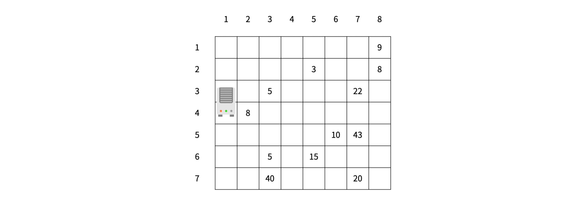
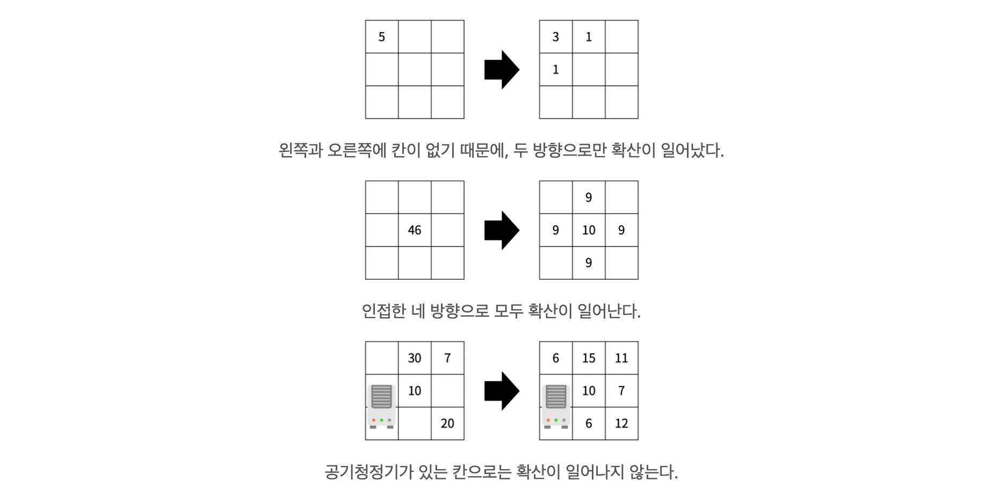
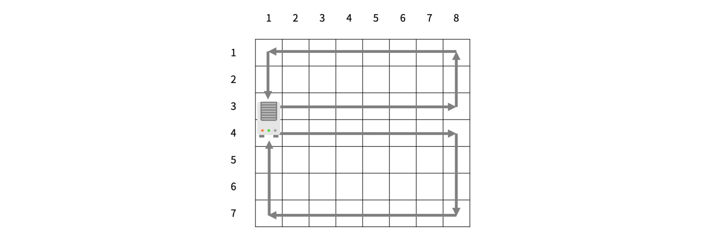
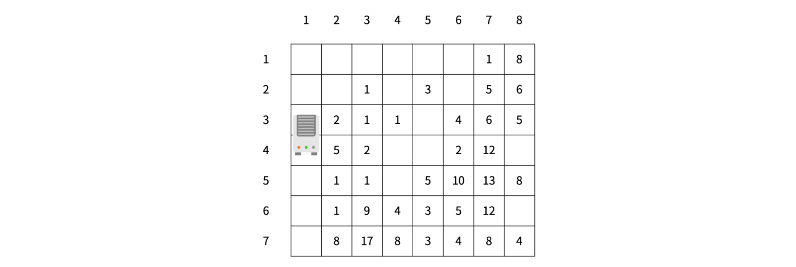
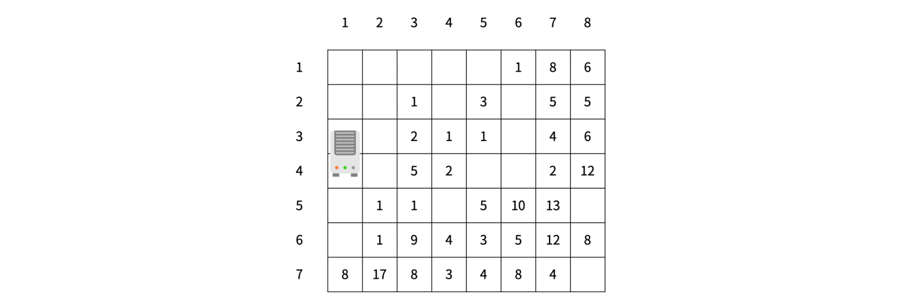

## 문제
https://www.acmicpc.net/problem/17144

미세먼지를 제거하기 위해 구사과는 공기청정기를 설치하려고 한다. 공기청정기의 성능을 테스트하기 위해 구사과는 집을 크기가 R×C인 격자판으로 나타냈고, 1×1 크기의 칸으로 나눴다. 구사과는 뛰어난 코딩 실력을 이용해 각 칸 (r, c)에 있는 미세먼지의 양을 실시간으로 모니터링하는 시스템을 개발했다. (r, c)는 r행 c열을 의미한다.  
  
공기청정기는 항상 1번 열에 설치되어 있고, 크기는 두 행을 차지한다. 공기청정기가 설치되어 있지 않은 칸에는 미세먼지가 있고, (r, c)에 있는 미세먼지의 양은 Ar,c이다.  

1초 동안 아래 적힌 일이 순서대로 일어난다.  

1. 미세먼지가 확산된다. 확산은 미세먼지가 있는 모든 칸에서 동시에 일어난다.  
    - (r, c)에 있는 미세먼지는 인접한 네 방향으로 확산된다.  
    - 인접한 방향에 공기청정기가 있거나, 칸이 없으면 그 방향으로는 확산이 일어나지 않는다.  
    - 확산되는 양은 Ar,c/5이고 소수점은 버린다.  
    - (r, c)에 남은 미세먼지의 양은 Ar,c - (Ar,c/5)×(확산된 방향의 개수) 이다.  
2. 공기청정기가 작동한다.  
    - 공기청정기에서는 바람이 나온다.  
    - 위쪽 공기청정기의 바람은 반시계방향으로 순환하고, 아래쪽 공기청정기의 바람은 시계방향으로 순환한다.  
    - 바람이 불면 미세먼지가 바람의 방향대로 모두 한 칸씩 이동한다.  
    - 공기청정기에서 부는 바람은 미세먼지가 없는 바람이고, 공기청정기로 들어간 미세먼지는 모두 정화된다.  
다음은 확산의 예시이다.  
  
공기청정기의 바람은 다음과 같은 방향으로 순환한다.  
  
방의 정보가 주어졌을 때, T초가 지난 후 구사과의 방에 남아있는 미세먼지의 양을 구해보자.  

---

## 입력  
첫째 줄에 R, C, T (6 ≤ R, C ≤ 50, 1 ≤ T ≤ 1,000) 가 주어진다.  

둘째 줄부터 R개의 줄에 Ar,c (-1 ≤ Ar,c ≤ 1,000)가 주어진다. 공기청정기가 설치된 곳은 Ar,c가 -1이고, 나머지 값은 미세먼지의 양이다. -1은 2번 위아래로 붙어져 있고, 가장 윗 행, 아랫 행과 두 칸이상 떨어져 있다.  

---

## 출력  
첫째 줄에 T초가 지난 후 구사과 방에 남아있는 미세먼지의 양을 출력한다.  

---

**예제 입력 1**  
```Python
7 8 1
0 0 0 0 0 0 0 9
0 0 0 0 3 0 0 8
-1 0 5 0 0 0 22 0
-1 8 0 0 0 0 0 0
0 0 0 0 0 10 43 0
0 0 5 0 15 0 0 0
0 0 40 0 0 0 20 0
```

**예제 출력 1**  
```Python
188
```

**힌트**
미세먼지의 확산이 일어나면 다음과 같은 상태가 된다.  
  
공기청정기가 작동한 이후 상태는 아래와 같다.  
  

---

## 🔍 Algorithm
**시뮬레이션**

## 💻 Logic

```Python
def spread():
    # A 리스트 deepcopy
    A_copy = copy.deepcopy(A)
    for i in range(R):
        for j in range(C):
            if A_copy[i][j] > 0:
                value = A_copy[i][j] // 5
                # 상하좌우 계산
                for k in range(4):
                    next_x = j + dx[k]
                    next_y = i + dy[k]
                    # boundary 체크 후, 확산
                    if 0 <= next_x < C and 0 <= next_y < R:
                        if A[next_y][next_x] != -1:
                            A[next_y][next_x] += value
                            A[i][j] -= value
```

- 미세먼지 확산시키는 함수  
  - **A 리스트 deepcopy**  
    반복문을 도는 중에 확산시키기 전의 상태를 사용해야 하기 때문에  
    기존 리스트 `A`를 **deepcopy** 해서 저장한 후 사용  
  - **상하좌우 계산**  
    미세먼지가 있으면 확산시킬 `value` 계산한 후, 상하좌우 계산  
  - **boundary 체크 후, 확산**  
    **boundary** 안에 위치하는지 확인하고 다음 값이 **-1**이 아니면 `value`를 더해서 확산  

---

```Python
def wind(x, y, d):
    # x, y : 공기청정기 위치 , d : 1이면 위로 확산, -1이면 아래로 확산
    temp = A[y][x+1]
    A[y][x+1] = 0
    # 공기청정기 위치한 행 확산
    for i in range(x+2, C): temp, A[y][i] = A[y][i], temp
    # 마지막 열 확산
    if d == 1:
        for i in range(y-1, -1, -1): temp, A[i][C-1] = A[i][C-1], temp
    else:
        for i in range(y+1, R): temp, A[i][C-1] = A[i][C-1], temp
    # 맨 위 or 맨 아래 행 확산
    for i in range(C-2, x-1, -1): 
        if d == 1: temp, A[0][i] = A[0][i], temp
        else: temp, A[R-1][i] = A[R-1][i], temp
    # 첫번째 열 확산
    if d == 1:
        for i in range(1, y): temp, A[i][0] = A[i][0], temp
    else:
        for i in range(R-2, y, -1): temp, A[i][0] = A[i][0], temp
```

- 공기청정기 작동 함수  
  - **x, y, d 를 인자로 받음**  
    `x, y` : 공기청정기 위치 , `d` : **1**이면 위로 확산, **-1**이면 아래로 확산  
  - **각 행과 열에 맞춰 한칸씩 이동하는 코드 작성**  
    **마지막 열**과 **첫번째 열**은 `d`에 따라 방향이 다름  

---

```Python
def calculate():
    count = 0
    for i in range(R):
        for j in range(C):
            if A[i][j] > 0:
                count += A[i][j]
    return count
```

- 남아있는 미세먼지 양 계산하는 함수  

---

## 🧩 Code
<details><summary>전체 코드 확인</summary>

```Python
import sys, copy
from collections import deque
R, C, T = map(int, sys.stdin.readline().split())
A = []
purifier = []
dx = [1, 0, -1, 0]
dy = [0, 1, 0, -1]
for i in range(R):
    temp = list(map(int, sys.stdin.readline().split()))
    for j in range(C):
        if temp[j] == -1:
            purifier.append((j, i))
    A.append(temp)

def spread():
    # A 리스트 deepcopy
    A_copy = copy.deepcopy(A)
    for i in range(R):
        for j in range(C):
            if A_copy[i][j] > 0:
                value = A_copy[i][j] // 5
                # 상하좌우 계산
                for k in range(4):
                    next_x = j + dx[k]
                    next_y = i + dy[k]
                    # boundary 체크 후, 확산
                    if 0 <= next_x < C and 0 <= next_y < R:
                        if A[next_y][next_x] != -1:
                            A[next_y][next_x] += value
                            A[i][j] -= value

def wind(x, y, d):
    # x, y : 공기청정기 위치 , d : 1이면 위로 확산, -1이면 아래로 확산
    temp = A[y][x+1]
    A[y][x+1] = 0
    # 공기청정기 위치한 행 확산
    for i in range(x+2, C): temp, A[y][i] = A[y][i], temp
    # 마지막 열 확산
    if d == 1:
        for i in range(y-1, -1, -1): temp, A[i][C-1] = A[i][C-1], temp
    else:
        for i in range(y+1, R): temp, A[i][C-1] = A[i][C-1], temp
    # 맨 위 or 맨 아래 행 확산
    for i in range(C-2, x-1, -1): 
        if d == 1: temp, A[0][i] = A[0][i], temp
        else: temp, A[R-1][i] = A[R-1][i], temp
    # 첫번째 열 확산
    if d == 1:
        for i in range(1, y): temp, A[i][0] = A[i][0], temp
    else:
        for i in range(R-2, y, -1): temp, A[i][0] = A[i][0], temp

def calculate():
    count = 0
    for i in range(R):
        for j in range(C):
            if A[i][j] > 0:
                count += A[i][j]
    return count

for _ in range(T):
    spread()
    wind(purifier[0][0], purifier[0][1], 1)
    wind(purifier[1][0], purifier[1][1], -1)
print(calculate())
```
</details>

## 📝 Review

전형적인 시뮬레이션 문제  

공기청정기 작동시키고 바람에 따라 한칸씩 이동하는 방법을 어떻게 효율적이게 할까 고민하다가  
일단 그냥 편한대로 풀었다..  더 효율적인 방법이 있는지 찾아봐야 할 듯  


```toc
```