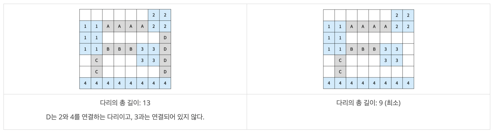
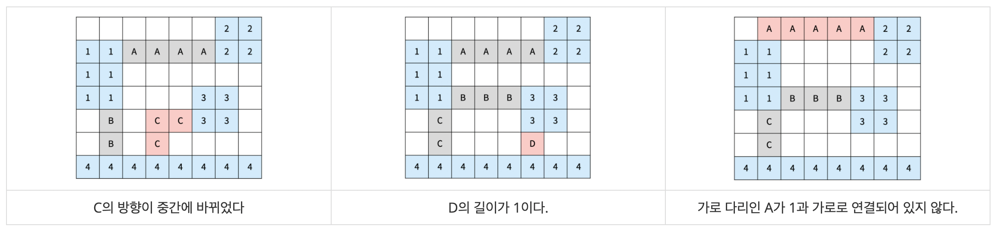
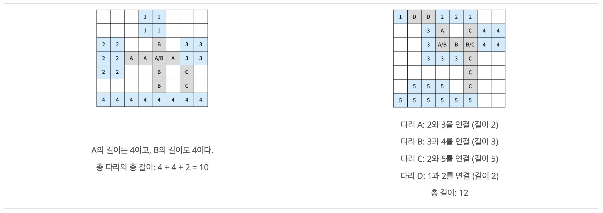

## 문제
https://www.acmicpc.net/problem/17472

섬으로 이루어진 나라가 있고, 모든 섬을 다리로 연결하려고 한다. 이 나라의 지도는 N×M 크기의 이차원 격자로 나타낼 수 있고, 격자의 각 칸은 땅이거나 바다이다.

섬은 연결된 땅이 상하좌우로 붙어있는 덩어리를 말하고, 아래 그림은 네 개의 섬으로 이루어진 나라이다. 색칠되어있는 칸은 땅이다.  

  

다리는 바다에만 건설할 수 있고, 다리의 길이는 다리가 격자에서 차지하는 칸의 수이다. 다리를 연결해서 모든 섬을 연결하려고 한다. 섬 A에서 다리를 통해 섬 B로 갈 수 있을 때, 섬 A와 B를 연결되었다고 한다. 다리의 양 끝은 섬과 인접한 바다 위에 있어야 하고, 한 다리의 방향이 중간에 바뀌면 안된다. 또, 다리의 길이는 2 이상이어야 한다.

다리의 방향이 중간에 바뀌면 안되기 때문에, 다리의 방향은 가로 또는 세로가 될 수 밖에 없다. 방향이 가로인 다리는 다리의 양 끝이 가로 방향으로 섬과 인접해야 하고, 방향이 세로인 다리는 다리의 양 끝이 세로 방향으로 섬과 인접해야 한다.

섬 A와 B를 연결하는 다리가 중간에 섬 C와 인접한 바다를 지나가는 경우에 섬 C는 A, B와 연결되어있는 것이 아니다. 

아래 그림은 섬을 모두 연결하는 올바른 2가지 방법이고, 다리는 회색으로 색칠되어 있다. 섬은 정수, 다리는 알파벳 대문자로 구분했다.

  

다음은 올바르지 않은 3가지 방법이다

  

다리가 교차하는 경우가 있을 수도 있다. 교차하는 다리의 길이를 계산할 때는 각 칸이 각 다리의 길이에 모두 포함되어야 한다. 아래는 다리가 교차하는 경우와 기타 다른 경우에 대한 2가지 예시이다.

  

나라의 정보가 주어졌을 때, 모든 섬을 연결하는 다리 길이의 최솟값을 구해보자.

---

## 입력  
첫째 줄에 지도의 세로 크기 N과 가로 크기 M이 주어진다. 둘째 줄부터 N개의 줄에 지도의 정보가 주어진다. 각 줄은 M개의 수로 이루어져 있으며, 수는 0 또는 1이다. 0은 바다, 1은 땅을 의미한다.

---

## 출력  
모든 섬을 연결하는 다리 길이의 최솟값을 출력한다. 모든 섬을 연결하는 것이 불가능하면 -1을 출력한다.

---

## 🔍 Algorithm
**Brute Force, BFS, DFS, Kruskal**

## 💻 Logic

```Python
def number_island(x, y, cnt):
    q = deque()
    q.append((x, y))
    map_list[y][x] = cnt
    # BFS 탐색
    while q:
        x, y = q.popleft()
        for i in range(4):
            next_x, next_y = x + dx[i], y + dy[i]
            if 0 <= next_x < M and 0 <= next_y < N:
                if not visited[next_y][next_x] and map_list[next_y][next_x] == 1:
                    map_list[next_y][next_x] = cnt
                    q.append((next_x, next_y))
                    visited[next_y][next_x] = True
```

- **BFS** 탐색을 통해 섬 분류하는 함수  
  - **BFS 탐색**  
    상하좌우, `visited` 확인하고 `map_list` 값이 **1**이면  
    해당 `cnt`로 섬 숫자 지정하는 방식으로 연결된 땅들 섬으로 분류  
    
---

```Python
def make_bridge(x, y, dest):
    result = sys.maxsize
    # 방향 4군데
    for i in range(4):
        stack = []
        stack.append((x, y))
        length = 0
        # 그 방향으로 DFS 탐색
        while stack:
            cur_x, cur_y = stack.pop()
            next_x, next_y = cur_x + dx[i], cur_y + dy[i]
            # 범위 벗어나는 경우
            if not (0 <= next_x < M and 0 <= next_y < N):
                break
            # 바다인 경우
            elif map_list[next_y][next_x] == 0:
                length += 1
                stack.append((next_x, next_y))
            # 목적지인 경우
            elif map_list[next_y][next_x] == dest:
                if length >= 2:
                    result = min(result, length)
                break
            # 목적지가 아닌 땅인 경우
            else:
                break
    return result
```

- **DFS** 탐색을 통해 다리 연결하는 함수  
  - **방향 4군데 확인**  
    상하좌우 방향 4군데 전부 반복문을 돌면서 확인  
  - **DFS 탐색**
    그 방향으로 **DFS** 탐색하면서 다리를 만들 수 있는지 확인  
    범위에 벗어나거나 목적지가 아닌 땅인 경우에는 다리를 만들 수 없으므로 **break**  
    `map_list` 값이 **0**이어서 바다인 경우에는 `length` **+1** 해서 다리 길이 늘리고,  
    `map_list` 값이 `dest`면 목적지에 도착한 경우이므로 `result`와 `length` 비교해서 **최솟값**을 저장  
    이 때, 문제 조건에서 다리 길이는 **2 이상**이어야 하기 때문에 조건 확인하고 저장  
    
---

```Python
def find_parent(parent, x):
    if parent[x] != x:
        parent[x] = find_parent(parent, parent[x])
    return parent[x]

def union_parent(parent, a, b):
    a = find_parent(parent, a)
    b = find_parent(parent, b)
    if(a < b):
        parent[b] = a
    else:
        parent[a] = b

def kruskal():
    result, cnt = 0, 0
    while h:
        l, a, b = heapq.heappop(h)
        if find_parent(parent, a) != find_parent(parent, b):
            union_parent(parent, a, b)
            result += l
            cnt += 1
    # 모든 노드 방문했는지 확인
    if cnt != island_cnt-2:
        return -1
    return result
```

- **Kruskal** 알고리즘 이용해서 **MST** 확인하는 함수  
  - **우선순위 큐를 이용해서 MST 확인**  
  - **모든 노드 방문했는지 확인**
    
---

```Python
for i in range(N):
    for j in range(M):
        if not visited[i][j] and map_list[i][j] == 1:
            number_island(j, i, island_cnt)
            island_cnt += 1

parent = [int(x) for x in range(island_cnt)]
# 섬 조합 쌍 생성
comb_list = combinations([int(x) for x in range(1, island_cnt)], 2)
for comb in comb_list:
    comb = list(comb)
    bridge_len = sys.maxsize
    for i in range(N):
        for j in range(M):
            # 해당 조합에 맞는 다리 만들고 길이 최솟값 저장
            if map_list[i][j] == comb[0]:
                result = make_bridge(j, i, comb[1])
                bridge_len = min(result, bridge_len)
    # 섬, 다리 조합 우선순위 큐에 저장
    if bridge_len != sys.maxsize:
        heapq.heappush(h, [bridge_len, comb[0], comb[1]])
# 크루스칼 알고리즘 수행
print(kruskal())
```

- `number_island` 함수 실행해서 섬 넘버링  
- 섬 조합 쌍 생성하고 둘 사이에 다리를 만들 수 있는지 `make_bridge` 함수를 실행해서 확인하고 다리 생성  
- 섬, 다리 조합 **우선순위 큐**에 저장하고 **Kruskal** 알고리즘 수행  

---

## 🧩 Code
<details><summary>전체 코드 확인</summary>

```Python
import sys, heapq
from collections import deque
from itertools import combinations

def number_island(x, y, cnt):
    q = deque()
    q.append((x, y))
    map_list[y][x] = cnt
    # BFS 탐색
    while q:
        x, y = q.popleft()
        for i in range(4):
            next_x, next_y = x + dx[i], y + dy[i]
            if 0 <= next_x < M and 0 <= next_y < N:
                if not visited[next_y][next_x] and map_list[next_y][next_x] == 1:
                    map_list[next_y][next_x] = cnt
                    q.append((next_x, next_y))
                    visited[next_y][next_x] = True

def make_bridge(x, y, dest):
    result = sys.maxsize
    # 방향 4군데
    for i in range(4):
        stack = []
        stack.append((x, y))
        length = 0
        # 그 방향으로 DFS 탐색
        while stack:
            cur_x, cur_y = stack.pop()
            next_x, next_y = cur_x + dx[i], cur_y + dy[i]
            # 범위 벗어나는 경우
            if not (0 <= next_x < M and 0 <= next_y < N):
                break
            # 바다인 경우
            elif map_list[next_y][next_x] == 0:
                length += 1
                stack.append((next_x, next_y))
            # 목적지인 경우
            elif map_list[next_y][next_x] == dest:
                if length >= 2:
                    result = min(result, length)
                break
            # 목적지가 아닌 땅인 경우
            else:
                break
    return result

def find_parent(parent, x):
    if parent[x] != x:
        parent[x] = find_parent(parent, parent[x])
    return parent[x]

def union_parent(parent, a, b):
    a = find_parent(parent, a)
    b = find_parent(parent, b)
    if(a < b):
        parent[b] = a
    else:
        parent[a] = b

def kruskal():
    result, cnt = 0, 0
    while h:
        l, a, b = heapq.heappop(h)
        if find_parent(parent, a) != find_parent(parent, b):
            union_parent(parent, a, b)
            result += l
            cnt += 1
    # 모든 노드 방문했는지 확인
    if cnt != island_cnt-2:
        return -1
    return result

N, M = map(int, sys.stdin.readline().split())
map_list = [[int(x) for x in sys.stdin.readline().split()] for _ in range(N)]
visited = [[False for _ in range(M)] for _ in range(N)]
dx = [1, 0, -1, 0]
dy = [0, 1, 0, -1]
island_cnt, h = 1, []

for i in range(N):
    for j in range(M):
        if not visited[i][j] and map_list[i][j] == 1:
            number_island(j, i, island_cnt)
            island_cnt += 1

parent = [int(x) for x in range(island_cnt)]
# 섬 조합 쌍 생성
comb_list = combinations([int(x) for x in range(1, island_cnt)], 2)
for comb in comb_list:
    comb = list(comb)
    bridge_len = sys.maxsize
    for i in range(N):
        for j in range(M):
            # 해당 조합에 맞는 다리 만들고 길이 최솟값 저장
            if map_list[i][j] == comb[0]:
                result = make_bridge(j, i, comb[1])
                bridge_len = min(result, bridge_len)
    # 섬, 다리 조합 우선순위 큐에 저장
    if bridge_len != sys.maxsize:
        heapq.heappush(h, [bridge_len, comb[0], comb[1]])
# 크루스칼 알고리즘 수행
print(kruskal())
```
</details>

---

## 📝 Review

DFS, BFS, MST 다 섞여있는 복잡한 문제였다.  
아직은 문제를 보고 어떤 알고리즘을 사용해야 되는지 판단하는게 익숙하지 않아서 문제에 적혀있는 알고리즘 분류를 보고 문제를 풀었다,,  
Kruskal 알고리즘은 기억이 잘 안나서 이코테 파이썬 코드를 참고해서 다시 공부하고 구현했다.  
문제마다 어떤 알고리즘을 사용해야 되는지 잘 판단할 수 있도록 연습해야겠다..!  


```toc
```