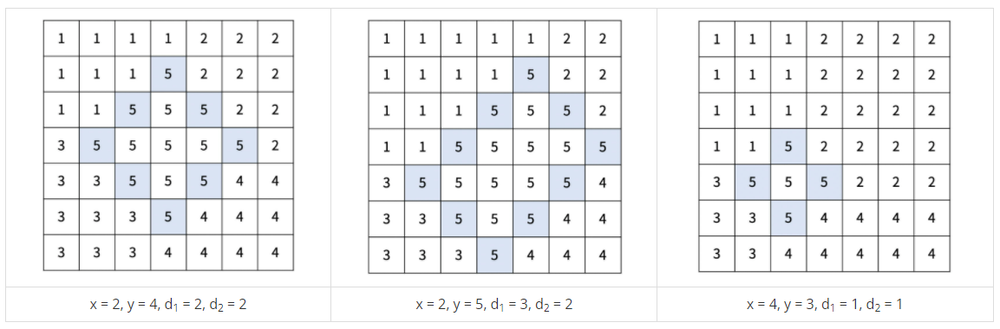

## 문제
https://www.acmicpc.net/problem/17779

재현시의 시장 구재현은 지난 몇 년간 게리맨더링을 통해서 자신의 당에게 유리하게 선거구를 획정했다. 견제할 권력이 없어진 구재현은 권력을 매우 부당하게 행사했고, 심지어는 시의 이름도 재현시로 변경했다. 이번 선거에서는 최대한 공평하게 선거구를 획정하려고 한다.  

재현시는 크기가 N×N인 격자로 나타낼 수 있다. 격자의 각 칸은 구역을 의미하고, r행 c열에 있는 구역은 (r, c)로 나타낼 수 있다. 구역을 다섯 개의 선거구로 나눠야 하고, 각 구역은 다섯 선거구 중 하나에 포함되어야 한다. 선거구는 구역을 적어도 하나 포함해야 하고, 한 선거구에 포함되어 있는 구역은 모두 연결되어 있어야 한다. 구역 A에서 인접한 구역을 통해서 구역 B로 갈 수 있을 때, 두 구역은 연결되어 있다고 한다. 중간에 통하는 인접한 구역은 0개 이상이어야 하고, 모두 같은 선거구에 포함된 구역이어야 한다.  

선거구를 나누는 방법은 다음과 같다.  

1. 기준점 (x, y)와 경계의 길이 d1, d2를 정한다. (d1, d2 ≥ 1, 1 ≤ x < x+d1+d2 ≤ N, 1 ≤ y-d1 < y < y+d2 ≤ N)  
2. 다음 칸은 경계선이다.  
    1. (x, y), (x+1, y-1), ..., (x+d1, y-d1)  
    2. (x, y), (x+1, y+1), ..., (x+d2, y+d2)  
    3. (x+d1, y-d1), (x+d1+1, y-d1+1), ... (x+d1+d2, y-d1+d2)  
    4. (x+d2, y+d2), (x+d2+1, y+d2-1), ..., (x+d2+d1, y+d2-d1)  
3. 경계선과 경계선의 안에 포함되어있는 곳은 5번 선거구이다.  
4. 5번 선거구에 포함되지 않은 구역 (r, c)의 선거구 번호는 다음 기준을 따른다.  
    - 1번 선거구: 1 ≤ r < x+d1, 1 ≤ c ≤ y  
    - 2번 선거구: 1 ≤ r ≤ x+d2, y < c ≤ N  
    - 3번 선거구: x+d1 ≤ r ≤ N, 1 ≤ c < y-d1+d2  
    - 4번 선거구: x+d2 < r ≤ N, y-d1+d2 ≤ c ≤ N  
아래는 크기가 7×7인 재현시를 다섯 개의 선거구로 나눈 방법의 예시이다.  
  

구역 (r, c)의 인구는 A[r][c]이고, 선거구의 인구는 선거구에 포함된 구역의 인구를 모두 합한 값이다. 선거구를 나누는 방법 중에서, 인구가 가장 많은 선거구와 가장 적은 선거구의 인구 차이의 최솟값을 구해보자.  

---

## 입력  
첫째 줄에 재현시의 크기 N이 주어진다.  

둘째 줄부터 N개의 줄에 N개의 정수가 주어진다. r행 c열의 정수는 A[r][c]를 의미한다.  

- 5 ≤ N ≤ 20  
- 1 ≤ A[r][c] ≤ 100  

---

## 출력  
첫째 줄에 인구가 가장 많은 선거구와 가장 적은 선거구의 인구 차이의 최솟값을 출력한다.  

---

## 🔍 Algorithm
**시뮬레이션, Brute Force**

## 💻 Logic

```Python
def divide_area(x, y, d1, d2):
    sum = [0 for _ in range(5)]
    isFiveArea = [[False for _ in range(N)]for _ in range(N)]

    # 5번 선거구 경계선 채우기
    for i in range(d1+1): isFiveArea[x+i][y-i] = True
    for i in range(d2+1): isFiveArea[x+i][y+i] = True
    for i in range(d1+1): isFiveArea[x+d2+i][y+d2-i] = True
    for i in range(d2+1): isFiveArea[x+d1+i][y-d1+i] = True

    # 5번 선거구 경계선 안쪽 채우기
    for i in range(x+1, x+d1+d2):
        check = 0   # 0: default, 1: 5구역 경계 시작, 2: 5구역 경계 끝
        for j in range(N):
            if isFiveArea[i][j]: check += 1
            if check == 1: isFiveArea[i][j] = True
            elif check == 2: break
    
    # 선거구 인구 계산
    for i in range(N):
        for j in range(N):
            if isFiveArea[i][j]:
                sum[4] += population[i][j]
            else:
                if 0 <= j <= y and 0 <= i < x+d1:
                    sum[0] += population[i][j]
                elif y < j < N and 0 <= i <= x+d2:
                    sum[1] += population[i][j]
                elif 0 <= j < y-d1+d2 and x+d1 <= i < N:
                    sum[2] += population[i][j]
                elif y-d1+d2 <= j < N and x+d2 < i < N:
                    sum[3] += population[i][j]
    return max(sum) - min(sum)
```

- 문제에서 제시한 것처럼 순서대로 구역을 나누고 선거구별 인구 계산하는 함수  
  - **5번 선거구 경계선 채우기**  
    5번 선거구인지 아닌지를 나타내는 `isFiveArea` 리스트 선언 후  
    제시된 경계선 나누는 방법에 따라 해당하는 `isFiveArea` 값 **True**로 변경  
  - **5번 선거구 경계선 안쪽 채우기**  
    이중 for문을 이용해서 위에서부터 아래로, 왼쪽에서 오른쪽으로 5번 선거구 경계선 안에 해당하는지 확인  
    해당 행에서 경계선이 나오면 `check` 변수를 **+1**,  
    check가 1이면 경계선 안이기 때문에 해당하는 `isFiveArea` 값을 **True**로 변경  
    해당 행에서 경계선이 끝나는 부분이 나오면 check가 2일 것이므로, **break**  
  - **선거구별 인구 계산**  
    선거구별 인구수 합을 저장할 `sum` 리스트 생성  
    `isFiveArea` 값이 **True**면 5번 선거구 인구 합에 인구수 더함  
    나머지 선거구들도 제시된 식에 맞게 계산해서 해당하는 `sum` 리스트 값에 인구수 더함  
    마지막으로 `sum` 리스트에서 **max값과 min값의 차**를 return  

---

```Python
result = sys.maxsize
for x in range(1, N+1):
    for y in range(1, N+1):
        for d1 in range(1, N+1):
            for d2 in range(1, N+1):
                if 1 <= x < x+d1+d2 <= N and 1 <= y-d1 < y < y+d2 <= N:
                    result = min(result, divide_area(x-1, y-1, d1, d2))
print(result)
```

- **기준점(x,y)과 d1, d2를 설정해서 최솟값 계산**  
  제시된 식에 맞게 **d1, d2**를 설정한 후, `divide_area` 함수 실행,  
  실행된 결과와 원래 `result` 의 **min값**을 다시 `result` 에 저장  
  반복문 실행 후, `result` 출력  

## 🧩 Code
<details><summary>전체 코드 확인</summary>

```Python
import sys
N = int(sys.stdin.readline())
population = [[int(x) for x in sys.stdin.readline().split()] for _ in range(N)]

def divide_area(x, y, d1, d2):
    sum = [0 for _ in range(5)]
    isFiveArea = [[False for _ in range(N)]for _ in range(N)]

    # 5번 선거구 경계선 채우기
    for i in range(d1+1): isFiveArea[x+i][y-i] = True
    for i in range(d2+1): isFiveArea[x+i][y+i] = True
    for i in range(d1+1): isFiveArea[x+d2+i][y+d2-i] = True
    for i in range(d2+1): isFiveArea[x+d1+i][y-d1+i] = True

    # 5번 선거구 경계선 안쪽 채우기
    for i in range(x+1, x+d1+d2):
        check = 0   # 0: default, 1: 5구역 경계 시작, 2: 5구역 경계 끝
        for j in range(N):
            if isFiveArea[i][j]: check += 1
            if check == 1: isFiveArea[i][j] = True
            elif check == 2: break
    
    # 선거구 인구 계산
    for i in range(N):
        for j in range(N):
            if isFiveArea[i][j]:
                sum[4] += population[i][j]
            else:
                if 0 <= j <= y and 0 <= i < x+d1:
                    sum[0] += population[i][j]
                elif y < j < N and 0 <= i <= x+d2:
                    sum[1] += population[i][j]
                elif 0 <= j < y-d1+d2 and x+d1 <= i < N:
                    sum[2] += population[i][j]
                elif y-d1+d2 <= j < N and x+d2 < i < N:
                    sum[3] += population[i][j]
    return max(sum) - min(sum)

result = sys.maxsize
for x in range(1, N+1):
    for y in range(1, N+1):
        for d1 in range(1, N+1):
            for d2 in range(1, N+1):
                if 1 <= x < x+d1+d2 <= N and 1 <= y-d1 < y < y+d2 <= N:
                    result = min(result, divide_area(x-1, y-1, d1, d2))
print(result)
```
</details>

## 📝 Review
처음에는 5번 선거구가 특이 케이스라는 것을 모르고 1번 선거구부터 주어진 식에 맞춰서 나눈 다음에 계산하려고 했다.  
그러다가 뭔가 잘못된 것을 깨닫고 문제를 다시 읽은 후, 문제에서 제시된 순서대로 구현해나갔다.  
(r,c)와 (x,y) 순서에서 계속 헷갈려서 풀이에 시간을 많이 쓴건 흠,,  
다 풀고나니 코드 곳곳에서 효율적이지 않은 부분들이 보이는데 이건 차근차근 고쳐나가야지  


```toc
```