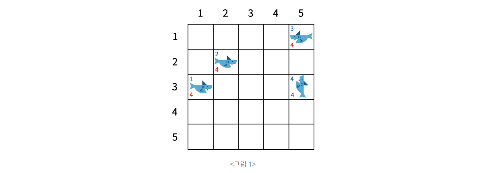
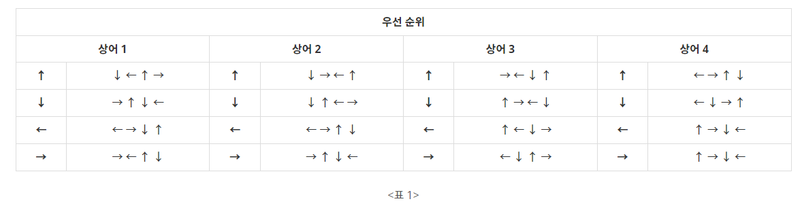

## 문제
https://www.acmicpc.net/problem/19237

청소년 상어는 더욱 자라 어른 상어가 되었다. 상어가 사는 공간에 더 이상 물고기는 오지 않고 다른 상어들만이 남아있다. 상어에는 1 이상 M 이하의 자연수 번호가 붙어 있고, 모든 번호는 서로 다르다. 상어들은 영역을 사수하기 위해 다른 상어들을 쫓아내려고 하는데, 1의 번호를 가진 어른 상어는 가장 강력해서 나머지 모두를 쫓아낼 수 있다.  

N×N 크기의 격자 중 M개의 칸에 상어가 한 마리씩 들어 있다. 맨 처음에는 모든 상어가 자신의 위치에 자신의 냄새를 뿌린다. 그 후 1초마다 모든 상어가 동시에 상하좌우로 인접한 칸 중 하나로 이동하고, 자신의 냄새를 그 칸에 뿌린다. 냄새는 상어가 k번 이동하고 나면 사라진다.  

각 상어가 이동 방향을 결정할 때는, 먼저 인접한 칸 중 아무 냄새가 없는 칸의 방향으로 잡는다. 그런 칸이 없으면 자신의 냄새가 있는 칸의 방향으로 잡는다. 이때 가능한 칸이 여러 개일 수 있는데, 그 경우에는 특정한 우선순위를 따른다. 우선순위는 상어마다 다를 수 있고, 같은 상어라도 현재 상어가 보고 있는 방향에 따라 또 다를 수 있다. 상어가 맨 처음에 보고 있는 방향은 입력으로 주어지고, 그 후에는 방금 이동한 방향이 보고 있는 방향이 된다.  

모든 상어가 이동한 후 한 칸에 여러 마리의 상어가 남아 있으면, 가장 작은 번호를 가진 상어를 제외하고 모두 격자 밖으로 쫓겨난다.  

  
  

<그림 1>은 맨 처음에 모든 상어가 자신의 냄새를 뿌린 상태를 나타내며, <표 1>에는 각 상어 및 현재 방향에 따른 우선순위가 표시되어 있다. 이 예제에서는 k = 4이다. 왼쪽 하단에 적힌 정수는 냄새를 의미하고, 그 값은 사라지기까지 남은 시간이다. 좌측 상단에 적힌 정수는 상어의 번호 또는 냄새를 뿌린 상어의 번호를 의미한다.  

  
<그림 2>는 모든 상어가 한 칸 이동하고 자신의 냄새를 뿌린 상태이고, <그림 3>은 <그림 2>의 상태에서 한 칸 더 이동한 것이다. (2, 4)에는 상어 2과 4가 같이 도달했기 때문에, 상어 4는 격자 밖으로 쫓겨났다.  

  
<그림 4>은 격자에 남아있는 모든 상어가 한 칸 이동하고 자신의 냄새를 뿌린 상태, <그림 5>는 <그림 4>에서 한 칸 더 이동한 상태를 나타낸다. 상어 2는 인접한 칸 중에 아무 냄새도 없는 칸이 없으므로 자신의 냄새가 들어있는 (2, 4)으로 이동했다. 상어가 이동한 후에, 맨 처음에 각 상어가 뿌린 냄새는 사라졌다.  

이 과정을 반복할 때, 1번 상어만 격자에 남게 되기까지 몇 초가 걸리는지를 구하는 프로그램을 작성하시오.  

---

## 입력  
첫 줄에는 N, M, k가 주어진다. (2 ≤ N ≤ 20, 2 ≤ M ≤ N2, 1 ≤ k ≤ 1,000)  

그 다음 줄부터 N개의 줄에 걸쳐 격자의 모습이 주어진다. 0은 빈칸이고, 0이 아닌 수 x는 x번 상어가 들어있는 칸을 의미한다.  

그 다음 줄에는 각 상어의 방향이 차례대로 주어진다. 1, 2, 3, 4는 각각 위, 아래, 왼쪽, 오른쪽을 의미한다.  

그 다음 줄부터 각 상어의 방향 우선순위가 상어 당 4줄씩 차례대로 주어진다. 각 줄은 4개의 수로 이루어져 있다. 하나의 상어를 나타내는 네 줄 중 첫 번째 줄은 해당 상어가 위를 향할 때의 방향 우선순위, 두 번째 줄은 아래를 향할 때의 우선순위, 세 번째 줄은 왼쪽을 향할 때의 우선순위, 네 번째 줄은 오른쪽을 향할 때의 우선순위이다. 각 우선순위에는 1부터 4까지의 자연수가 한 번씩 나타난다. 가장 먼저 나오는 방향이 최우선이다. 예를 들어, 우선순위가 1 3 2 4라면, 방향의 순서는 위, 왼쪽, 아래, 오른쪽이다.  

맨 처음에는 각 상어마다 인접한 빈 칸이 존재한다. 따라서 처음부터 이동을 못 하는 경우는 없다.  

---

## 출력  
1번 상어만 격자에 남게 되기까지 걸리는 시간을 출력한다. 단, 1,000초가 넘어도 다른 상어가 격자에 남아 있으면 -1을 출력한다.  

---

**예제 입력 1**  
```Python
5 4 4
0 0 0 0 3
0 2 0 0 0
1 0 0 0 4
0 0 0 0 0
0 0 0 0 0
4 4 3 1
2 3 1 4
4 1 2 3
3 4 2 1
4 3 1 2
2 4 3 1
2 1 3 4
3 4 1 2
4 1 2 3
4 3 2 1
1 4 3 2
1 3 2 4
3 2 1 4
3 4 1 2
3 2 4 1
1 4 2 3
1 4 2 3
```

**예제 출력 1**  
```Python
14
```

---

## 🔍 Algorithm
**시뮬레이션**

## 💻 Logic

```Python
def update_grid():
    for i in range(N):
        for j in range(N):
            if grid[i][j] != 0:
                # 시간 -1
                grid[i][j][1] -= 1
                # 시간이 0이면 해당 좌표 0으로 초기화
                if grid[i][j][1] == 0:
                    grid[i][j] = 0
```

- 냄새가 남아있는 시간 업데이트하는 함수  
  시간이 **0**이면 해당 좌표 값 **0**으로 초기화  
  아니면 좌표 값 **-1**  

---

```Python
def move_shark(copy_grid, n, x, y):
    check = False
    p = priority[n][cur_dir[n]-1]
    # 우선순위에 맞게 다음 위치 계산
    for p in priority[n][cur_dir[n]-1]:
        next_x = x + dx[p-1]
        next_y = y + dy[p-1]
        # 다음 위치가 boundary 안이고 0인지 확인
        if 0 <= next_x < N and 0 <= next_y < N:
            if copy_grid[next_y][next_x] == 0:
                # 실제 grid가 0일 때만 진행
                if grid[next_y][next_x] == 0:
                    grid[next_y][next_x] = [n+1, k+1]
                shark[n] = (next_x, next_y)
                cur_dir[n] = p
                check = True
                break
    # 주변에 0인 칸이 없는 경우
    if not check:
        for p in priority[n][cur_dir[n]-1]:
            next_x = x + dx[p-1]
            next_y = y + dy[p-1]
            if 0 <= next_x < N and 0 <= next_y < N:
                # 자기 냄새가 있는 곳으로 돌아감
                if copy_grid[next_y][next_x][0] == n+1:
                    if grid[next_y][next_x][0] == n+1:
                        grid[next_y][next_x] = [n+1, k+1]
                    shark[n] = (next_x, next_y)
                    cur_dir[n] = p
                    break
```

- 상어 이동 함수  
  - **우선순위에 맞게 다음 위치 계산**  
    다음 위치가 **boundary 안**이고 **0**인지 확인  
    실제 `grid`가 **0**일 때만 `grid`에 `[n+1, k+1]` 값 넣고, 현재 상어 위치, 방향 다시 설정  
  - **주변에 0인 칸이 없는 경우**  
    우선순위에 맞게 다시 다음 위치 계산  
    `grid`가 **n+1**인 경우, `grid`에 `[n+1, k+1]` 값 넣고, 현재 상어 위치, 방향 다시 설정  

---

```Python
def check_collision():
    global num
    for i in range(M):
        if shark[i] == -1:
            continue
        for j in range(i+1, M):
            # 중복되는 위치에 있으면, 숫자가 큰 상어의 위치를 -1로 초기화하고 num -1
            if shark[i] == shark[j]:
                shark[j] = -1
                num -= 1
```

- 상어 중복 처리 함수  
  중복되는 위치에 있으면, 숫자가 큰 상어의 위치를 **-1**로 초기화하고 `num` **-1**  

---

```Python
while(num > 1):
    if(count >= 1000 and num > 1):
        count = -1
        break
    count += 1
    copy_grid = copy.deepcopy(grid)
    for i in range(M):
        if shark[i] != -1:
            move_shark(copy_grid, i, shark[i][0], shark[i][1])
    update_grid()
    check_collision()
print(count)
```

- 상어가 1마리 남을 때까지 진행  
  `count`가 **1000 이상**이면서 `num`이 **1보다 크면** `count` **-1**로 설정하고 출력  
  상어 이동 독립적으로 하기 위해 `grid` **deepcopy**  
  남은 상어 수만큼 `move_shark` 함수 실행하고  
  `update_grid` , `check_collision` 함수 실행  
  `num`이 **1 이하**면 `count` 출력  

---

## 🧩 Code
<details><summary>전체 코드 확인</summary>

```Python
import sys, copy

N, M, k = map(int, sys.stdin.readline().split())
grid = [[int(x) for x in sys.stdin.readline().split()] for _ in range(N)]
cur_dir = [int(x) for x in sys.stdin.readline().split()]
priority = [[[int(x) for x in sys.stdin.readline().split()] for _ in range(4)] for _ in range(M)]
shark = [0 for _ in range(M)]
num = M
count = 0
dx = [0, 0, -1, 1]
dy = [-1, 1, 0, 0]

def update_grid():
    for i in range(N):
        for j in range(N):
            if grid[i][j] != 0:
                # 시간 -1
                grid[i][j][1] -= 1
                # 시간이 0이면 해당 좌표 0으로 초기화
                if grid[i][j][1] == 0:
                    grid[i][j] = 0

def move_shark(copy_grid, n, x, y):
    check = False
    p = priority[n][cur_dir[n]-1]
    # 우선순위에 맞게 다음 위치 계산
    for p in priority[n][cur_dir[n]-1]:
        next_x = x + dx[p-1]
        next_y = y + dy[p-1]
        # 다음 위치가 boundary 안이고 0인지 확인
        if 0 <= next_x < N and 0 <= next_y < N:
            if copy_grid[next_y][next_x] == 0:
                # 실제 grid가 0일 때만 진행
                if grid[next_y][next_x] == 0:
                    grid[next_y][next_x] = [n+1, k+1]
                shark[n] = (next_x, next_y)
                cur_dir[n] = p
                check = True
                break
    # 주변에 0인 칸이 없는 경우
    if not check:
        for p in priority[n][cur_dir[n]-1]:
            next_x = x + dx[p-1]
            next_y = y + dy[p-1]
            if 0 <= next_x < N and 0 <= next_y < N:
                # 자기 냄새가 있는 곳으로 돌아감
                if copy_grid[next_y][next_x][0] == n+1:
                    if grid[next_y][next_x][0] == n+1:
                        grid[next_y][next_x] = [n+1, k+1]
                    shark[n] = (next_x, next_y)
                    cur_dir[n] = p
                    break

def check_collision():
    global num
    for i in range(M):
        if shark[i] == -1:
            continue
        for j in range(i+1, M):
            # 중복되는 위치에 있으면, 숫자가 큰 상어의 위치를 -1로 초기화하고 num -1
            if shark[i] == shark[j]:
                shark[j] = -1
                num -= 1

for i in range(N):
    for j in range(N):
        if grid[i][j] != 0:
            grid[i][j] = [grid[i][j], k]
            shark[grid[i][j][0]-1] = (j, i)

while(num > 1):
    if(count >= 1000 and num > 1):
        count = -1
        break
    count += 1
    copy_grid = copy.deepcopy(grid)
    for i in range(M):
        if shark[i] != -1:
            move_shark(copy_grid, i, shark[i][0], shark[i][1])
    update_grid()
    check_collision()
print(count)
```
</details>

---

## 📝 Review

문제에서 주어진대로만 구현하면 돼서 구현에 크게 문제는 없었지만 시간이 조오금 걸렸다  
시간을 어떻게 줄이면서 풀지는 차근차근 문제 많이 풀어보면서 생각해봐야지,,


```toc
```