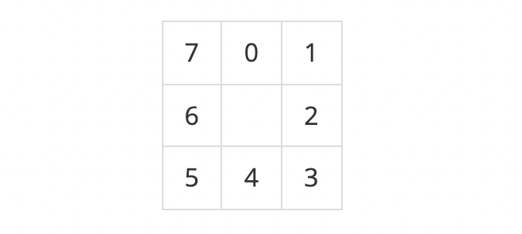

## 문제
https://www.acmicpc.net/problem/20056

어른 상어가 마법사가 되었고, 파이어볼을 배웠다.  

마법사 상어가 크기가 N×N인 격자에 파이어볼 M개를 발사했다. 가장 처음에 파이어볼은 각자 위치에서 이동을 대기하고 있다. i번 파이어볼의 위치는 (ri, ci), 질량은 mi이고, 방향은 di, 속력은 si이다. 위치 (r, c)는 r행 c열을 의미한다.  

격자의 행과 열은 1번부터 N번까지 번호가 매겨져 있고, 1번 행은 N번과 연결되어 있고, 1번 열은 N번 열과 연결되어 있다.  

파이어볼의 방향은 어떤 칸과 인접한 8개의 칸의 방향을 의미하며, 정수로는 다음과 같다.  
  
마법사 상어가 모든 파이어볼에게 이동을 명령하면 다음이 일들이 일어난다.  

1. 모든 파이어볼이 자신의 방향 di로 속력 si칸 만큼 이동한다.  
    - 이동하는 중에는 같은 칸에 여러 개의 파이어볼이 있을 수도 있다.  
2. 이동이 모두 끝난 뒤, 2개 이상의 파이어볼이 있는 칸에서는 다음과 같은 일이 일어난다.  
    1. 같은 칸에 있는 파이어볼은 모두 하나로 합쳐진다.  
    2. 파이어볼은 4개의 파이어볼로 나누어진다.  
    3. 나누어진 파이어볼의 질량, 속력, 방향은 다음과 같다.  
        1. 질량은 ⌊(합쳐진 파이어볼 질량의 합)/5⌋이다.  
        2. 속력은 ⌊(합쳐진 파이어볼 속력의 합)/(합쳐진 파이어볼의 개수)⌋이다.  
        3. 합쳐지는 파이어볼의 방향이 모두 홀수이거나 모두 짝수이면, 방향은 0, 2, 4, 6이 되고, 그렇지 않으면 1, 3, 5, 7이 된다.  
    4. 질량이 0인 파이어볼은 소멸되어 없어진다.  
마법사 상어가 이동을 K번 명령한 후, 남아있는 파이어볼 질량의 합을 구해보자.  

---

## 입력  
첫째 줄에 N, M, K가 주어진다.  

둘째 줄부터 M개의 줄에 파이어볼의 정보가 한 줄에 하나씩 주어진다. 파이어볼의 정보는 다섯 정수 ri, ci, mi, si, di로 이루어져 있다.  

서로 다른 두 파이어볼의 위치가 같은 경우는 입력으로 주어지지 않는다.  

---

## 출력  
마법사 상어가 이동을 K번 명령한 후, 남아있는 파이어볼 질량의 합을 출력한다.  

---

## 🔍 Algorithm
**시뮬레이션**

## 💻 Logic

```Python
def move_fireball(count):
    # 파이어볼 수만큼 이동
    for _ in range(count):
        next_y, next_x, m, s, d = fireball.pop(0)
        # 방향과 속력에 맞게 다음 위치 계산
        for _ in range(s):
            next_x += dx[d]
            next_y += dy[d]
            # 행과 열은 1번과 N번이 연결되어 있음
            if next_x < 1: next_x = N
            elif next_x > N: next_x = 1
            if next_y < 1: next_y = N
            elif next_y > N: next_y = 1
        # 다음 파이어볼의 위치를 나타낼 grid에 append
        grid[next_y][next_x].append([m, s, d])
```

- 파이어볼 이동 함수  
  - **파이어볼 수만큼 이동**  
    `fireball` 리스트에 있는 값 수만큼 **pop**하면서 반복문 실행  
  - **방향과 속력에 맞게 다음 위치 계산**  
    행과 열은 **1번**과 **N번**이 연결되어 있으므로 범위 안넘어가게 다음 위치 계산  
    그 다음, 다음 파이어볼의 위치를 나타내는 리스트인 `grid`에 **append**  

---

```Python
def check_collision():
    for i in range(1, N+1):
        for j in range(1, N+1):
            n = len(grid[i][j])
            # grid에 값이 있을 때까지 반복문 진행
            if n == 0:
                continue
            # grid 좌표 값이 하나만 있으면 바로 append
            elif n == 1:
                m, s, d = grid[i][j].pop(0)
                fireball.append([i, j, m, s, d])
            # 둘 이상이면 문제에 주어진대로 계산
            else:
                m_sum, s_sum, dir, last_d = 0, 0, True, -1
                while grid[i][j]:
                    m, s, d = grid[i][j].pop(0)
                    m_sum += m
                    s_sum += s
                    if last_d == -1:
                        last_d = d
                    # 하나라도 홀수, 짝수가 섞일 경우 False 저장
                    else:
                        if last_d%2 != d%2: dir = False
                # 질량이 0이하면 버림
                if m_sum//5 > 0:
                    if dir:
                        for k in range(4):
                            fireball.append([i, j, m_sum//5, s_sum//n, k*2])
                    else:
                        for k in range(4):
                            fireball.append([i, j, m_sum//5, s_sum//n, k*2+1])
```

- 중복 처리 함수  
  - **grid에 값이 있을 때까지 반복문 진행**  
    `grid` 좌표 값이 하나만 있으면 바로 **append**  
    둘 이상이면 문제에 주어진대로 계산  

---

## 🧩 Code
<details><summary>전체 코드 확인</summary>

```Python
import sys
N, M, K = map(int, sys.stdin.readline().split())
fireball = [[int(x) for x in sys.stdin.readline().split()] for _ in range(M)]
grid = [[[] for _ in range(N+1)] for _ in range(N+1)]
dx = [0, 1, 1, 1, 0, -1, -1, -1]
dy = [-1, -1, 0, 1, 1, 1, 0, -1]
result = 0

def move_fireball(count):
    # 파이어볼 수만큼 이동
    for _ in range(count):
        next_y, next_x, m, s, d = fireball.pop(0)
        # 방향과 속력에 맞게 다음 위치 계산
        for _ in range(s):
            next_x += dx[d]
            next_y += dy[d]
            # 행과 열은 1번과 N번이 연결되어 있음
            if next_x < 1: next_x = N
            elif next_x > N: next_x = 1
            if next_y < 1: next_y = N
            elif next_y > N: next_y = 1
        # 다음 파이어볼의 위치를 나타낼 grid에 append
        grid[next_y][next_x].append([m, s, d])
        
def check_collision():
    for i in range(1, N+1):
        for j in range(1, N+1):
            n = len(grid[i][j])
            # grid에 값이 있을 때까지 반복문 진행
            if n == 0:
                continue
            # grid 좌표 값이 하나만 있으면 바로 append
            elif n == 1:
                m, s, d = grid[i][j].pop(0)
                fireball.append([i, j, m, s, d])
            # 둘 이상이면 문제에 주어진대로 계산
            else:
                m_sum, s_sum, dir, last_d = 0, 0, True, -1
                while grid[i][j]:
                    m, s, d = grid[i][j].pop(0)
                    m_sum += m
                    s_sum += s
                    if last_d == -1:
                        last_d = d
                    # 하나라도 홀수, 짝수가 섞일 경우 False 저장
                    else:
                        if last_d%2 != d%2: dir = False
                # 질량이 0이하면 버림
                if m_sum//5 > 0:
                    if dir:
                        for k in range(4):
                            fireball.append([i, j, m_sum//5, s_sum//n, k*2])
                    else:
                        for k in range(4):
                            fireball.append([i, j, m_sum//5, s_sum//n, k*2+1])

for _ in range(K):
    move_fireball(len(fireball))
    check_collision()
for i in fireball:
    result += i[2]
print(result)
```
</details>

---

## 📝 Review

처음에 문제를 제대로 이해하기가 약간 어려웠지만 주어진 예제를 손으로 풀어보니까 이해됐다  
그 다음 구현하는 과정은 문제에서 주어진대로만 하면 돼서 나름 쉽게 해결  


```toc
```