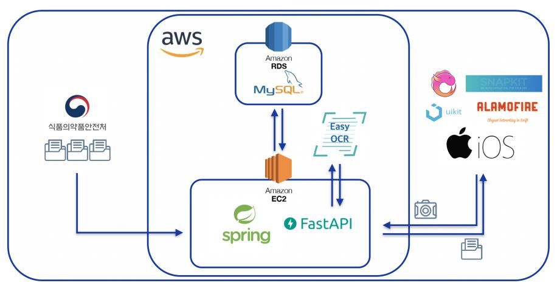
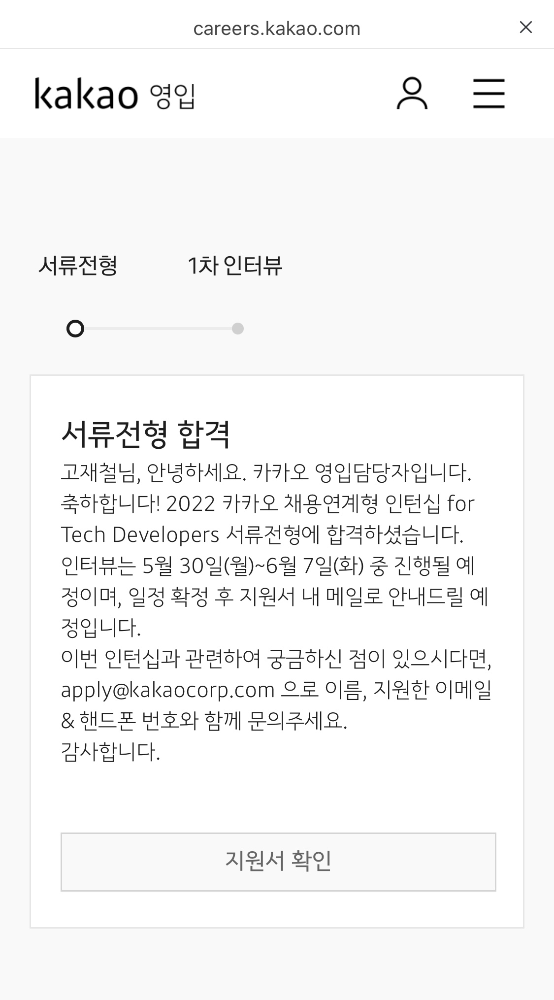
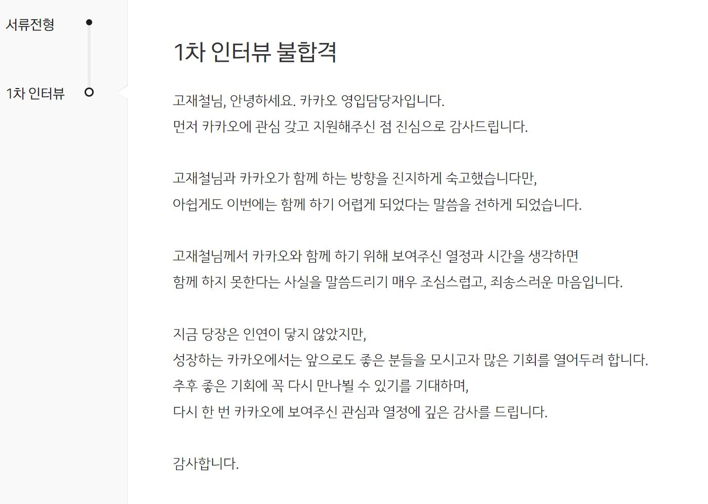

벌써 22년도 절반이 지나가고 있고, 4학년 1학기를 마무리하며 지난 1학기를 되돌아보려 합니다.

4학년 1학기는 바쁘게 아주 빠르게 지나갔네요.  
19학점을 들으면서 취업 준비를 위한 준비도 하다보니 시간 가는 줄 모를 정도였습니다^^,,  
백엔드로 진로를 정하고 처음으로 프로젝트도 2개나 진행해보고, 처음으로 코테도 치고 면접 경험도 하면서 많은 경험을 할 수 있었던 학기였습니다.

## 🎞 프로젝트

우선, 이번 학기 프로젝트는 2개를 진행했는데 **종합설계프로젝트2**와 **모바일앱프로그래밍2** 과목을 들으면서 각각 프로젝트를 진행했습니다.  

### [종프2] Carbon-Tracker

종프2는 작년 종프1이랑은 다르게 **Elastic Stack**, **Kafka** 등을 사용하면서 더 제대로 된 프로젝트를 할 수 있었고, 그래서 시작할 때부터 많은 기대와 흥미를 느끼며 시작했습니다.  
추후에 프로젝트 회고도 올릴 예정이어서 프로젝트에 대한 자세한 설명은 거기서 하고, 아무튼 처음으로 **Spring**을 사용해서 다른 사람들과 프로젝트를 진행해서 재미있었고 **Elastic Stack**, **Kafka** 등 다양한 기술들을 처음으로 사용해보면서 설치부터 중간중간 헤매는 부분들이 많았지만 그래서 더 재밌었고,, 많은 걸 배울 수 있는 프로젝트였습니다. ꉂꉂ(ᵔᗜᵔ*)  
특히, 아주 간단한 머신러닝을 통해 예측 모델을 생성하고 **FastAPI**를 사용해서 모델을 서빙하는 과정을 경험해봤는데 재밌었다..! 덕분에 **MLOps**에 조금이나마 흥미가 생겼고 더 알아봐야겠다,,,!

### [모앱2] Taboo-Drug

모앱2에서는 처방전을 스마트폰 카메라로 인식해서 자동으로 약품을 등록하도록 하는 기능을 구현하고자 했습니다.  
처방전 인식을 위해 **Tesseract OCR**을 사용하려고 하다가 **EasyOCR**이라는 비교적 최근에 나온 좋은 프레임워크가 있는 걸 보고 **EasyOCR**을 학습시켜서 구현하기로 했습니다.  
하지만 전체 프로젝트를 구현하는데 이틀 정도의 짧은 시간 밖에 없어서 제대로 학습시키기에는 시간이 부족했고 그래서 우선 인식 후, **Elasticsearch**에서 `fuzzy query`를 사용해 DB에 있는 약품명과 비교하여 정확한 값만 반환하도록 구현했습니다.  

다른 프로젝트랑 시험, 면접 등 다른 일정들 때문에 프로젝트를 늦게 시작해서 시간이 부족해 제대로 구현하지 못한게 아쉬운 프로젝트였다,, 처음부터 설계를 제대로 하고 OCR 학습도 제대로 한 다음에 했다면 정말 괜찮은 결과물이 나왔을텐데 이 점이 너무 아쉽게 느껴졌다. 그래도 종프2 프로젝트를 하면서 사용하지 못한 **Elasticsearch** 기능들을 사용해보고, OCR 기술을 가볍게지만 사용해볼 수 있어서 좋은 경험이 되었습니다. 특히 OCR 기술은 나중에 가능하다면 현재 진행하고 있는 야구장 좌석뷰 프로젝트에서도 티켓 인식하는 기능으로 추가할 수 있을 것 같아서 조금 흥미가 생겼다..!  

---

## 🎙 코테 & 면접  

이번 학기에 제일 큰 경험은 역시 코테와 면접인 것 같습니다.  

1. `[프로그래머스] 2022 Dev-Matching: 웹 백엔드 개발자(상반기)-1` - 코테 탈  
2. `[프로그래머스] 2022 Summer Coding` - `미리디 인턴` 최종 합  
3. `[KAKAO] 2022 카카오 테크 인턴십` - 면접 탈  
4. `[Works Mobile] 2022 웍스모바일 하계 인턴` - 서류 탈  
5. `[NCSOFT] 2022 인턴` - 코테 + 서류 탈  
6. `[LINE] 2022 SUMMER LINE 채용 연계형 INTERNSHIP` - 코테 탈  
7. `[SKT] 2022 SK텔레콤 T-WorX` - 코테 탈  
8. `[NAVER] 2022 네이버 기술 직군 신입 채용 : Track_공채` - ??  
9. `[프로그래머스] 2022 Dev-Matching: 웹 백엔드 개발자(상반기)-2` - ??  

아직 4학년 1학기고 내세울만한 프로젝트 경험이 아직 없다는 것도 알고 있어서 거의 인턴 채용 위주로 코테 경험삼아 지원해봤습니다. 그리고 결과는 나름 만족이었습니다. 처음 지원하기도 했고 아직 제대로 된 경험과 포트폴리오가 준비되어 있지 않다는 사실을 알고 있어서 서류 탈락은 어느 정도 예상된 결과였습니다. 하지만 코테의 경우에는 테스트 케이스를 주지 않는 코테에서 거의 다 탈락하는 것을 보고 혼자서 엣지 케이스를 많이 만들어보며 코테 준비를 해야겠다는 생각을 하게 되었습니다,,  

그래도 나름 만족스러운 결과라고 생각했던 이유가 우선 카카오 코테+서류 합격이었습니다. 학기 초에 코테 준비가 잘 되어있지 않을 때 쳤던 코테인데도 만족스러운 결과가 나왔고, 서류도 합격을 해서 면접까지 경험해볼 수 있었다는 점에서 만족스러웠습니다.

비록 면접에서는 좋은 결과를 얻진 못했지만 첫 면접이어서 면접이 어떤 식으로 진행되는지 알 수 있었고 학교 수업 때 배운 CS 지식들을 거의 다 까먹어서 아직 많이 부족하다는 것을 알 수 있었습니다... 그리고 프로젝트 관련 질문들도 처음 해봐서 정리되지 않은 상태로 대답을 많이 했는데 주로 면접관들이 원하는 것이 `왜 이 기술을 선택했는지` 라는 점과 특히 카카오가 원하는 인재상, 방향 등에 대해 알 수 있어서 많은 도움이 되었습니다.  

프로그래머스에서 진행한 **Summer Coding**에서는 코테를 통과하고, 지원했던 미리디에서 전화 면접을 진행했었는데 면접 대답을 엄청 못해서.. 떨어질 거라고 예상했었습니다. 예상대로 탈락이라는 결과를 받고 별 생각을 안하고 있었는데, 한달 뒤 쯤 추가 합격했다는 연락을 받고 놀랐습니다,,^  
하지만 비대면과 숙박 지원이 안돼서 인턴 기간 동안 지낼 곳이 없다는 문제도 있고, 이것저것 고려해본 결과 미리디 인턴은 포기하고 방학동안 개인적으로 공부를 열심히 하자고 결론을 내렸습니다ㅎ,,

---

## 📝 회고

이번 한학기를 돌아보면 반은 성공이고 남은 절반은 만족스럽지 않았던 것 같습니다.  

종프 프로젝트를 진행하면서 새로운 기술들을 많이 배운 점은 엄청 마음에 들었고, 카카오 인턴 면접 경험해보고 미리디 인턴 합격도 해보고 좋은 경험들이 많이 있었던 학기여서 이런 점은 마음에 들었습니다. 항상 원하는 방향이 공부할 땐 하고, 놀 땐 놀자라는 마인드인데 물론 이 점도 잘 충족해서 마음에 든 학기였기도 합니다ㅎ,,  

하지만 생각보다 바빠서 학기 초에 하고 싶었던 개인 프로젝트를 많이 진행하지 못한 점도 아쉽고, 아직 코테랑 면접도 준비해야 하는 것들이 많이 남아있다는 점에서 반쯤은 아쉽긴 합니다.. 그래도 아직 시간은 많으니 차근차근 나답게 천천히 준비해 나가야지^^  

이번 방학 목표는 스프링 기본기를 확실히 다지고 다음 학기에도 있을 면접들을 위해 CS 정리도 꾸준히 하면서 다음 학기 준비해볼게요 ꉂꉂ(ᵔᗜᵔ*)  
