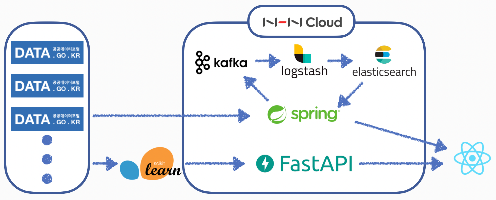

벌써 22년도 절반이 지나가고 있고, 4학년 1학기를 마무리하며 지난 1학기를 되돌아보려 합니다.

4학년 1학기는 바쁘게 아주 빠르게 지나갔네요.  
19학점을 들으면서 취업 준비를 위한 준비도 하다보니 시간 가는 줄 모를 정도였습니다^^,,  
백엔드로 진로를 정하고 처음으로 프로젝트도 2개나 진행해보고, 처음으로 코테도 치고 면접 경험도 하면서 많은 경험을 할 수 있었던 학기였습니다.

## 🎞 프로젝트

우선, 이번 학기 프로젝트는 2개를 진행했는데 종합설계프로젝트2와 모바일앱프로그래밍2 과목을 들으면서 각각 프로젝트를 진행했습니다.  

### [종프2] Carbon-Tracker

종프2는 작년 종프1이랑은 다르게 Elastic Stack, Kafka 등을 사용하면서 더 제대로 된 프로젝트를 할 수 있었고, 그래서 시작할 때부터 많은 기대와 흥미를 느끼며 시작했습니다.  
추후에 프로젝트 회고도 올릴 예정이어서 프로젝트에 대한 자세한 설명은 거기서 하고, 아무튼 처음으로 Spring을 사용해서 다른 사람들과 프로젝트를 진행해서 재미있었고 Elastic Stack, Kafka 등 다양한 기술들을 처음으로 사용해보면서 설치부터 중간중간 헤매는 부분들이 많았지만 그래서 더 재밌었고,, 많은 걸 배울 수 있는 프로젝트였습니다. ꉂꉂ(ᵔᗜᵔ*)  
특히, 아주 간단한 머신러닝을 통해 예측 모델을 생성하고 FastAPI를 사용해서 모델을 서빙하는 과정을 경험해봤는데 재밌었다..! 덕분에 MLOps에 조금이나마 흥미가 생겼고 더 알아봐야겠다,,,!

### [모앱2] Taboo-Drug

모앱2에서는 처방전을 스마트폰 카메라로 인식해서 자동으로 약품을 등록하도록 하는 기능을 구현하고자 했습니다.  
처방전 인식을 위해 Tesseract OCR을 사용하려고 하다가 EasyOCR이라는 비교적 최근에 나온 좋은 프레임워크가 있는 걸 보고 EasyOCR을 학습시켜서 구현하기로 했습니다.  
하지만 전체 프로젝트를 구현하는데 이틀 정도의 짧은 시간 밖에 없어서 제대로 학습시키기에는 시간이 부족했고 그래서 우선 인식 후, Elasticsearch에서 fuzzy query를 사용해 DB에 있는 약품명과 비교하여 정확한 값만 반환하도록 구현했습니다.  
다른 프로젝트랑 시험, 면접 등 다른 일정들 때문에 프로젝트를 늦게 시작해서 시간이 부족해 제대로 구현하지 못한게 아쉬운 프로젝트였다,, 처음부터 설계를 제대로 하고 OCR 학습도 제대로 한 다음에 했다면 정말 괜찮은 결과물이 나왔을텐데 이 점이 너무 아쉽게 느껴졌다. 그래도 종프2 프로젝트를 하면서 사용하지 못한 Elasticsearch 기능들을 사용해보고, OCR 기술을 가볍게지만 사용해볼 수 있어서 좋은 경험이 되었습니다. 특히 OCR 기술은 나중에 가능하다면 현재 진행하고 있는 야구장 좌석뷰 프로젝트에서도 티켓 인식하는 기능으로 추가할 수 있을 것 같아서 조금 흥미가 생겼다..!  

---

## 🎙 코테 & 면접  

이번 학기에 제일 큰 경험은 역시 코테와 면접인 것 같습니다.  

1. `[프로그래머스] 2022 Dev-Matching: 웹 백엔드 개발자(상반기)-1` - 코테 탈  
2. `[프로그래머스] 2022 Summer Coding` - `미리디 인턴` 최종 합  
3. `[KAKAO] 2022 카카오 테크 인턴십` - 면접 탈  
4. `[Works Mobile] 2022 웍스모바일 하계 인턴` - 서류 탈  
5. `[NCSOFT] 2022 인턴` - 코테 + 서류 탈  
6. `[LINE] 2022 SUMMER LINE 채용 연계형 INTERNSHIP` - 코테 탈  
7. `[SKT] 2022 SK텔레콤 T-WorX` - 코테 탈  
8. `[NAVER] 2022 네이버 기술 직군 신입 채용 : Track_공채` - ??  
9. `[프로그래머스] 2022 Dev-Matching: 웹 백엔드 개발자(상반기)-2` - ??  

