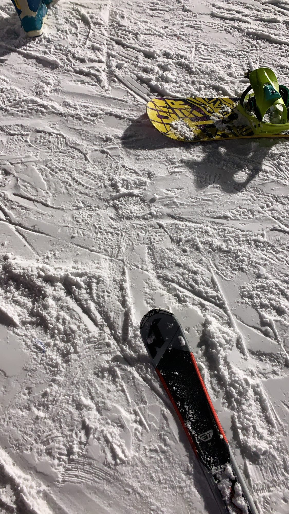
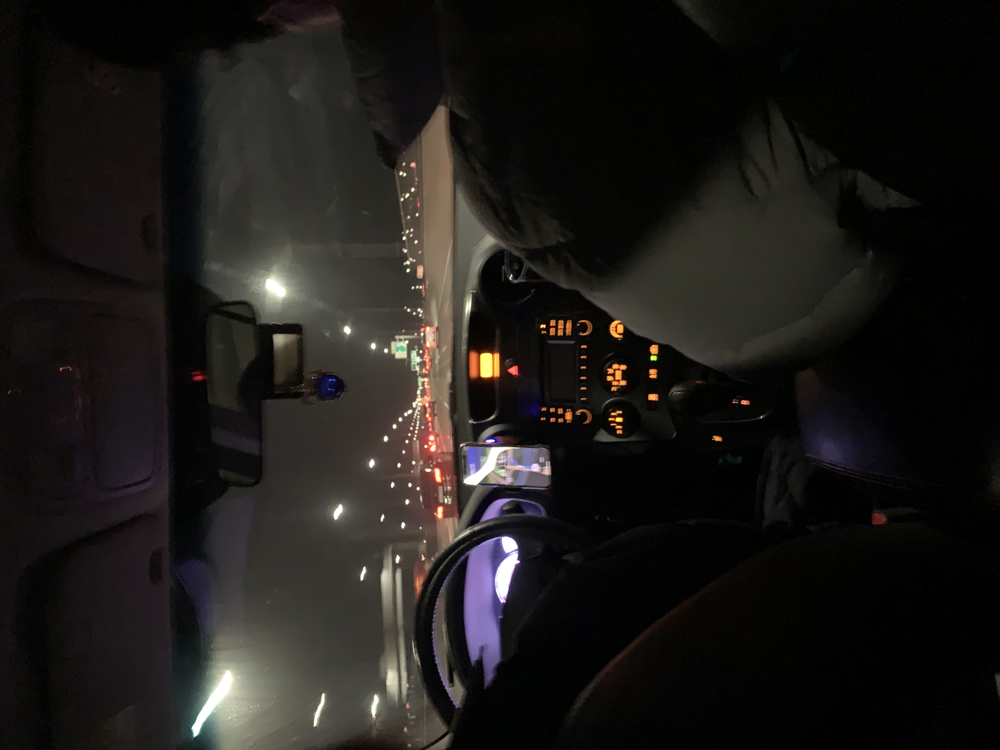

새해가 밝았습니다!  
22년이 된 지는 한달이 넘었지만 이제 설도 지났겠다 오랜만에 근황 한번 올려봅니다.

22년 되고 1월 한달은 개인적으로 정말 마음에 드는 한달이었네요.  
아직 어떤 분야로 가야 될지 못정하고 있었는데 일단 백엔드도 공부해보자 마음먹고 스프링 공부를 시작했고, 친구들이랑 `자바 웹 프로그래밍 Next Step` 이라는 책을 가지고 스터디도 시작했고, 예전부터 하던 알고 스터디도 계속 진행하면서 술도 꾸준히 마셔주는 아주 밸런스 있는 한달이었습니다.  

1박2일로 아주 잠깐 갔다온 홍천 비발디파크.  
홍천은 내가 없어도 잘 살고 있었고, 전부 다는 못갔지만 그래도 4년만에 슼기 모임 닉값 할 수 있었던 이틀이었네요. 다음에 다 같이 가면 그 때는 금잔디 별명 지울 예정ㅎ..  

공부도 공부지만 노는 것도 중요하다는 주의여서 아마 앞으로도 공부만 하면서 살진 않고, 밸런스 있게 놀 땐 놀면서 지낼 예정입니다. 물론 가면 갈수록 노는 비중은 줄여나가겠죠^^..  
이렇게 할 수 있는 것도 주변에 같이 놀아주는 친구들이 있으니까, 하하,, 항상 고맙네요. 특히 작년말부터는 맨날 같이 놀아주는 21학번들 고마워,, 취업하면 더 맛있는 거 사줄게ㅜ  

이제 다시 공부 얘기하자면, 앞으로 계획은 지금 하고 있는 자바 스터디를 2월 안에 끝내고 스프링 공부는 계속해서 이어갈 예정입니다. 물론 알고 스터디는 꾸준히 진행할 생각이구요.  
그리고 방학동안에 프론트, 백엔드 방향을 잡기 위해서 개인 프로젝트를 하나 진행할 예정인데 이게 야구랑 관련된 거라 개막 전에는 제대로 된 서비스를 만들기는 어렵다고 생각됩니다...  
그래도 개학 후에는 더 바쁠 거니까 처음 생각했던 것처럼 완벽하진 않아도 개학 전에 어느정도 프로젝트를 완성하고, 프로야구 개막 후에도 시간 될 때마다 기능을 개선하는 방향으로 프로젝트를 진행할 생각입니다.  
원래 운영체제나 컴퓨터구조, 네트워크 등 CS 관련 내용들도 정리할 생각이었는데 지금 당장은 이런 내용들 정리보다는 스프링 공부랑 프로젝트 경험이 더 중요하다고 생각해서 이런 정리들은 잠깐 뒤로 미루려고 합니다.  

1월 한달은 공부하는 마음가짐이랑 습관을 들이는 한달이었고,  
앞으로는 천천히 빠르게 시작하려고 합니다.  
올해는 우리 해라는데 열심히 해야죠,, 2022년 화이팅!
