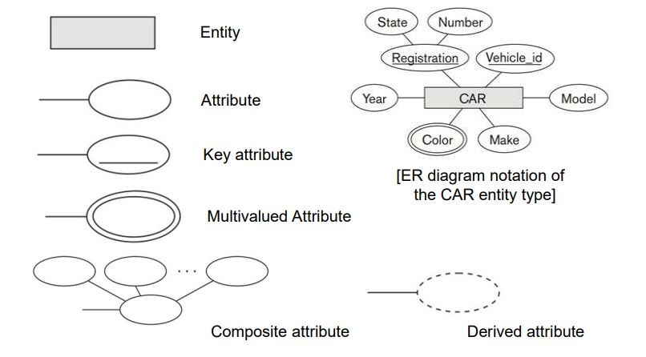
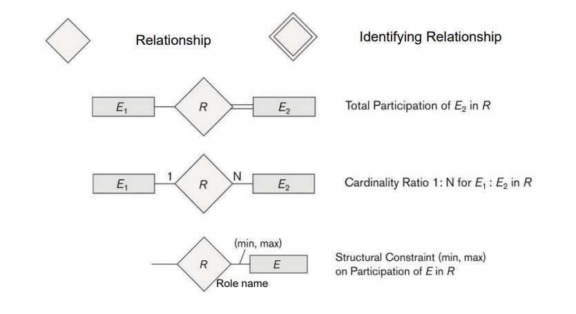

## 🎞 Database Design Process

  #### 1. 요구사항 수집 및 분석
  #### 2. Conceptual Design
  #### 3. Logical Design(or Data model mapping
  #### 4. Physical Design
  
---

## 💁‍♀️ Entity-Relationship(ER) model

데이터를 **Entity, Relationship, Attribute** 로 표현

* ### Entity
  ER model의 기본 컨셉으로, 구체적인 객체를 의미한다.  
  - **Entity Type** : 비슷한 속성을 가진 entity의 타입 (schema 같은 느낌)  
    ex) EMPLOYEE, COMPANY  
    > #### Weak Entity Type
    > 자기 자신을 위한 key attribute를 갖지 않는 entity type으로 항상 total participation을 맺음  
    > ( ER diagram에서 네모 두 개로 표현 )  
    > - **partial key** : weak entity를 식별할 수 있는 attribute로, owner entity type의 key와 합쳐서 표현되어야 함. (점선 밑줄로 표현)  
    
  - **Entity Set** : 특정한 순간에 데이터베이스에 있는 특정 entity type의 entity 집합 (state 같은 느낌)  
    ex) EMPLOYEE: e1, e2, ...  
  
* ### Attribute
  entity를 설명하는 특성으로, entity는 각각 attribute마다 특정한 값을 가진다.  
  각각의 attribute는 value set(or data type)을 가진다.  
  > * #### Attribute Type
  >   - **Simple (atomic)**
  >     ex) SSN
  >   - **Composite** : attribute가 여러 개의 요소들로 이루어진 경우  
  >     ex) Name(FirstName, LastName)
  >   - **Multi-valued** : attribute가 여러 개의 value를 가지는 경우  
  >     ex) {Color}
  
  - **Stored attribute**  
    : 값이 직접 저장된 attribute  
  - **Derived attribute**  
    : 저장된 값으로부터 파생되는 attribute  
  - **Complex attribute**  
    : composite attribute와 multi-valued attribute의 중첩  
  - **Key attribute**  
    : 각 entity가 고유한 값을 가지고, 고유하게 식별될 수 있는 특성 (하나 이상 가질 수 있음)  
  - **Value Sets (Domains) of Attribute**  
    : attribute마다 값들이 가져야 되는 domain  
    ex) 날짜의 경우에는 ***MM-DD-YYYY*** 같은 경우가 domain



* ### Relationship  
  둘 이상의 구별되는 entity들을 특정한 의미로 연관시키는 것  
  - **Relationship type R (관계 유형)** : entity들이 어떻게 연관되어 있는지에 대한 유형  
    ex) WORKS_ON, WORKS_FOR  
    
    > **Degree of relationship type**  
    > : relationship에 참여하고 있는 entity type의 수  
    > ex) Unary (1) (for self), Binary (2) (involving two), Tertiary (about three), …  

  - **Relationship set R (관계 집합)** : relationship instance들의 집합  

---

## 🚧 Structural Constraints on Binary Relationship Types

* ### Cardinality ratio  
  entity가 참여하는 relationship instance들의 최대 수 지정  
  ex) 1:1, 1:N, N:1, M:N  
  
* ### Participation constraint  
  관계를 맺는 두 entity type에 대해 한 entity가 존재하려면 다른 entity에 의존해야 하는지 여부를 나타냄 (최소 수)  
  - **Total Participation** : 모두 참여 (double line으로 표현)  
  - **Partial Participation** : 일부 참여 (double line으로 표현)  



```toc
```