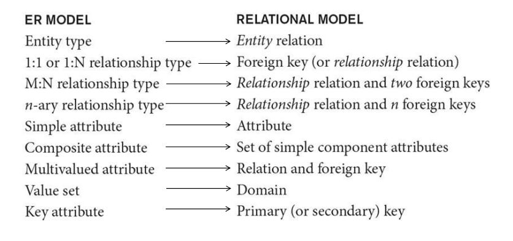

## 🗺 ER-to-Relational Mapping

* ### Goals  
  1. 모든 정보를 보존  
  2. 최대한 가능한 만큼 제약조건들을 유지  
  3. NULL 값들을 최소화  
  
---

## Step 1. Regular Entity Types
기존 엔터티의 attribute를 전부 포함하고, key attributes 중에서 하나를 골라 **Primary key**로 정한다.  
만약, 고른 key가 **composite**이면 해당하는 attribute들 모두 **Primary key**로 정한다.  

## Step 2. Weak Entity Types
**weak** 엔터티의 attribute를 전부 포함  
**owner** 엔터티의 **Primary key**를 **Foreign key**로 가지고,  
**owner** 엔터티의 **Primary key**와 weak 엔터티의 **Partial key**를 **Primary key**로 가진다.  

## Step 3. Binary 1:1 Relation Types
상황에 따라 3가지 방법으로 가능하다.  
### 1. Foreign key approach (2 relations)  
  주로 **한쪽이 total participation**일 때 사용  
  total participation인 쪽을 **S**, 반대를 **T**로 두면, T의 **Primary key**에 해당하는 **Foreign key**를 S에 만들어서 서로 연결시킨다.  
### 2. Merged relation (1 relation)  
  **둘다 total participation**인 경우에, 두 entity를 **하나의 relation**으로 합친다.  
### 3. Cross-reference or relationship relation (3 relations)  
  세 번째 relation **U**를 만들어서 S, T와 연결  
  S와 T의 **Foreign key** 중 하나를 U의 **Primary key**로 만들고, 나머지 **Foreign key** 하나는 U의 **Unique key**로 만든다.  
  추가적인 **join operation**이 필요

## Step 4. Binary 1:N Relation Types
**1-side**의 **Primary key**를 **N-side**에 **Foreign key**로 가지고 서로 연결시킨다.  

## Step 5. Binary M:N Relation Types
relationship relation이라 불리는 새로운 relation **U**를 생성  
각각 엔터티에서 **Primary key**들을 뽑아서 U의 **Foreign key**로 만들고 서로 연결  
이 때, 이 key들은 U의 **Primary key**가 된다.  

## Step 6. Multivalued attributes
**multivalued attribute A**에 대해서, 새로운 relation **U**를 만든다.  
U의 **Foreign key**로는, 원래 A attribute가 속했던 entity의 **Primary key**를 Foreign key로 가진다.  
U의 **Primary key**로는, 위에 얘기한 **Foreign key**와 원래 **attribute A**, 이렇게 둘을 Primary key로 가진다.  

## Step 7. N-ary Relationship Types
N-ary relationship type **R**에서 **n > 2** 면, 새로운 relationship relation **U**를 생성  
참여하는 모든 entity의 **Primary key**들을 U의 **Foreign key**로 가진다.  



```toc
```