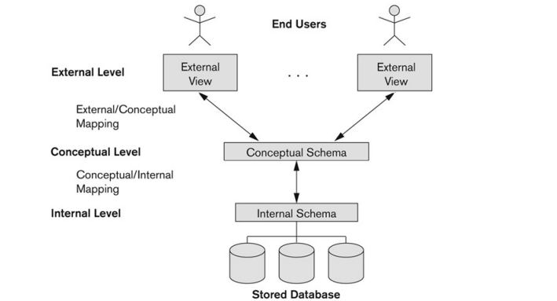

### Data Model
**데이터 추상화**를 달성하기 위해 필요한 수단 제공  
데이터베이스의 **구조(data types, relationships)**, 이런 구조를 조작하기 위한 **연산**, 데이터베이스가 가져야 할 **제약조건**의 집합으로 구성  

## 📚 Data Model 종류  

- ### Conceptual data models
  다수의 사용자가 데이터를 인식하는 방법과 비슷하게 개념(entity, attribute, relationship 등)을 제공  
  entity-based or object-based data model이라고도 불림 (***ER model***)  
  **high-level, semantic**  
  
- ### Physical data models
  데이터가 컴퓨터 저장매체에 어떻게 저장되는지에 관한 자세한 정보들을 제공  
  **low-level, internal**  
  
- ### Implementation data models
  개념적 모델을 컴퓨터가 처리할 수 있도록 변환  
  관계형데이터모델, 네트워크/계층 모델 등이 있음  
  **representational, logical**  

- ### Self-Describing data models
  데이터 description과 데이터 값들을 연결  
  NoSQL 시스템에서 주로 사용  

---

## 📜 Schema & Instance

### Database Schema
데이터베이스 구조, 데이터 타입, 제약조건에 대한 설명을 기술한 **메타데이터**의 집합으로  
데이터베이스 설계 중 지정되면 거의 변경되지 않음  

### Database Instance
**특정한 순간**에 데이터베이스에 저장되어 있는 실제 데이터로  
***Database State***라고도 불림  
> **Initial Database State** : DBMS에 처음 불려왔을 때의 state  
> **Valid State** : 데이터베이스의 구조와 제약조건을 만족하는 state  

---

## 🚦 Three-Schema Architecture

[DB 시스템의 주요 특징](https://jfelog.netlify.app/db-introduction/#-db-%EC%8B%9C%EC%8A%A4%ED%85%9C%EC%9D%98-%EC%A3%BC%EC%9A%94-%ED%8A%B9%EC%A7%95) 중 1 ~ 3번을 만족하기 위한 구조로  
사용자 어플리케이션과 물리적 데이터베이스를 분리시키기 위한 목적을 가지고 있다.  



- ### Internal(physical) Schema
  물리적인 storage 구조와 접근 경로에 대해 설명한다.  
  일반적으로 **physical** data model을 사용  
  
- ### Conceptual(logical) Schema
  전체 데이터베이스의 구조와 제약조건들에 대해 설명한다.  
  일반적으로 **conceptual(ex. ER)** 이나 **implementation(ex. relational)** data model을 사용  
  
- ### External(view level) Schema
  다양한 사용자 뷰에 대해 설명한다.  
  보통 conceptual schema와 같은 데이터 모델을 사용하고, 사용자가 관심있어 하는 부분에 대해서만 보여주고 나머지는 숨긴다.  
  
실제로 요청이 들어오면 그 **요청**을 **데이터**로 변환하기 위해 **Mapping**이 필요하다.  
실제 데이터는 physical level에만 존재하기 때문에 **external schema**로부터 요청이 들어오면 **conceptual schema**를 거쳐 **internal schema**에서 실제 데이터에 접근해 요청을 수행한다.  

---

## 🏳 Data Independence

데이터베이스 시스템에서 한 level의 schema가 변경되었을 때, 다른 상위 level의 schema 변경이 필요하지 않도록 독립되어 있는 것  
상위 스키마의 변경 없이 해당 스키마와 상위 레벨 스키마 사이의 mapping만 변경하면 된다.  

- ### Logical data independence
  external schema 변경 없이 ***conceptual(logical) schema***를 변경할 수 있는 능력  
  
- ### Physical data independence
  conceptual(logical) schema 변경 없이 ***internal(physical) schema***를 변경할 수 있는 능력  


```toc
```