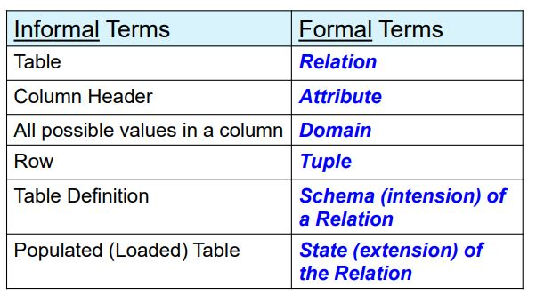

## 🔗 Relational Model Concepts

* ### Relation  
  집합을 베이스로 한 수학적인 개념으로, **table**과 같은 역할을 한다.  
  table처럼 여러 row와 column을 가지고 있는데 이때, row를 ***tuple***, column을 ***attribute***라고 부른다.  
  relation은 튜플을 유일하게 식별할 수 있는 ***key***를 가지고, 적합한 key가 없는 경우에는 임의의 key를 추가할 수 있는데 이것을 **surrogate key(or artificial key)** 라고 부른다.  
  
* ### Schema  
  `R(A_1, A_2, … , A_n)`  
  R : relation 이름  
  A_1, A_2, … , A_n : attribute 리스트  
  degree of relation R : R의 attribute 수  
  
* ### Tuple  
  값들이 정렬된 집합으로 <...> 내부에 표현된다.  
  튜플의 값들은 알맞은 **domain**으로부터 나와야 한다.  
  attribute의 순서는 무조건 지켜져야 하지만, tuple의 순서는 중요하지 않다.  
  tuple의 모든 값들은 atomic 해야 한다. (Composite or multi-valued attribute는 안됨)  
  > #### NULL values in certain tuples  
  > - **Unknown** : 아직 모르는 경우  
  > - **Not available** : 아직 해당하는 값이 없는 경우 (ex. 휴대폰이 없어서 아직 번호가 없는 경우)  
  > - **Inapplicable** : 적용되지 않는 경우 (ex. 성별에 따라 적용이 되지 않는 항목이 있을 수 있음)  
  
* ### Domain  
  atomic한 값의 집합으로, 해당 attribute가 가져야 되는 값들의 타입을 나타낸다.  
  ex) 한국 폰 번호의 경우에는, **01X-XXXX-XXXX** 과 같은 형식  
  
* ### State  
  attribute들마다 domain의 데카르트 곱(Cartesian product) 중 부분집합으로,  
  attribute들이 가질 수 있는 값들 중 **실제로 가지고 있는 값들의 집합**을 의미한다.  



---

## 🚨 Constraints

DB 무결성을 지키기 위해 사용되는 조건으로 크게 다음과 같이 3가지의 제약조건들이 있다.  
#### 1. Inherent or Implicit constraints  
: data model 스스로 가지는 제약조건  
#### 2. Schema-based or Explicit constraints  
: data model schema 자체에 직접적으로 명시되어 있는 제약조건  
#### 3. Application-based or Semantic constraints  
: data model과 상관없이 application 프로그램에서 강제되어야 하는 제약조건  
=> application program에 명세하며, ***TRIGGER***나 ***ASSERTION***을 사용해서 해결

이 중 **Relational model**에서의 제약조건들은 **두 번째 제약조건**에 해당한다.  

---

## 🚨 Relational Integrity Constraints

### 1. Key constraints (Unique constraints)  
: relation에서 모든 tuple들은 서로 유일하게 구별되어야 한다.  
> * #### Super Key  
>   속성들의 집합으로 구성된 키로, 유일성을 만족  
>   이 중, 최소성을 만족하는 것이 Key  
> * #### Candidate Key  
>   튜플을 유일하게 식별할 수 있는 속성들의 부분집합  
>   모든 relation은 반드시 하나 이상의 후보키를 가져야 함  
> * #### Primary Key  
>   후보키 중에서 선택한 주 키 (나머지는 unique key)  
>   Null 값을 가질 수 없고, 동일한 값이 중복 저장될 수 없음  

### 2. Entity integrity constraints (엔터티 무결성 제약조건)  
: primary key는 NULL 값을 가질 수 없다.  

### 3. Refrential integrity constraints (참조 무결성 제약조건)  
: foreign key의 값은 참조하고 있는 relation의 primary key에 존재하는 값만 가능  

---

## 🧵 Integrity violation 해결 방법  

#### 1. Cancel the operation  
: RESTRICT or REJECT 옵션을 사용해서 violation을 일으키는 operation을 바로 취소시키는 방법  
#### 2. Operation 수행하고 나서, 사용자에게 violation 알려주는 방법  
: 권장하지 않음.  
#### 3. violation을 해결하도록 추가적인 update trigger  
: CASCADE, SET NULL or SET DEFAULT 옵션 사용  
#### 4. 사용자 지정 error-correction 실행  
: 프로그램이 미리 지정되어 있어야 함  

```toc
```