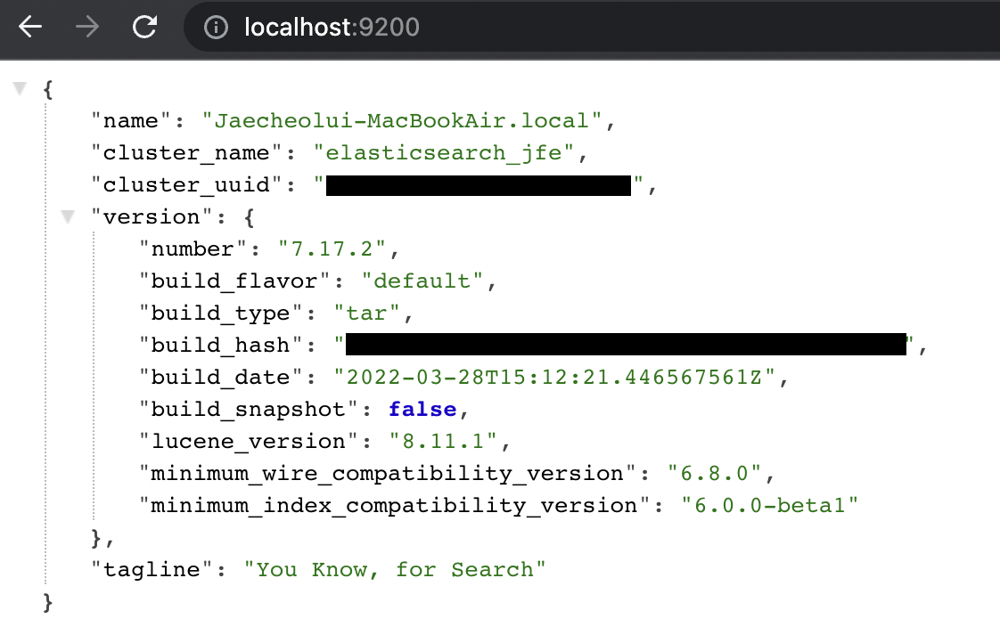
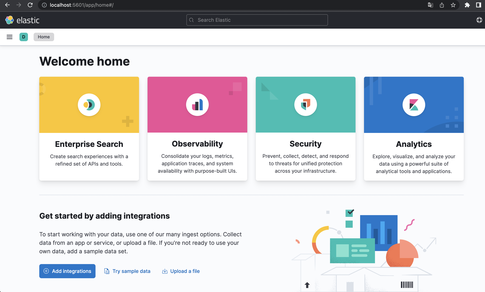

## 1. Homebrew 설치  

```shell
/bin/bash -c "$(curl -fsSL https://raw.githubusercontent.com/Homebrew/install/master/install.sh)"
```
**Homebrew** 설치가 되어있지 않으면 터미널에서 위 명령어를 입력하여 설치할 수 있다.  

---

## 2. elastic tap 저장소 추가  
```shell
brew tap elastic/tap
```
터미널에서 위 명령어를 통해 elastic 패키지 저장소를 추가할 수 있다.  

---

## 3. Elasticsearch 설치 및 실행  
```shell
brew install elastic/tap/elasticsearch-full
```
위 명령어로 **Elasticsearch**를 설치할 수 있고 
```shell
elasticsearch
```
설치 완료 후에는 `elasticsearch` 명령어를 통해 **Elasticsearch**를 실행할 수 있다.  
백그라운드에서 실행하고 싶으면 `elasticsearch` 명령어 대신 다음과 같은 명령어로 실행할 수도 있다.  
(중단할 경우에는 `start` 대신에 `stop` 사용)  
```shell
brew services start elastic/tap/elasticsearch-full
```

실행 후에는 [http://localhost:9200](http://localhost:9200) 에 접속하여 제대로 실행되었는지 확인할 수 있다.  
다음과 같은 화면이 보이면 제대로 실행중인 경우  
  

---

## 4. Kibana 설치 및 실행  
```shell
brew install elastic/tap/kibana-full
```
**kibana** 또한 위 명령어로 **kibana**를 설치할 수 있고 
```shell
kibana
```
설치 완료 후에는 `kibana` 명령어를 통해 실행할 수 있고,  
다음과 같은 명령어로 백그라운드에서 실행할 수도 있다.  
```shell
brew services start elastic/tap/kibana-full
```

실행 후에는 [http://localhost:5601](http://localhost:5601) 에 접속하여 제대로 실행되었는지 확인할 수 있다.  
다음과 같은 화면이 보이면 성공  
  

---

## 5. Logstash 설치 및 실행  
```shell
brew install elastic/tap/logstash-full
```
**Logstash**도 위 명령어를 통해 설치할 수 있고,  
실행하기 전에 인덱싱하기 적절하게 필터링을 위한 설정 파일(`logstash-sample.conf`)을 수정하여 필터링 설정을 할 수 있다.  
```shell
cd /opt/homebrew/etc/logstash
```
**Homebrew**를 이용하여 설치한 경우에는 다음과 같은 경로에서 설정 파일들을 확인할 수 있고  
여기서 `logstash-sample.conf` 설정 파일을 수정하면 된다.  
```shell
vi logstash-sample.conf
```

```shell
# Sample Logstash configuration for creating a simple
# Beats -> Logstash -> Elasticsearch pipeline.
input {
  beats {
    port => 5044
  }
}

output {
  elasticsearch {
    hosts => ["http://localhost:9200"]
    index => "%{[@metadata][beat]}-%{[@metadata][version]}-%{+YYYY.MM.dd}"
    #user => "elastic"
    #password => "changeme"
  }
}
```
설정 파일을 열어보면 위와 같이 파일이 구성되어 있는데 여기서 `filter`를 추가하여 필터링 설정을 할 수 있다.  
(filter 설정에 대한 예시는 이후 포스트에서 다룰 예정)  
이렇게 설정한 후에는 해당 디렉토리에서 다음 명령어를 통해 **Logstash**를 실행할 수 있다.  
```shell
logstash -f logstash-sample.conf
```

---

## 6. Filebeat 설치 및 실행  
```shell
brew install elastic/tap/filebeat-full
```
**Filebeat**도 위 명령어를 통해 설치할 수 있고,  
실행하기 전에 설정 파일(`filebeat.yml`)을 수정하여 **input**과 **output**에 대한 설정을 할 수 있다.  
```shell
cd /opt/homebrew/etc/filebeat
vi filebeat.yml
```
**Filebeat** 설정에 대한 설명도 이후 포스트에서 예시를 통해 다룰 예정이다.  
이렇게 설정한 후에는 해당 디렉토리에서 다음 명령어를 통해 **Filebeat**를 실행할 수 있다.  
```shell
filebeat -e                 # 일반적으로 실행 하는 경우
filebeat -e -c filebeat.yml # -c 옵션은 configuration 파일을 특정할 때 사용 (-c 사용안하면 default는 filebeat.yml)
```

```toc
```