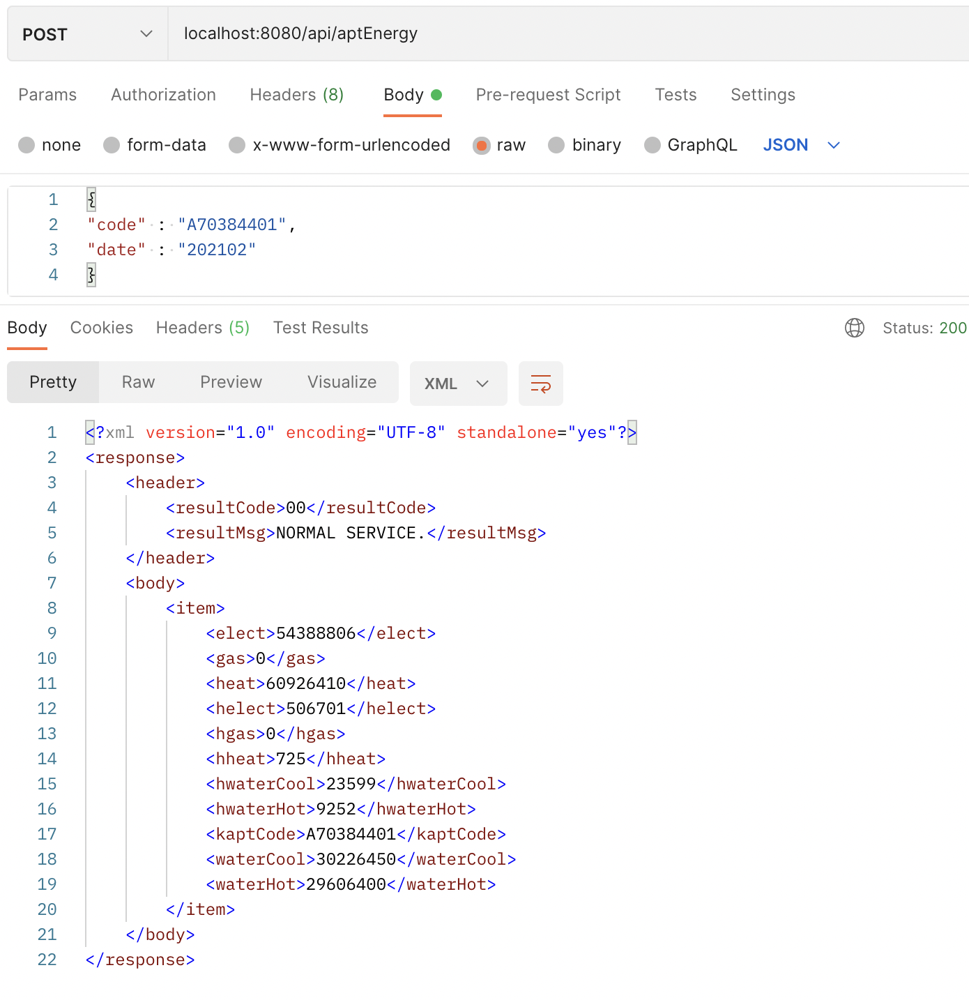
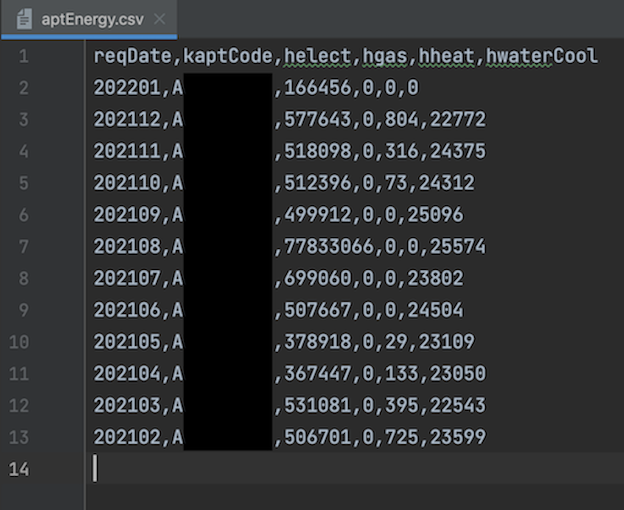
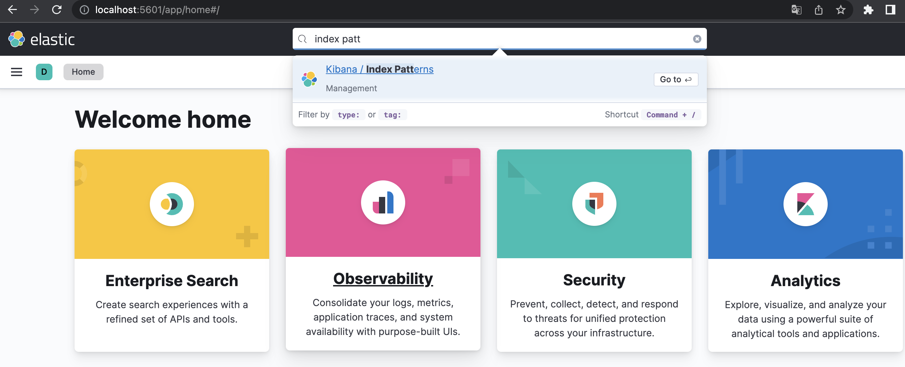
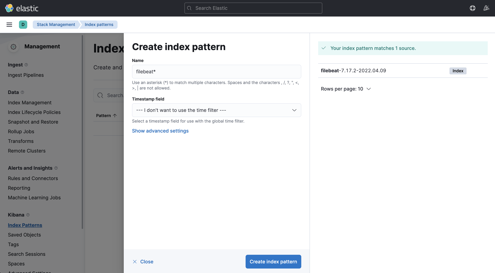
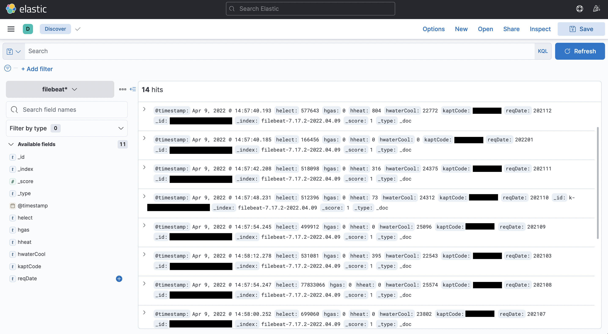

## 1. 공공데이터 api 준비  

일단 먼저 원하는 공공데이터 api를 [공공데이터 포털](https://www.data.go.kr/)에서 확인할 수 있다. 여기서 자신이 원하는 다양한 공공데이터를 찾을 수 있고, csv 형태의 파일 데이터나 api 형식으로 제공받을 수 있는데 이 포스트에서는 실제 프로젝트 진행 중에 사용했던 공공데이터 api를 기준으로 설명할 것이다.  
[국토교통부_공동주택 에너지 사용 정보](https://www.data.go.kr/data/15012964/openapi.do) api로 api를 호출하면 xml 형태의 데이터를 반환해준다.  

## 2. 데이터 전처리  

Filebeat가 파일을 읽어서 logstash로 보낼 때, 보통 csv 파일을 읽도록 하는 것이 편하기 때문에 Spring 환경에서 api를 호출하면서 xml 형태의 호출 결과를 csv 파일 형식으로 저장하도록 설정했다.  
([Xml filter plugin](https://www.elastic.co/guide/en/logstash/current/plugins-filters-xml.html)을 사용해서 Logstash에서 filter 설정을 하는 방법도 있다.)  

공공데이터 api 호출 방법은 [국토교통부_공동주택 에너지 사용 정보](https://www.data.go.kr/data/15012964/openapi.do) 하단에 샘플 코드를 제공하고 있어서 이를 활용해서 api 호출을 쉽게 할 수 있고, xml 호출 결과를 csv 파일로 변환하는 방법은 xsl 파일을 이용해서 csv 형태의 스타일로 바꿔서 파일을 저장하는 방식으로 진행했다.  

```java
private void xmlToCsv(String xml, String apiName) throws Exception{
        File stylesheet = new File("src/main/resources/data/" + apiName + "Style.xsl");

        DocumentBuilderFactory factory = DocumentBuilderFactory.newInstance();
        DocumentBuilder builder = factory.newDocumentBuilder();
        Document document = builder.parse(new InputSource(new StringReader(xml)));

        StreamSource stylesource = new StreamSource(stylesheet);
        Transformer transformer = TransformerFactory.newInstance()
                .newTransformer(stylesource);
        Source source = new DOMSource(document);
        Result outputTarget = new StreamResult(new FileOutputStream("src/main/resources/data/" + apiName + ".csv", true));
        transformer.transform(source, outputTarget);
    }
```
[참고 : [https://stackoverflow.com/questions/21413978/convert-an-xml-file-to-csv-file-using-java](https://stackoverflow.com/questions/21413978/convert-an-xml-file-to-csv-file-using-java)]

```xml
<?xml version="1.0"?>
<xsl:stylesheet version="1.0" xmlns:xsl="http://www.w3.org/1999/XSL/Transform">
<xsl:output method="text" omit-xml-declaration="yes" indent="no"/>
<xsl:template match="/">
reqDate,kaptCode,helect,hgas,hheat,hwaterCool
<xsl:for-each select="//item">
<xsl:value-of select="concat(kaptCode, ',', helect, ',', hgas, ',', hheat, ',', hwaterCool, '&#xA;')"/>
</xsl:for-each>
</xsl:template>
</xsl:stylesheet>
```
위와 같은 형태의 xsl 파일을 이용해서 원하는 값들만 csv 스타일로 지정할 수 있다.  
그러면 다음과 같은 xml 형식의 응답 데이터들 중 원하는 값들만 csv 파일에 저장할 수 있다.  

  
  

(reqDate의 경우는 응답 데이터에는 없지만 따로 필요하기 때문에 위 `xmlToCsv()` 메소드를 수정해서 추가했습니다.)  

---

## 3. Elasticsearch 및 Kibana 실행  
앞서 포스트에서 진행한 것처럼 Elastic Stack 전부 다 설치 완료되었다고 생각하고 같은 방법으로 실행하면 된다.  
```shell
brew services start elastic/tap/elasticsearch-full
brew services start elastic/tap/kibana-full
```
위 명령어로 Elasticsearch와 Kibana를 백그라운드에서 실행해주고, 이제 Logstash 설정으로 넘어가면 된다.  

---

## 4. Logstash 설정 및 실행  
실행하기 전에 인덱싱하기 적절하게 필터링을 위한 설정 파일(`logstash-sample.conf`)을 수정하여 필터링 설정을 할 수 있는데 Homebrew를 통해 설치한 경우에는 다음과 같은 경로에 Logstash의 설정 파일들이 위치해 있다.  
```shell
cd /opt/homebrew/etc/logstash
vi logstash-sample.conf
```
```shell
# Sample Logstash configuration for creating a simple
# Beats -> Logstash -> Elasticsearch pipeline.
input {
  beats {
    port => 5044
  }
}

output {
  elasticsearch {
    hosts => ["http://localhost:9200"]
    index => "%{[@metadata][beat]}-%{[@metadata][version]}-%{+YYYY.MM.dd}"
    #user => "elastic"
    #password => "changeme"
  }
}
```
처음 설정 파일을 열어보면 위와 같이 파일이 구성되어 있는데 여기서 `filter`를 추가하여 필터링 설정을 할 수 있다.  
"message" 필드를 통해 데이터들이 들어오고 csv 형태의 파일들은 ","를 기준으로 데이터들이 나뉘기 때문에 이를 이용해서 값들을 나누어주면 된다.  
나뉜 값들은 이름을 지정해서 새로운 필드로 추가해주면 되고, 기본으로 제공하는 필요없는 필드들은 제거해주면 된다.  

```shell
# Sample Logstash configuration for creating a simple
# Beats -> Logstash -> Elasticsearch pipeline.
input {
  beats {
    port => 5044
  }
}

filter {
  mutate {
    split => ["message", ","]
    add_field => {
      "reqDate" => "%{[message][0]}"
      "kaptCode" => "%{[message][1]}"
      "helect" => "%{[message][2]}"
      "hgas" => "%{[message][3]}"
      "hheat" => "%{[message][4]}"
      "hwaterCool" => "%{[message][5]}"
    }

    remove_field => ["ecs", "host", "@version", "agent", "log", "tags", "input", "message"]
  }
}

output {
  elasticsearch {
    hosts => ["http://localhost:9200"]
    index => "%{[@metadata][beat]}-%{[@metadata][version]}-%{+YYYY.MM.dd}"
    #user => "elastic"
    #password => "changeme"
  }
}
```

이렇게 설정한 후에는 해당 디렉토리에서 다음 명령어를 통해 **Logstash**를 실행한다.  
```shell
logstash -f logstash-sample.conf
```

---

## 5. Filebeat 설정 및 실행  
실행하기 전에 설정 파일(`filebeat.yml`)을 수정하여 **input**과 **output**에 대한 설정을 할 수 있다.  
```shell
cd /opt/homebrew/etc/filebeat
vi filebeat.yml
```
```shell
# ============================== Filebeat inputs ===============================

filebeat.inputs:

# Each - is an input. Most options can be set at the input level, so
# you can use different inputs for various configurations.
# Below are the input specific configurations.

# filestream is an input for collecting log messages from files.
- type: filestream

  # Change to true to enable this input configuration.
  enabled: true

  # Paths that should be crawled and fetched. Glob based paths.
  paths:
    - /Users/jfe/Desktop/Carbon_Tracker/Server/carbonTracker/src/main/resources/data/aptEnergy.csv
```
설정 파일에서 input 부분에서 filestream 타입의 input을 허용해주기 위해 enabled: true로 바꿔주고, 읽기 원하는 데이터 파일의 경로를 지정해주면 된다.  
그 다음, Filebeat -> Logstash -> Elasticsearch -> Kibana 순서로 데이터를 보내기 때문에 Elasticsearch로의 output 부분은 전부 주석 처리해주고, Logstash로의 output 부분 주석들을 해제해주면 된다.  

```shell
# ---------------------------- Elasticsearch Output ----------------------------
# output.elasticsearch:
  # Array of hosts to connect to.
  # hosts: ["localhost:9200"]

  # Protocol - either `http` (default) or `https`.
  #protocol: "https"

  # Authentication credentials - either API key or username/password.
  #api_key: "id:api_key"
  #username: "elastic"
  #password: "changeme"

# ------------------------------ Logstash Output -------------------------------
output.logstash:
  # The Logstash hosts
  hosts: ["localhost:5044"]
```

이렇게 설정한 후에는 해당 디렉토리에서 다음 명령어를 통해 **Filebeat**를 실행하면 된다.  
```shell
filebeat -e                 # 일반적으로 실행 하는 경우
filebeat -e -c filebeat.yml # -c 옵션은 configuration 파일을 특정할 때 사용 (-c 사용안하면 default는 filebeat.yml)
```

---

## 6. Kibana에서 데이터 확인  

[http://localhost:5601](http://localhost:5601) 에 접속하여 제대로 실행되었는지 확인하고, Index Patterns로 이동해서 index pattern을 설정하면 된다.  
데이터가 정상적으로 수집되고 있으면 해당 index가 보여지고, 그 index를 기준으로 pattern을 만들 수 있다.  
  
  

생성한 index pattern에 대한 데이터들은 discover 메뉴로 가서 확인할 수 있다.  
  

---

공공데이터 api를 연동해서 얻은 데이터를 Filebeat -> Logstash -> Elasticsearch -> Kibana 순서로 수집하는 방법에 대해서 간단하게만 포스팅했는데, 그래서 데이터 전처리도 아직 완벽하게 하지 않았고 Kibana 사용 방법도 아직 제대로 알지는 못해서 프로젝트를 더 진행하면서 추후에 프로젝트 진행 과정과 회고와 함께 추가로 포스팅하겠습니다. (종프 화이팅,,)  

---

## 📎 Reference  
[https://www.data.go.kr/data/15012964/openapi.do](https://www.data.go.kr/data/15012964/openapi.do)  
[https://stackoverflow.com/questions/21413978/convert-an-xml-file-to-csv-file-using-java](https://stackoverflow.com/questions/21413978/convert-an-xml-file-to-csv-file-using-java)  
[https://taetaetae.github.io/posts/make-dashboards-from-elasticstack-1/](https://taetaetae.github.io/posts/make-dashboards-from-elasticstack-1/)  
[http://trandent.com/article/etc/detail/323366](http://trandent.com/article/etc/detail/323366)

```toc
```