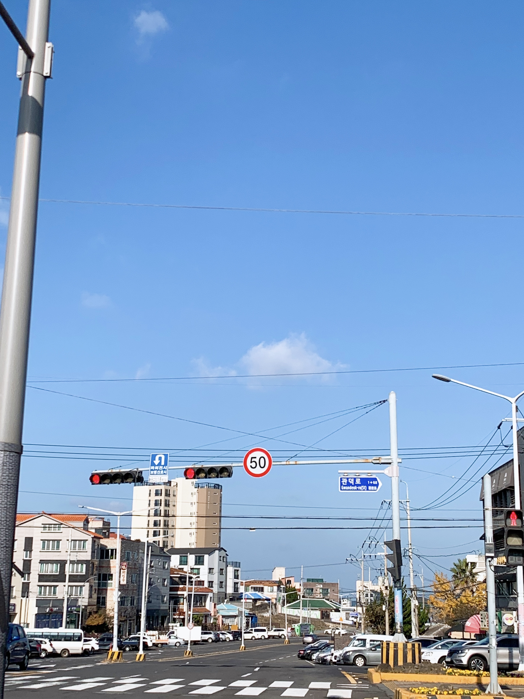

드디어..! 블로그 시작하기로 했습니다.  

사실 이전에 **velog**에도 시험 공부하면서 몇 개 정리해두긴 했지만 별로 많이 하진 않았고,   
이후에 올해 여름부터 **gatsby**를 이용해서 제대로 된 블로그를 만드려고 했었지만 디자인부터 다 하려니 막막해서 하다가 그만뒀었습니다..ㅎ

그러다가 갑자기 이번 기말 시험 공부는 어디에 정리할까 고민하다 다시 블로그를 만들어볼까 생각했고, 괜찮은 **gatsby** 테마를 찾아서 바로 만들어버렸네요.  
제주도 갔다와서 조금 변화가 있었던 것 같기도 하고 그냥 시험기간이어서 바로 만들었지 않을까 ^^,,  
아무래도 테마없이 노베이스에서 디자인부터 하다가 포기하는 것보다는 괜찮은 테마 골라서 내 입맛대로 바꾸는게 훨씬 도움되는 듯.  

일단 블로그는 기술 블로그긴 하지만 이렇게 일상 관련 두서없는 포스트들도 올릴 생각이다. 물론 내 성격상 거의 안올릴 듯 하지만,,  
이번 학기 마지막 기말 시험들 디비나 기학개, 데통 등 정리 글들 먼저 올리고 나서 종강하고 이전에 못올린 컴구, 운체 정리 글들을 올리지 않을까라고 생각해봅니다. 아 알고 스터디도 계속하면서 이제 여기도 올려야지  

종강하고 할 것들은 나중에 생각하고 당장 지금 발등에 불은 어카지;;  
