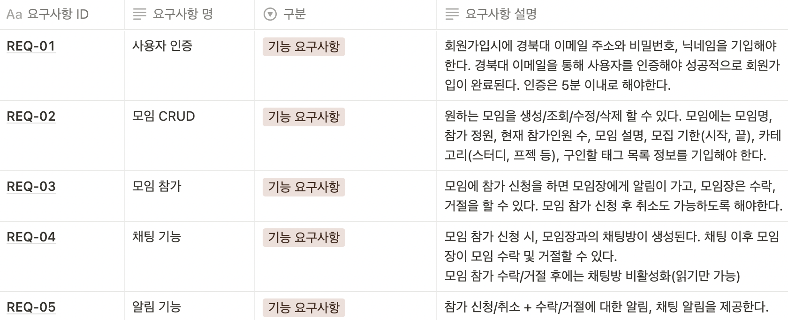
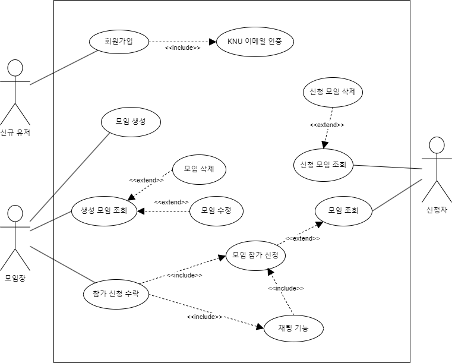
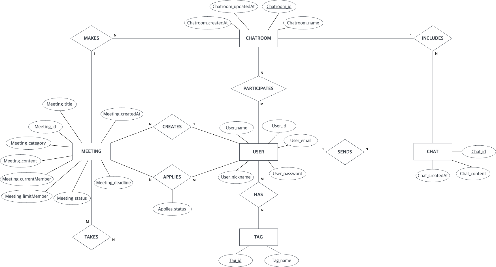
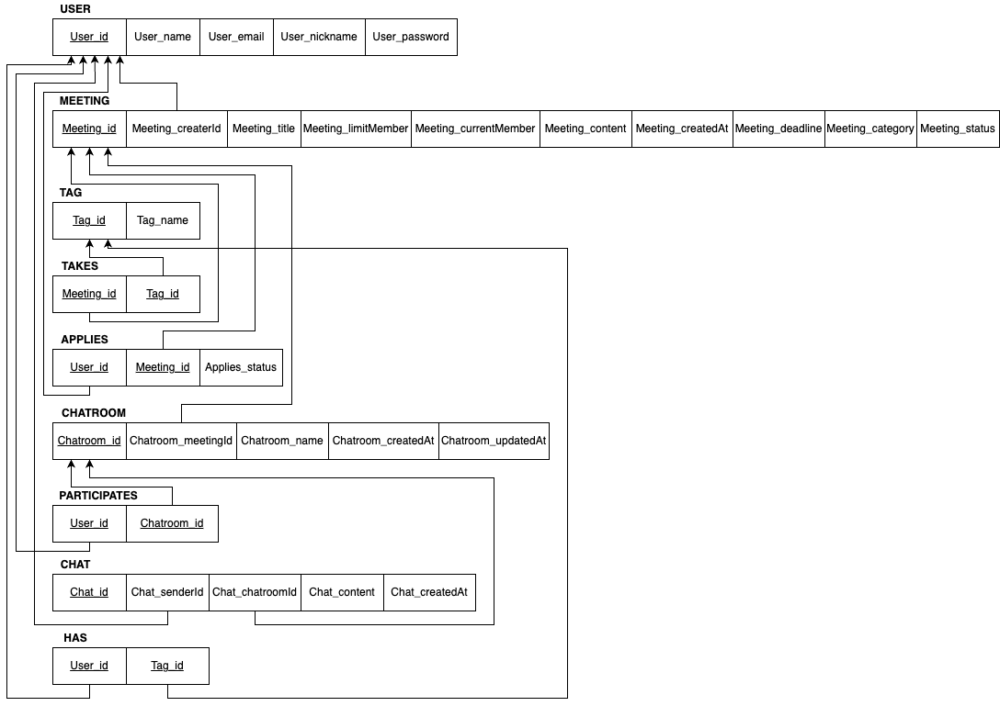
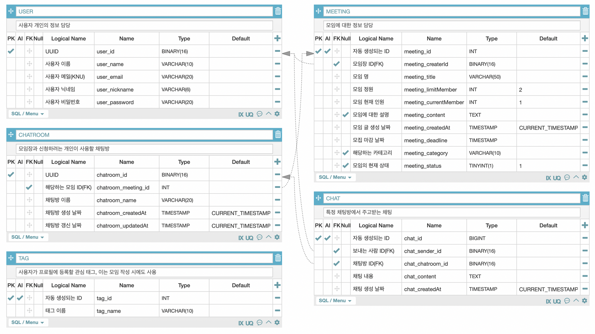
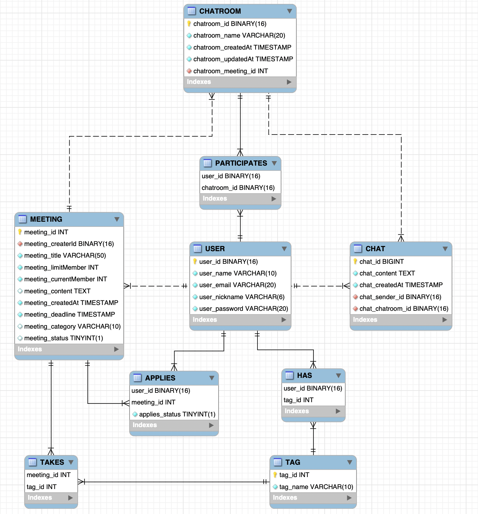

학교 멘토링 프로그램으로 카카오 판교 아지트를 방문하고 자극을 받은 뒤, 2학기가 시작하기 직전인 8월 중순 무렵부터 새로운 프로젝트를 시작했다.  

주제로 삼은 건 경북대 학생들을 위한 프로젝트/스터디 구인구직 사이트.  
이미 우리 과에서는 7월 쯤부터 노션을 통해 학부생들을 위해 서비스를 제공하고 있었지만, 노션으로 사용하기에는 불편함을 느껴 웹으로 만들어보고 싶다는 욕심이 생겼다.  
그렇게 새로운 프로젝트를 시작했고, 지금까지 진행한 프로젝트 진행 상황과 앞으로 있을 프로젝트 진행 상황에 대해서 포스팅 해볼 예정이다.  

## 🧾 요구사항 정의 및 기능 설계

우선 사용자 요구사항 정의서를 작성하면서 프로젝트에 필요한 기능들을 생각했다.  



<center>[사용자 요구사항 정의서]</center>
<br/>

**회원가입/로그인** 부분은 전체 서비스가 경북대 학생들을 위한 서비스이기 때문에 `@knu.ac.kr` 메일 인증을 거쳐서 **회원가입**을 하고 **로그인** 할 수 있도록 기능을 설계했다.  
그 다음에는 서비스에서 가장 중요하고 없어서는 안되는 기능인 **모임 CRUD**와 **참가 기능**을 넣었다.  
모임에는 **카테고리**와 **태그**를 넣어서 검색 시에 필터링 할 수 있도록 구현할 예정이다.  

다음으로는 **채팅 기능**에 대해 설계했다.  
**채팅 기능**도 이 프로젝트를 시작하게 된 큰 이유 중 하나다.  
기존 노션을 이용한 구인구직 시스템에는 채팅 기능이 없어서 모임장은 자신의 연락처를 남기고 참여를 원하는 사람이 직접 연락을 하는 방식이었는데, 이는 개인정보 유출 문제도 생길 수 있을 뿐더러 연락을 위해 플랫폼을 옮기는 것부터가 사용자 친화적이지 못하다고 생각해서 **채팅 기능**을 꼭 넣어야겠다고 생각했다.  

프로젝트는 크게 **프론트엔드**는 `React`, **백엔드**는 `Spring Boot`를 사용하여 개발하기로 했다.  
특히 이번에는 개인적으로 저번 프로젝트에서 많이 다뤄보지 못한 Spring을 다뤄볼 수 있는 기회라고 생각하고 프로젝트에 임했다.  

🛠 기술 스택  
> **프론트엔드**  
> - React  
> - Tailwind CSS  
> - React Query  
> - Vite, Vitest  

> **백엔드**  
> - Java  
> - Spring Boot  
> - MySQL  
> - AWS EC2, RDS  

---

## 🙆 Usecase Diagram

**Usecase Diagram**을 그리기 전에 위에서 정의한 요구사항 정의서를 바탕으로 먼저 전체 흐름을 적어두고, **Actor**와 **Usecase**를 나눈 다음 다이어그램을 그렸다.  

**Actor**는 크게 모임을 만드는 `모임장`과 원하는 모임에 신청하는 `신청자`, 그리고 처음 서비스를 이용하는 `신규 유저`로 나눴다.  
**Usecase**는 서비스에 필요한 기능들을 하나씩 나누었고, 이 기능들 간의 관계를 생각해서 다이어그램을 그렸다.  



<center>[Usecase Diagram]</center>  
<br/>

회원가입은 이메일 인증을 거쳐야 가능하기 때문에 `include` 관계로 표현했고,  
신청자가 모임 참가 신청을 해야 채팅이 가능하고 채팅을 거친 다음에 모임장이 참가 신청에 대한 수락/거절을 하기 때문에 이 과정을 `include` 관계로 표현했다.  
또한, 나머지 수정/삭제 기능들은 조회에 대한 추가 기능이기 때문에 `extend` 관계로 표현했다.  

아직까지도 **Usecase Diagram**은 헷갈리는 부분이 많다.  
특히 `include`, `extend` 관계 부분이 헷갈리는데, 소프트웨어 설계 수업을 들을 때도 그랬지만 다이어그램을 그리고 제대로 된 정답을 알 수가 없어서 잘 모르겠다,,  
그래도 나름 팀원들과 머리를 맞대서 그려봤는데 `include` 부분은 주변 다른 사람들의 조언도 구해서 맞는지 한번 더 확인해봐야겠다.  

---

## 🔗 ER Diagram

처음부터 바로 **ER Diagram**을 그릴 수도 있지만, DB 수업 때 배운 방식대로 **Entity**와 **Relation**을 생각해서 차근차근 그려나갔다.  



<center>[ER Model]</center>  
<br/>

우선 서비스에 필요한 기능을 바탕으로 필요한 **Entity**들을 추려냈고, 이 **Entity**들에 필요한 필드들을 정의한 다음에 위와 같은 `ER Model`을 그렸다.  

이후, `ER Model`을 바탕으로 **Relational Mapping** 과정 [[Database] ER-to-Relational Mapping](https://jfelog.netlify.app/db-er-to-relational/)을 거쳐 **PK**와 **FK**를 명시한 다음과 같은 `Relational Model`을 만들었다.  



<center>[Relational Model]</center>  
<br/>

마지막으로 필요한 `주요 테이블 정보`들을 정리하고, 지금까지 설계한 내용들을 바탕으로 `ER Diagram`을 그리며 마무리했다.  



<center>[주요 테이블 정보]</center>  
<br/>



<center>[ER Diagram]</center>  
<br/>


```toc
```