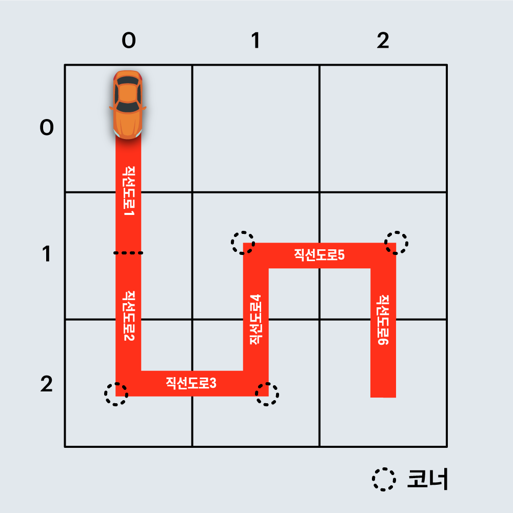
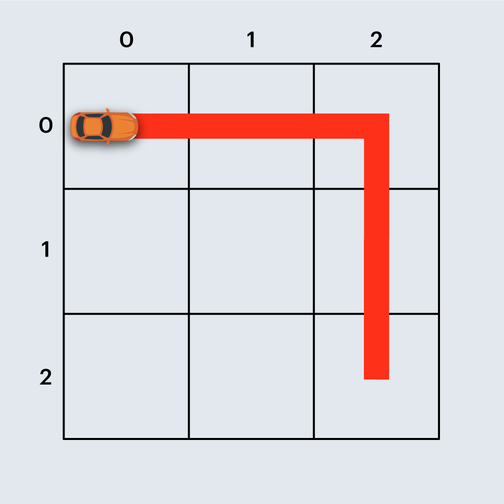

## [2020 카카오 인턴십]

## 문제
https://programmers.co.kr/learn/courses/30/lessons/67259

건설회사의 설계사인 죠르디는 고객사로부터 자동차 경주로 건설에 필요한 견적을 의뢰받았습니다.  
제공된 경주로 설계 도면에 따르면 경주로 부지는 `N x N` 크기의 정사각형 격자 형태이며 각 격자는 `1 x 1` 크기입니다.  
설계 도면에는 각 격자의 칸은 `0` 또는 `1` 로 채워져 있으며, `0`은 칸이 비어 있음을 `1`은 해당 칸이 벽으로 채워져 있음을 나타냅니다.  
경주로의 출발점은 (0, 0) 칸(좌측 상단)이며, 도착점은 (N-1, N-1) 칸(우측 하단)입니다. 죠르디는 출발점인 (0, 0) 칸에서 출발한 자동차가 도착점인 (N-1, N-1) 칸까지 무사히 도달할 수 있게 중간에 끊기지 않도록 경주로를 건설해야 합니다.  
경주로는 상, 하, 좌, 우로 인접한 두 빈 칸을 연결하여 건설할 수 있으며, 벽이 있는 칸에는 경주로를 건설할 수 없습니다.  
이때, 인접한 두 빈 칸을 상하 또는 좌우로 연결한 경주로를 `직선 도로` 라고 합니다.  
또한 두 `직선 도로`가 서로 직각으로 만나는 지점을 `코너` 라고 부릅니다.  
건설 비용을 계산해 보니 `직선 도로` 하나를 만들 때는 100원이 소요되며, `코너`를 하나 만들 때는 500원이 추가로 듭니다.  
죠르디는 견적서 작성을 위해 경주로를 건설하는 데 필요한 최소 비용을 계산해야 합니다.  

예를 들어, 아래 그림은 `직선 도로` 6개와 `코너` 4개로 구성된 임의의 경주로 예시이며, 건설 비용은 6 x 100 + 4 x 500 = 2600원 입니다.  



또 다른 예로, 아래 그림은 직선 도로 4개와 코너 1개로 구성된 경주로이며, 건설 비용은 4 x 100 + 1 x 500 = 900원 입니다.



도면의 상태(0은 비어 있음, 1은 벽)을 나타내는 2차원 배열 board가 매개변수로 주어질 때, 경주로를 건설하는데 필요한 최소 비용을 return 하도록 solution 함수를 완성해주세요.

---

## 제한사항  
- board는 2차원 정사각 배열로 배열의 크기는 3 이상 25 이하입니다.  
- board 배열의 각 원소의 값은 0 또는 1 입니다.  
    - 도면의 가장 왼쪽 상단 좌표는 (0, 0)이며, 가장 우측 하단 좌표는 (N-1, N-1) 입니다.  
    - 원소의 값 0은 칸이 비어 있어 도로 연결이 가능함을 1은 칸이 벽으로 채워져 있어 도로 연결이 불가능함을 나타냅니다.  
- board는 항상 출발점에서 도착점까지 경주로를 건설할 수 있는 형태로 주어집니다.  
- 출발점과 도착점 칸의 원소의 값은 항상 0으로 주어집니다.  

---

## 입출력 예  
|board|result|
|---|---|
|[[0,0,0],[0,0,0],[0,0,0]]|900|
|[[0,0,0,0,0,0,0,1],[0,0,0,0,0,0,0,0],[0,0,0,0,0,1,0,0],[0,0,0,0,1,0,0,0],[0,0,0,1,0,0,0,1],[0,0,1,0,0,0,1,0],[0,1,0,0,0,1,0,0],[1,0,0,0,0,0,0,0]]|3800|
|[[0,0,1,0],[0,0,0,0],[0,1,0,1],[1,0,0,0]]|2100|
|[[0,0,0,0,0,0],[0,1,1,1,1,0],[0,0,1,0,0,0],[1,0,0,1,0,1],[0,1,0,0,0,1],[0,0,0,0,0,0]]	|3200|


---

## 🔍 Algorithm
**BFS, DP**

## 💻 Logic

```Python
# BFS 탐색
    q = deque()
    q.append((x, y, d, cost))
    while q:
        x, y, d, cost = q.popleft()
        for i in range(4):
            next_x, next_y = x + dx[i], y + dy[i]
            # boundary 안이고 벽이 아닌 경우
            if 0 <= next_x < N and 0 <= next_y < N and board[next_y][next_x] == 0:
                # 직선 도로 비용 추가
                next_cost = cost + 100
                # 방향이 달라지면 코너 비용 추가
                if d != i and d != -1:
                    next_cost += 500
                # 해당 cost_list 값보다 작으면 업데이트하고 append
                if next_cost < cost_list[next_y][next_x][i]:
                    cost_list[next_y][next_x][i] = next_cost
                    q.append((next_x, next_y, i, next_cost))
    answer = min(cost_list[N-1][N-1])
```
- **cost_list에 누적 최소 비용을 저장하면서 BFS 탐색**  
  boundary 안이고 벽이 아닌 경우에는 직선 도로 비용을 더해서 `next_cost`에 저장하고,  
  만약 방향이 달라진 경우에는 코너 비용도 추가해서 저장해준다.  
  해당 `cost_list[next_y][next_x][i]` 값보다 `next_cost` 값이 작으면 `cost_list` 값을 업데이트하고 **deque**에 **append**해준다.  
  마지막 위치에 해당하는 `cost_list` 값들 중 최솟값이 정답  


---

## 🧩 Code
<details><summary>전체 코드 확인</summary>

```Python
from collections import deque
import sys

def solution(board):
    answer, N = 0, len(board)
    dx = [1, 0, -1, 0]
    dy = [0, 1, 0, -1]
    cost_list = [[[sys.maxsize for _ in range(4)]for _ in range(N)]for _ in range(N)]   # y좌표, x좌표, 방향에 해당하는 누적 최소 비용 저장
    x, y, d, cost = 0, 0, -1, 0
    # BFS 탐색
    q = deque()
    q.append((x, y, d, cost))
    while q:
        x, y, d, cost = q.popleft()
        for i in range(4):
            next_x, next_y = x + dx[i], y + dy[i]
            # boundary 안이고 벽이 아닌 경우
            if 0 <= next_x < N and 0 <= next_y < N and board[next_y][next_x] == 0:
                # 직선 도로 비용 추가
                next_cost = cost + 100
                # 방향이 달라지면 코너 비용 추가
                if d != i and d != -1:
                    next_cost += 500
                # 해당 cost_list 값보다 작으면 업데이트 하고 append
                if next_cost < cost_list[next_y][next_x][i]:
                    cost_list[next_y][next_x][i] = next_cost
                    q.append((next_x, next_y, i, next_cost))
    answer = min(cost_list[N-1][N-1])
    return answer
```
</details>

---

## 📝 Review

**BFS**를 사용해야겠다는 생각은 처음부터 하고 구현을 했고, 하다가 해당 경로의 최소 누적 비용을 저장할 필요성을 느껴서 **DP**도 섞어서 구현을 했다.  
시간은 조금 걸렸지만 구현을 다 하고 확인을 하니 계속 마지막 테스트 케이스만 틀려서 다른 사람들의 힌트를 확인했다..  
해당 좌표에 대해서만 최소 누적 비용을 저장하고 비교하는 것이 아니라 `방향`에 따라 다르게 저장을 할 필요가 있다고 해서 `cost_list` 리스트를 **3차원**으로 변경하니까 통과,,  
카카오 4번 문제부터는 확실히 난이도가 올라가는 것 같다,,  


```toc
```