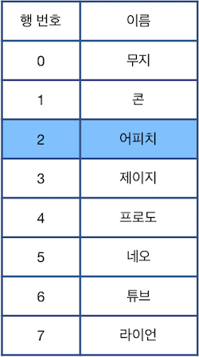

## [2021 카카오 채용연계형 인턴십]

## 문제
https://programmers.co.kr/learn/courses/30/lessons/81303

[본 문제는 정확성과 효율성 테스트 각각 점수가 있는 문제입니다.]

업무용 소프트웨어를 개발하는 니니즈웍스의 인턴인 앙몬드는 명령어 기반으로 표의 행을 선택, 삭제, 복구하는 프로그램을 작성하는 과제를 맡았습니다. 세부 요구 사항은 다음과 같습니다



위 그림에서 파란색으로 칠해진 칸은 현재 **선택된 행**을 나타냅니다. 단, 한 번에 한 행만 선택할 수 있으며, 표의 범위(0행 ~ 마지막 행)를 벗어날 수 없습니다. 이때, 다음과 같은 명령어를 이용하여 표를 편집합니다.

- `"U X"` : 현재 선택된 행에서 X칸 위에 있는 행을 선택합니다.  
- `"D X"` : 현재 선택된 행에서 X칸 아래에 있는 행을 선택합니다.  
- `"C"` : 현재 선택된 행을 삭제한 후, 바로 아래 행을 선택합니다. 단, 삭제된 행이 가장 마지막 행인 경우 바로 윗 행을 선택합니다.  
- `"Z"` : 가장 최근에 삭제된 행을 원래대로 복구합니다. **단, 현재 선택된 행은 바뀌지 않습니다.**  

---

## 제한사항  
- 5 ≤ `n` ≤ 1,000,000  
- 0 ≤ `k` < `n`  
- 1 ≤ `cmd`의 원소 개수 ≤ 200,000  
    - `cmd`의 각 원소는 `"U X"`, `"D X"`, `"C"`, `"Z"` 중 하나입니다.  
    - X는 1 이상 300,000 이하인 자연수이며 0으로 시작하지 않습니다.  
    - X가 나타내는 자연수에 ',' 는 주어지지 않습니다. 예를 들어 123,456의 경우 123456으로 주어집니다.  
    - `cmd`에 등장하는 모든 X들의 값을 합친 결과가 1,000,000 이하인 경우만 입력으로 주어집니다.  
    - 표의 모든 행을 제거하여, 행이 하나도 남지 않는 경우는 입력으로 주어지지 않습니다.  
    - 본문에서 각 행이 제거되고 복구되는 과정을 보다 자연스럽게 보이기 위해 `"이름"` 열을 사용하였으나, `"이름"`열의 내용이 실제 문제를 푸는 과정에 필요하지는 않습니다. `"이름"`열에는 서로 다른 이름들이 중복없이 채워져 있다고 가정하고 문제를 해결해 주세요.  
- 표의 범위를 벗어나는 이동은 입력으로 주어지지 않습니다.  
- 원래대로 복구할 행이 없을 때(즉, 삭제된 행이 없을 때) "Z"가 명령어로 주어지는 경우는 없습니다.  
- 정답은 표의 0행부터 n - 1행까지에 해당되는 O, X를 순서대로 이어붙인 문자열 형태로 return 해주세요.  

---

## 입출력 예  
|n|k|cmd|result|
|---|---|---|---|
|8|2|["D 2","C","U 3","C","D 4","C","U 2","Z","Z"]|"OOOOXOOO"|
|8|2|["D 2","C","U 3","C","D 4","C","U 2","Z","Z","U 1","C"]|"OOXOXOOO"|


---

## 🔍 Algorithm
**Linked List**

## 💻 Logic

```Python
# 연결리스트 형태의 dictionary 생성 (첫 행과 마지막 행 연결 부분은 None)
table = {i: [i-1, i+1] for i in range(1, n-1)}
table[0] = [None, 1]
table[n-1] = [n-2, None]
```
- **연결리스트 생성**  
    `[prev, next]` 연결리스트 형태의 **dictionary** 생성  
    첫 행과 마지막 행 연결 부분은 **None**으로 따로 저장  

```Python
if c[0] == 'D':
  for _ in range(int(c[2:])):
    current = table[current][1]
elif c[0] == 'U':
  for _ in range(int(c[2:])):
    current = table[current][0]
```
- **명령어가 'D' or 'U'인 경우**  
    `c`가 문자열이기 때문에 이동거리는 **slice**를 통해 구하고,  
    그 이동거리만큼 반복문으로 연결리스트를 이동한다.  

```Python
elif c[0] == 'C':
  answer[current] = 'X'
  prev, next = table[current]
  removed.append((table[current], current))   # 삭제된 값과 위치 removed에 append
  # 첫 행, 마지막 행 삭제하는 경우 나눠서 처리
    if prev == None:
      table[next][0] = None
      current = next
    elif next == None:
      table[prev][1] = None
      current = prev
    else:
      table[prev][1] = next
      table[next][0] = prev
      current = next
```
- **명령어가 'C'인 경우**  
    해당 위치에 해당하는 `answer` 값을 **X**로 바꾸고, 삭제할 값과 위치를 `removed` 리스트에 **append**  
    연결리스트 연결 상태는 첫 행, 마지막 행 삭제하는 경우와 나머지 경우로 나눠서 처리
    
```Python
elif c[0] == 'Z':
  (prev, next), i = removed.pop()
  answer[i] = 'O'
  # 첫 행, 마지막 행 복구하는 경우 나눠서 처리
  if prev == None:
    table[next][0] = i
  elif next == None:
    table[prev][1] = i
  else:
    table[prev][1] = i
    table[next][0] = i
```
- **명령어가 'Z'인 경우**  
    `removed` 리스트에서 `prev, next, i`를 **pop**하고, `i`에 해당하는 `answer` 값을 **O**으로 바꿔준다.  
    복구하는 경우도 삭제와 마찬가지로 첫 행, 마지막 행 복구하는 경우와 나머지 경우로 나눠서 처리  


---

## 🧩 Code
<details><summary>전체 코드 확인</summary>

```Python
def solution(n, k, cmd):
    answer = ['O' for _ in range(n)]
    current, removed = k, []
    # 연결리스트 형태의 dictionary 생성 (첫 행과 마지막 행 연결 부분은 None)
    table = {i: [i-1, i+1] for i in range(1, n-1)}
    table[0] = [None, 1]
    table[n-1] = [n-2, None]
    for c in cmd:
        if c[0] == 'D':
            for _ in range(int(c[2:])):
                current = table[current][1]
        elif c[0] == 'U':
            for _ in range(int(c[2:])):
                current = table[current][0]
        elif c[0] == 'C':
            answer[current] = 'X'
            prev, next = table[current]
            removed.append((table[current], current))   # 삭제된 값과 위치 removed에 append
            # 첫 행, 마지막 행 삭제하는 경우 나눠서 처리
            if prev == None:
                table[next][0] = None
                current = next
            elif next == None:
                table[prev][1] = None
                current = prev
            else:
                table[prev][1] = next
                table[next][0] = prev
                current = next
        elif c[0] == 'Z':
            (prev, next), i = removed.pop()
            answer[i] = 'O'
            # 첫 행, 마지막 행 복구하는 경우 나눠서 처리
            if prev == None:
                table[next][0] = i
            elif next == None:
                table[prev][1] = i
            else:
                table[prev][1] = i
                table[next][0] = i
    return ''.join(answer)
```
</details>

---


## 📝 Review

처음에는 스택을 이용해서 간단하게 구현했지만 역시나 효율성에서 통과하지 못했다.  
도저히 방향을 못잡겠어서 질문하기를 참고했고, 연결리스트로 풀어야 한다는 팁을 얻고 연결리스트로 풀었다.  
연결리스트로 풀어야 된다는 것을 알고 나서도 이것저것 생각보다 시간이 걸렸고, 전체적으로 시간이 오래 걸렸던 문제,,,  
다양한 알고리즘 문제들을 풀어야 할 필요성을 느낌  


```toc
```