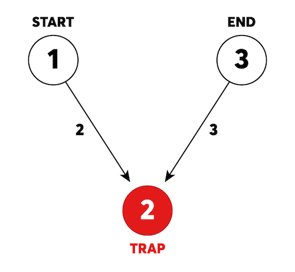

## [2021 카카오 채용연계형 인턴십]

## 문제
https://programmers.co.kr/learn/courses/30/lessons/81304

신규 게임 ‘카카오 미로 탈출’이 출시되어, 라이언이 베타테스터로 참가했습니다.



위 예시 그림은 카카오 미로 탈출의 초기 상태를 나타냅니다. 1번부터 3번까지 번호가 붙어있는 3개의 방이 있고, 방과 방 사이를 연결하는 길에는 이동하는데 걸리는 시간이 표시되어 있습니다. 길은 화살표가 가리키는 방향으로만 이동할 수 있습니다. 미로에는 함정이 존재하며, 함정으로 이동하면, 이동한 함정과 연결된 모든 화살표의 방향이 바뀝니다.  
출발지점인 `1`번 방에서 탈출이 가능한 `3`번 방까지 이동해야 합니다. 탈출하는데 걸리는 최소 시간을 구하려고 합니다.  

- 그림의 원은 방을 나타내며 원 안의 숫자는 방 번호를 나타냅니다.  
    - 방이 `n`개일 때, 방 번호는 1부터 `n`까지 사용됩니다.  
- 화살표에 표시된 숫자는 방과 방 사이를 이동할 때 걸리는 시간을 나타냅니다.  
    - 화살표가 가리키고 있는 방향으로만 이동이 가능합니다. 즉, 위 그림에서 2번 방에서 1번 방으로는 이동할 수 없습니다.  
- 그림에 표시된 빨간색 방인 `2`번 방은 함정입니다.  
    - 함정 방으로 이동하는 순간, 이동한 함정 방과 연결되어있는 모든 길의 방향이 반대가 됩니다.  
    - 위 그림 `1`번 방에서 `2`번 방으로 이동하는 순간 `1`에서 `2`로 이동할 수 있던 길은 `2`에서 `1`로 이동할 수 있는 길로 바뀌고, `3`에서 `2`로 이동할 수 있던 길은 `2`에서 `3`으로 이동할 수 있는 길로 바뀝니다.  
    - 똑같은 함정 방을 두 번째 방문하게 되면 원래 방향의 길로 돌아옵니다. 즉, 여러 번 방문하여 계속 길의 방향을 반대로 뒤집을 수 있습니다.  
- 미로를 탈출하는데 필요한 최단 시간은 다음과 같습니다.  
    - 1→2: 2번 방으로 이동합니다. 이동 시간은 2입니다.  
    - 함정 발동: 2번 방과 연결된 모든 길의 방향이 반대가 됩니다.  
    - 2→3: 3번 방으로 이동합니다. 이동 시간은 3입니다.  
    - 탈출에 성공했습니다. 총 이동시간은 5입니다.  

방의 개수를 나타내는 정수 `n`, 출발 방의 번호 `start`, 도착 방의 번호 `end`, 통로와 이동시간을 나타내는 2차원 정수 배열 `roads`, 함정 방의 번호를 담은 정수 배열 `traps`이 매개변수로 주어질 때, 미로를 탈출하는데 필요한 최단 시간을 return 하도록 solution 함수를 완성해주세요.


---

## 제한사항  
- 2 ≤ `n` ≤ 1,000  
- 1 ≤ `start` ≤ `n`  
- 1 ≤ `end` ≤ `n`  
- 1 ≤ `roads`의 행 길이 ≤ 3,000  
- `roads`의 행은 [P, Q, S]로 이루어져 있습니다.  
    - `P`에서 `Q`로 갈 수 있는 길이 있으며, 길을 따라 이동하는데 `S`만큼 시간이 걸립니다.  
    - 1 ≤ `P` ≤ `n`  
    - 1 ≤ `Q` ≤ `n`  
    - `P` ≠ `Q`  
    - 1 ≤ `S` ≤ 3,000  
    - 서로 다른 두 방 사이에 직접 연결된 길이 여러 개 존재할 수도 있습니다.  
- 0 ≤ `traps`의 길이 ≤ 10  
    - 1 ≤ `traps`의 원소 ≤ `n`  
    - 시작 방과 도착 방은 함정이 아닙니다.  
- 항상 미로를 탈출할 수 있는 경우만 주어집니다.  

---

## 입출력 예  
|n|start|end|roads|traps|result|
|---|---|---|---|---|---|
|3|1|3|[[1, 2, 2], [3, 2, 3]]|[2]|5|
|4|1|4|[[1, 2, 1], [3, 2, 1], [2, 4, 1]]|[2, 3]|4|


---

## 🔍 Algorithm
**Dijkstra, BitMask**

## 💻 Logic

```Python
graph = defaultdict(list)
# visited : 활성화 된 함정 노드에 따라 방문했던 노드 표시
# visited[node][활성화 된 함정 상태] (활성화 된 함정 상태는 비트마스크로 표시)
visited = [[INF for _ in range(2**len(traps))]for _ in range(n+1)]
traps_dict = {n: i for i, n in enumerate(traps)}    # 함정 노드: traps 리스트 상 index
# 그래프 정보 입력
for a, b, v in roads:
    graph[a].append([b, v, False])  # False : 정방향
    graph[b].append([a, v, True])   # True : 역방향
```
- `visited` : 활성화 된 함정 노드에 따라 방문했던 노드 표시  
  `visited[node][활성화 된 함정 상태]` (활성화 된 함정 상태는 **비트마스크**로 표시)  
- `traps_dict` : (함정노드: traps 리스트 상 index) 형태로 **dictionary** 생성  
- `defaultdict`로 생성한 `graph`에 정보 입력  
  상태가 **False**면 **정방향**, **True**면 **역방향**을 의미  

```Python
# 다익스트라 알고리즘
    h = []
    heapq.heappush(h, (0, start, 0))
    visited[start][0] = 0
    while h:
        cost, node, state = heapq.heappop(h)
        # end 노드 도착
        if node == end:
            answer = min(answer, cost)
            continue
        # 이미 방문한 값보다 크면 방문 X
        if cost > visited[node][state]:
            continue
        for next_node, next_cost, direction in graph[node]:
            # 함정 노드면 비트마스킹
            cur_trap, next_trap = False, False
            if node in traps_dict:
                cur_trap = bool(state & (1 << traps_dict[node]))
            if next_node in traps_dict:
                next_trap = bool(state & (1 << traps_dict[next_node]))
            if direction != (cur_trap ^ next_trap): # cur_trap, next_trap 상태가 같으면 정방향, 다르면 역방향
                continue
            # 다음 노드가 함정 노드인지에 따라 상태 변경
            next_state = state
            if next_node in traps_dict:
                next_state = state ^ (1 << traps_dict[next_node])
            # 다음 cost 계산하고, 다음 상태의 cost가 이미 방문했고 더 작으면 방문 X
            next_cost = cost + next_cost
            if next_cost >= visited[next_node][next_state]:
                continue
            visited[next_node][next_state] = next_cost
            heapq.heappush(h, (next_cost, next_node, next_state))
    return answer
```
- `end` 노드 도착  
  `answer`에 `answer`와 `cost` 중 **최솟값** 저장하고 **heap**에 값이 남아있을 수도 있으니 **continue** 해서 계속 진행  
- 이미 방문한 값보다 크면 방문 X  
- 함정 노드면 **비트마스킹**  
  현재 노드와 다음 노드에 대해서 함정 노드인지 확인하고, 함정 노드면 비트마스킹 한 값과 현재 상태(현재 활성화 함정 상태)를 `&` 비트 연산하여 저장  
  비트 연산한 값 `cur_trap`, `next_trap`의 값이 같으면 **정방향**, 다르면 **역방향**  
- 다음 노드가 함정 노드인지에 따라 상태 변경  
  다음 노드가 함정 노드면 현재 상태와 비트 연산하여 다음 상태 변경  
- 다음 cost 계산하고, 다음 상태의 cost가 이미 방문했고 더 작으면 방문 X  


---

## 🧩 Code
<details><summary>전체 코드 확인</summary>

```Python
import heapq, sys
from collections import defaultdict

def solution(n, start, end, roads, traps):
    INF = sys.maxsize
    answer = INF
    graph = defaultdict(list)
    # visited : 활성화 된 함정 노드에 따라 방문했던 노드 표시
    # visited[node][활성화 된 함정 상태] (활성화 된 함정 상태는 비트마스크로 표시)
    visited = [[INF for _ in range(2**len(traps))]for _ in range(n+1)]
    traps_dict = {n: i for i, n in enumerate(traps)}    # 함정 노드: traps 리스트 상 index
    # 그래프 정보 입력
    for a, b, v in roads:
        graph[a].append([b, v, False])  # False : 정방향
        graph[b].append([a, v, True])   # True : 역방향
    # 다익스트라 알고리즘
    h = []
    heapq.heappush(h, (0, start, 0))
    visited[start][0] = 0
    while h:
        cost, node, state = heapq.heappop(h)
        # end 노드 도착
        if node == end:
            answer = min(answer, cost)
            continue
        # 이미 방문한 값보다 크면 방문 X
        if cost > visited[node][state]:
            continue
        for next_node, next_cost, direction in graph[node]:
            # 함정 노드면 비트마스킹
            cur_trap, next_trap = False, False
            if node in traps_dict:
                cur_trap = bool(state & (1 << traps_dict[node]))
            if next_node in traps_dict:
                next_trap = bool(state & (1 << traps_dict[next_node]))
            if direction != (cur_trap ^ next_trap): # cur_trap, next_trap 상태가 같으면 정방향, 다르면 역방향
                continue
            # 다음 노드가 함정 노드인지에 따라 상태 변경
            next_state = state
            if next_node in traps_dict:
                next_state = state ^ (1 << traps_dict[next_node])
            # 다음 cost 계산하고, 다음 상태의 cost가 이미 방문했고 더 작으면 방문 X
            next_cost = cost + next_cost
            if next_cost >= visited[next_node][next_state]:
                continue
            visited[next_node][next_state] = next_cost
            heapq.heappush(h, (next_cost, next_node, next_state))
    return answer
```
</details>

---

## 📝 Review

다익스트라로 풀어야하고, 방향을 다르게 해서 구현해야 한다는 점까지는 이해했지만 쉽게 구현할 수 없었다.  
시간을 많이 투자했는데도 해결이 안돼서 다른 풀이를 참고했고, 비트마스크를 사용해서 푸는 방법을 찾을 수 있었다.  
풀이를 보고도 이해해서 다시 코드를 짜는데 시간이 많이 걸렸고, 비트마스크 방식에 대해 더 자세히 알아봐야겠다..  
카카오 문제들이 계속해서 4번부터 어려웠지만 이번 문제는 진짜 어려웠고 이해하는데 너무 오래걸렸다..


```toc
```