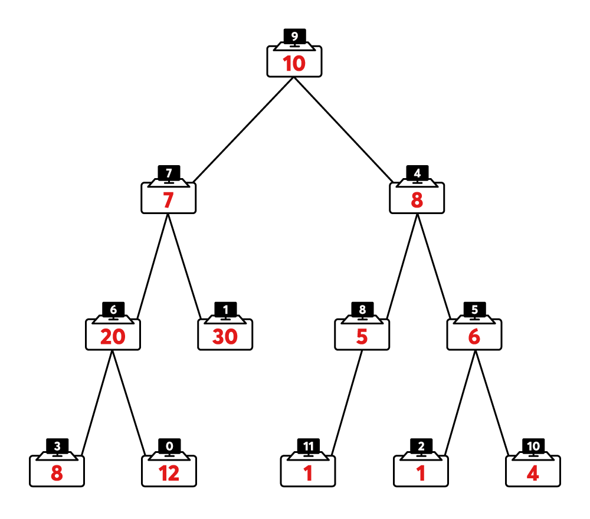
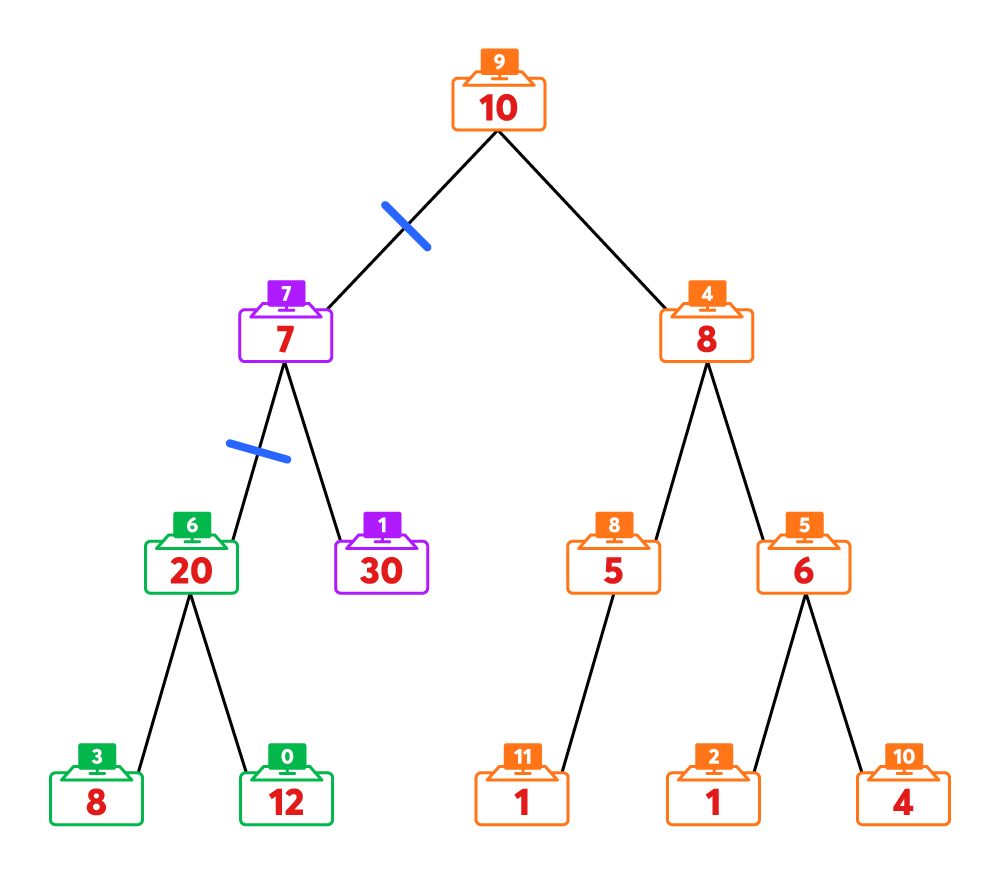

## [2021 카카오 채용연계형 인턴십]

## 문제
https://programmers.co.kr/learn/courses/30/lessons/81305

[본 문제는 정확성과 효율성 테스트 각각 점수가 있는 문제입니다.]

카카오 인턴을 선발하는 코딩 테스트 시험장이 하나의 이진 트리 형태로 연결되어 있습니다. 아래 그림은 12개의 시험장이 연결된 예시입니다.



1. 하나의 노드는 하나의 시험장을 나타냅니다.  
2. 검은 바탕의 흰 숫자는 해당 시험장의 고유 번호(ID)를 나타냅니다.  
    2-1. 시험장이 n개 있다면, 시험장의 고유 번호는 0부터 n-1까지 부여됩니다.  
3. 노드 안의 빨간 숫자는, 해당 시험장의 응시자 수를 나타냅니다.  
    3-1. 위의 그림에서, 9번 시험장에는 10명, 4번 시험장에는 8명, 6번 시험장에는 20명의 응시자가 시험을 볼 예정입니다.  
4. 노드 사이의 간선은 해당 시험장이 연결되어 있음을 의미합니다.  
    4-1. 위의 그림에서, 9번 시험장은 7번 시험장과, 7번 시험장은 6번 시험장과 연결되어 있습니다.  

코딩 테스트를 총괄하는 무지는 안정적인 시험을 위해, 시험장에서 오는 트래픽을 `k`개의 그룹으로 나누어 각 그룹별 서버로 분산시키기로 하였습니다. 시험장 사이를 연결한 간선들 중 `k-1`개를 끊어서 시험장을 `k`개의 그룹으로 나눌 계획입니다. 이때, 그룹별 최대 트래픽을 최소화하기 위하여 가장 큰 그룹의 인원을 최소화시켜야 합니다.



위의 그림에서 7번과 6번 시험장을 잇는 간선을 끊고, 9번과 7번 시험장을 잇는 간선을 끊는다면, 전체 시험장은 3개의 그룹으로 나누어집니다.

- 주황색 노드로 표시된 A그룹의 인원은 35명(10+8+5+6+1+1+4)
- 보라색 노드로 표시된 B그룹의 인원은 37명(7+30)
- 녹색 노드로 표시된 C그룹의 인원은 40명(20+8+12)

즉, 인원이 가장 많은 그룹은 40명입니다. 다른 어떤 방법으로 시험장을 3개의 그룹으로 나눈다고 해도, 인원이 가장 많은 그룹의 인원이 40명 미만이 되도록 나눌 수는 없습니다.

나눌 그룹의 수를 나타내는 정수 `k`, 각 시험장의 응시자 수를 나타내는 1차원 정수 배열 `num`, 시험장의 연결 상태를 나타내는 2차원 정수 배열 `links`가 매개변수로 주어집니다. 인원이 가장 많은 그룹의 인원이 최소화되도록 `k`개의 그룹으로 나누었을 때, 최소화된 최대 그룹의 인원을 return 하도록 solution 함수를 완성해주세요.

---

## 제한사항  
- 1 ≤ `k` ≤ 10,000  
- `k` ≤ `num`의 길이 ≤ 10,000  
    - `num[i]`에는 i번 시험장의 응시자 수가 담겨있습니다.  
    - 1 ≤ `num`의 원소 ≤ 10,000  
- `links`의 길이 = `num`의 길이  
    - `links`의 i번째 행은 i번 노드(시험장)의 [왼쪽 자식 노드 번호, 오른쪽 자식 노드 번호]입니다.  
        - 해당 위치에 자식 노드가 없는 경우 `-1`이 담겨있습니다.  
        - 잘못된 노드 번호나, 하나의 이진 트리 구조가 아닌 입력은 주어지지 않습니다.  

---

## 입출력 예  
|k|num|links|result|
|---|---|---|---|
|3|[12, 30, 1, 8, 8, 6, 20, 7, 5, 10, 4, 1]|[[-1, -1], [-1, -1], [-1, -1], [-1, -1], [8, 5], [2, 10], [3, 0], [6, 1], [11, -1], [7, 4], [-1, -1], [-1, -1]]|40|
|1|[6, 9, 7, 5]|[[-1, -1], [-1, -1], [-1, 0], [2, 1]]|27|
|2|[6, 9, 7, 5]|[[-1, -1], [-1, -1], [-1, 0], [2, 1]]|14|
|4|[6, 9, 7, 5]|[[-1, -1], [-1, -1], [-1, 0], [2, 1]]|9|


---

## 🔍 Algorithm
**DFS, Parametric Search**

## 💻 Logic

```Python
# Parametric Search
    while start < end:
        mid = (start + end) // 2
        count = 0
        dfs(root, mid, num)
        count += 1
        if count <= k:
            end = mid
        else:
            start = mid + 1
```
- `최소화된 최대 그룹의 인원`을 구하는 **최적화 문제**를 `각 그룹을 x명으로 제한할 때 k개 이하의 그룹 수가 되는지` 판단하는 **결정 문제**로 바꿔서 해결  
- 몇 명으로 제한할지는 **이분 탐색**처럼 정하고, 그 때 몇 개 이하의 그룹 수가 되는지는 **DFS** 탐색 하면서 확인  

```Python
def dfs(node, limit, num):
    global count
    left_value, right_value = 0, 0
    if left[node] != -1: 
        left_value = dfs(left[node], limit, num)    # 왼쪽 자식 노드에서 오는 값
    if right[node] != -1:
        right_value = dfs(right[node], limit, num)  # 오른쪽 자식 노드에서 오는 값
    # 나눌 필요 없는 경우
    if num[node] + left_value + right_value <= limit:
        return num[node] + left_value + right_value
    # 자식 노드 중 하나만 나누면 되는 경우
    if num[node] + min(left_value, right_value) <= limit:
        count += 1
        return num[node] + min(left_value, right_value)
    # 자식 노드 둘 다 나눠야 하는 경우
    count += 2
    return num[node]
```
- 리프에서부터 값을 `limit`를 벗어나지 않게 비교하면서 상위 노드로 올려주고, `limit`를 벗어나면 그룹을 나누어준다.  
    1. 다 더해도 `limit`를 넘지 않아서 자식 노드와 그룹 나눌 필요 없는 경우  
    2. 자식 노드 중 **min** 값을 더했을 때는 `limit`를 넘지 않아서 하나만 나누면 되는 경우  
    3. 자식 노드 둘 다 더할 수 없어서 둘 다 나눠야 하는 경우  
- 이렇게 세가지로 나눠서 탐색하고 그룹 수를 카운트 해준다.


---

## 🧩 Code
<details><summary>전체 코드 확인</summary>

```Python
from collections import defaultdict
import sys
sys.setrecursionlimit(10**6)

left, right, parent = defaultdict(int), defaultdict(int), defaultdict(lambda: -1)
count = 0

def dfs(node, limit, num):
    global count
    left_value, right_value = 0, 0
    if left[node] != -1: 
        left_value = dfs(left[node], limit, num)    # 왼쪽 자식 노드에서 오는 값
    if right[node] != -1:
        right_value = dfs(right[node], limit, num)  # 오른쪽 자식 노드에서 오는 값
    # 나눌 필요 없는 경우
    if num[node] + left_value + right_value <= limit:
        return num[node] + left_value + right_value
    # 자식 노드 중 하나만 나누면 되는 경우
    if num[node] + min(left_value, right_value) <= limit:
        count += 1
        return num[node] + min(left_value, right_value)
    # 자식 노드 둘 다 나눠야 하는 경우
    count += 2
    return num[node]
        
def solution(k, num, links):
    global count
    root, start, end = 0, max(num), 10 ** 8
    # 트리 정보 입력
    for i in range(len(num)):
        left[i], right[i] = links[i]
        if left[i] != -1: parent[left[i]] = i
        if right[i] != -1: parent[right[i]] = i
    # root 값 찾기
    for i in range(len(num)):
        if parent[i] == -1: 
            root = i
            break
    # 이분 탐색
    while start < end:
        mid = (start + end) // 2
        count = 0
        dfs(root, mid, num)
        count += 1
        if count <= k:
            end = mid
        else:
            start = mid + 1
    return start
```
</details>

---

## 📝 Review

DFS로 해야 되나,,?? 라는 생각만 들고 감이 안잡혀서 다른 사람들 풀이 보고 이해했다..  
난이도가 그만큼 어려워서인지 풀이도 많지 않았고, 봐도 이해하는데 오래걸렸다.  
`Parametric Search` 라는 알고리즘은 처음 알게 되었고, 이해는 했으니 이제 많이 풀어봐야겠다ㅜ


```toc
```