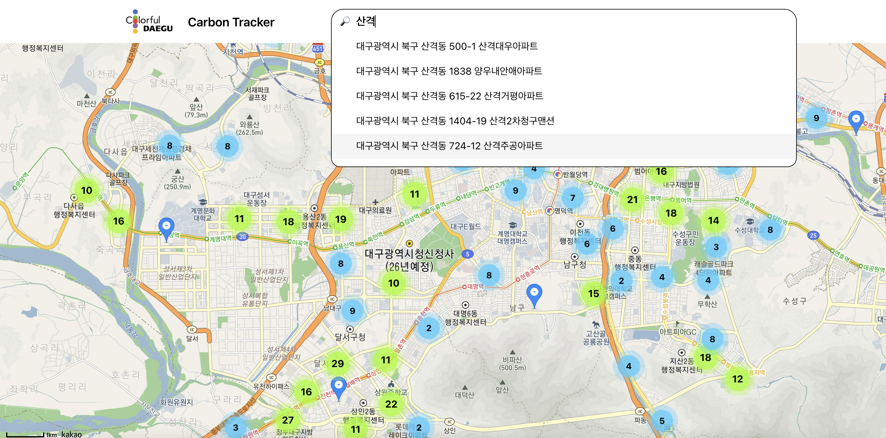
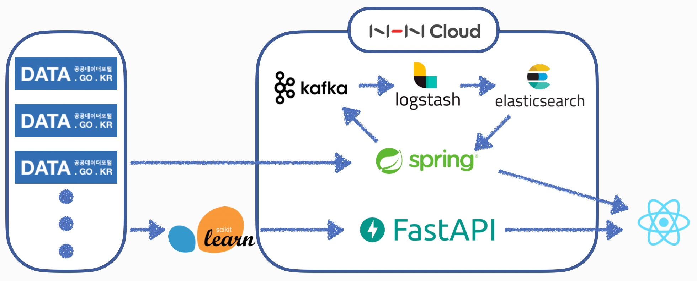

마지막 포스팅 이후 거의 세달 만에 다시 돌아왔다,,  
자소서 쓰고 코테 치고 이것 저것 공부하다 보니 바빠서 블로그 관리할 생각을 못하고 있었다. 하지만 취준을 하다보니 지난 프로젝트를 되돌아보고 정리할 필요성을 느껴서 끝난지 조금 지난 프로젝트지만 늦게나마 정리해보려고 한다. // 블로그도 다시 써야지  

## 🎞 프로젝트 소개





[https://github.com/Go-Jaecheol/Carbon-Tracker](https://github.com/Go-Jaecheol/Carbon-Tracker)  
Carbon-Tracker는 `대구 주택 단지별 탄소 배출량 및 탄소 포인트 예측/시각화`라는 주제의 프로젝트로, 종합설계프로젝트2 과목을 수강하면서 진행한 산학 협력 프로젝트다.  

22.03 ~ 22.06 기간 동안 4명의 팀원이 크게 React를 사용한 프론트엔드 2명 / Spring Boot를 사용한 백엔드 2명으로 나뉘어 진행했고, 그 중 백엔드 파트를 담당했다.  

프로젝트는 국토 교통부에서 제공하는 공공데이터 API를 활용해 데이터를 수집하고, Elastic Stack을 사용해 데이터 처리/시각화하는 과정으로 진행했다. 또한 기상청에서 제공하는 공공데이터도 활용하여 하루 탄소 배출량 예측 모델을 만들고, 이를 FastAPI를 통해 서비스를 제공해주는 과정도 진행했다.  

---

## 프로젝트를 통해 배운 점

### ✔ `Elastic Stack(ELK Stack)`‼ `Kafka`‼  
이번 프로젝트를 통해 가장 큰 경험을 한 부분이라고 할 수 있다.  
Elastic Stack과 Kafka라는 기술들에 대해 하나도 모르는 상태에서 직접 찾아보고 시행착오를 겪으면서 사용해보았다는 점에서 좋은 경험이 되었다고 생각한다.  

처음에는 공공데이터 API에서 받은 정보들을 csv 파일로 저장해서 Beats로 읽고 Logstash를 통해 데이터 처리 후 Elasticsearch에 보내서 데이터를 저장하도록 해야겠다고 생각하고 구현했다. 이 과정에서도 클라우드 환경이 아닌 Mac OS에 Elastic Stack을 설치하는 과정부터 제대로 정리된 글들이 많지 않아서 시간이 걸렸고, 특히 xml 형식으로 제공하는 공공데이터 API의 특성상 어떻게 데이터를 처리해야 하는지 알기 어려워 고생했어서 이 과정들을 추후 확인하고 다른 사람들에게도 공유하기 위해 블로그에 정리해뒀다.  
[[Elastic] Elastic Stack(ELK Stack) - Mac OS 설치 방법](https://jfelog.netlify.app/elastic-mac-install/)  
[[Elastic] Elastic Stack + 공공데이터 api 활용](https://jfelog.netlify.app/elastic-open-data-api/)  

종합설계프로젝트 과목의 특성상 다른 중소기업과 같이 연계하여 프로젝트를 진행하기 때문에 해당 기업의 요청사항에 맞게 구현해야 했는데, Elastic Stack과 Kafka의 사용 이유도 이 때문이다. Kafka를 사용해달라는 요청을 받고 어떻게 해야할지 고민하다가 문득 xml형식을 csv 파일로 변환하고, 이를 Beats가 읽어서 Logstash에서 다시 데이터 처리를 한다는 점이 불필요하다는 생각이 들었다. csv 파일 변환이 과연 필요할까..??  
그래서 공공데이터 API에서 반환한 xml 데이터를 바로 Kafka로 보내고, Logstash가 topic별로 데이터를 처리해서 Elasticsearch에 저장하는 방식으로 변경했다.  

---

`[추가 예정]..!`  
`[수정 예정]..!`  

---

## Keep

## Problem

## Try


```toc
```