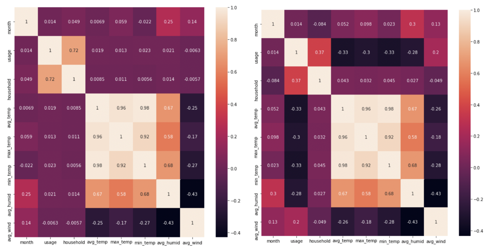
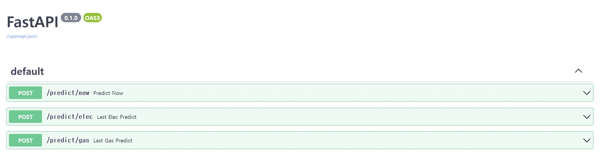
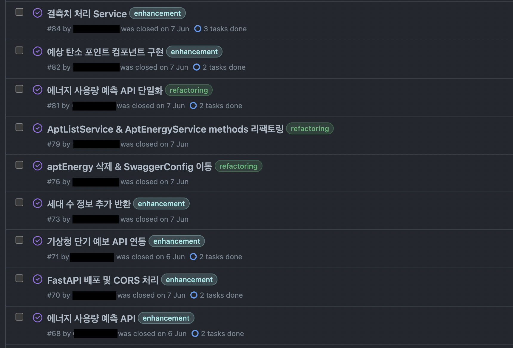

마지막 포스팅 이후 거의 세달 만에 다시 돌아왔다,,  
자소서 쓰고 코테 치고 이것 저것 공부하다 보니 바빠서 블로그 관리할 생각을 못하고 있었다. 하지만 취준을 하다보니 지난 프로젝트를 되돌아보고 정리할 필요성을 느껴서 끝난지 조금 지난 프로젝트지만 늦게나마 정리해보려고 한다. (블로그도 다시 써야지)  

## 🎞 프로젝트 소개


[https://github.com/Go-Jaecheol/Carbon-Tracker](https://github.com/Go-Jaecheol/Carbon-Tracker)  
**Carbon-Tracker**는 `대구 주택 단지별 탄소 배출량 및 탄소 포인트 예측/시각화`라는 주제의 프로젝트로, 종합설계프로젝트2 과목을 수강하면서 진행한 산학 협력 프로젝트다.  

**22.03 ~ 22.06** 기간 동안 4명의 팀원이 크게 **React**를 사용한 프론트엔드 2명 / **Spring Boot**를 사용한 백엔드 2명으로 나뉘어 진행했고, 그 중 백엔드 파트를 담당했다.  

프로젝트는 국토 교통부에서 제공하는 공공데이터 API를 활용해 데이터를 수집하고, **Elastic Stack**을 사용해 데이터 처리/시각화하는 과정으로 진행했다. 또한 기상청에서 제공하는 공공데이터도 활용하여 하루 탄소 배출량 예측 모델을 만들고, 이를 **FastAPI**를 통해 서비스를 제공해주는 과정도 진행했다.  

---

## 👨‍💻 프로젝트를 통해 배운 점

### ✅ ELK Stack‼ Kafka‼  
이번 프로젝트를 통해 가장 큰 경험을 한 부분이라고 할 수 있다.  
**Elastic Stack**과 **Kafka**라는 기술들에 대해 하나도 모르는 상태에서 직접 찾아보고 시행착오를 겪으면서 사용해보았다는 점에서 좋은 경험이 되었다고 생각한다.  

처음에는 **공공데이터 API**에서 받은 정보들을 **csv** 파일로 저장해서 **Beats**로 읽고 **Logstash**를 통해 데이터 처리 후 **Elasticsearch**에 보내서 데이터를 저장하도록 해야겠다고 생각하고 구현했다. 이 과정에서도 클라우드 환경이 아닌 **Mac OS**에 **Elastic Stack**을 설치하는 과정부터 제대로 정리된 글들이 많지 않아서 시간이 걸렸고, 특히 **xml** 형식으로 제공하는 공공데이터 API의 특성상 어떻게 데이터를 처리해야 하는지 알기 어려워 고생했어서 이 과정들을 추후 확인하고 다른 사람들에게도 공유하기 위해 블로그에 정리해뒀다.  
[[Elastic] Elastic Stack(ELK Stack) - Mac OS 설치 방법](https://jfelog.netlify.app/elastic-mac-install/)  
[[Elastic] Elastic Stack + 공공데이터 api 활용](https://jfelog.netlify.app/elastic-open-data-api/)  

종합설계프로젝트 과목의 특성상 다른 중소기업과 같이 연계하여 프로젝트를 진행하기 때문에 해당 기업의 요청사항에 맞게 구현해야 했는데, **Elastic Stack**과 **Kafka**의 사용 이유도 이 때문이다. **Kafka**를 사용해달라는 요청을 받고 어떻게 해야할지 고민하다가 문득 **xml**형식을 **csv** 파일로 변환하고, 이를 **Beats**가 읽어서 **Logstash**에서 다시 데이터 처리를 한다는 점이 불필요하다는 생각이 들었다. csv 파일 변환이 과연 필요할까..??  
그래서 공공데이터 API에서 반환한 **xml** 데이터를 **json** 형태로 **Kafka**에 보내고, **Logstash**가 **topic**별로 데이터를 처리해서 **Elasticsearch**에 저장하는 방식으로 변경했다.  

```shell
input {
  kafka {
    bootstrap_servers => "localhost:9092"
    group_id => "carbon"
    topics => ["energy", "apt"]
    consumer_threads => 2
    decorate_events => true
  }
}

filter {
  json {
    source => "message"
  }
  mutate {
    add_field => {"[@metadata][index]" => "%{[@metadata][kafka][topic]}"}
    remove_field => ["ecs", "host", "@version", "agent", "log", "tags", "input", "message"]
  }

  mutate {
    convert => {
      "helect" => "integer"
      "hgas" => "integer"
      "hwaterCool" => "integer"
    }
    remove_field => [ "@timestamp" ]
  }
}

output {
  if [@metadata][kafka][topic] == "energy" {
    elasticsearch {
      hosts => ["http://localhost:9200"]
      index => "energy"
      document_id => "%{kaptCode}%{date}"
    }
  }
  else if [@metadata][kafka][topic] == "apt" {
    elasticsearch {
      hosts => ["http://localhost:9200"]
      index => "apt"
      document_id => "%{kaptCode}"
    }
  }
  else {
    elasticsearch {
      hosts => ["http://localhost:9200"]
      index => "kafka-%{[@metadata][index]}"
    }
  }
}
```

<center>[그래서 바꾼 `logstash.conf` 설정 파일]</center>  

`input` 부분을 **beats**에서 **kafka**로 바꾸고, 해당 kafka 서버를 설정하고 원하는 **group**, **topic**들을 설정했다.  
`filter` 설정에서 **json**으로 받은 message에서 원하는 필드를 추가/삭제하고, 데이터 형도 알맞게 설정했다.  
처리한 데이터는 **Elasticsearch**로 보내야 하기 때문에 각각 **topic**에 맞는 **index**에 위치하도록 `output`을 설정했다.  

---

### ✅ 머신러닝과 FastAPI  

프로젝트 설계 초기부터 가능하면 기상청 공공데이터 API를 통해 기상 정보를 제공 받아서 에너지 사용량을 예측해보자! 라는 의견이 나왔었고, 꼭 기한 내에 이 부분까지 완성하고 싶었다. 머신 러닝은 잘 모르지만 학교 수업 때 들은 내용들과 예전 대회에서 상 받을 때 썼던 모델들을 가지고 예측 모델을 만들어봤다.  

우선 에너지 사용량을 예측하기 위해 과거 날짜별 전기, 가스, 수도 사용량 데이터를 얻으려고 했는데, 여기서부터 문제가 생겼다.  
수도 사용량은 과거 데이터를 제공해주지 않았고, 전기/가스 사용량도 월별 데이터만 제공해줘서 학습용 데이터가 많이 부족했다.  
그래도 우선 이 데이터들과 기상청에서 제공해주는 과거 기상 정보들로 필요한 데이터들을 전처리해주고, 해당 데이터들간의 상관 관계를 비교하여 학습 데이터로 사용했다.  



상관 관계를 비교하여 선정한 feature들로 train 데이터들을 만들고 train 데이터와 test 데이터를 나누었다.  
그리고 학습에 필요한 데이터가 부족하다고 생각해서 **K-Fold 교차 검증**을 진행해야겠다는 생각이 들었다.  
학습에는 그나마 대회에서 썼을 때 좋은 결과를 냈던 **XGBoost** 알고리즘으로 학습해봤고, **RandomizedSearchCV**로 학습에 적합한 하이퍼 파라미터를 찾아서 학습을 진행했다.  

결과는 만족스럽지 못했다,, 85퍼센트 정도의 정확도로 학습 데이터가 부족하기 때문에 어느정도 예상했던 결과였지만, 이상치를 더 확실하게 제거하는 등 전처리를 더 잘하거나 더 적합한 하이퍼 파라미터를 찾았다면 어땠을까 아쉬움이 남았다..  

예측 모델을 서빙하기 위한 프레임워크로는 **FastAPI**를 선택했다.  
우선 기한 내에 빠르게 구현하기 위해 그래도 익숙한 웹 프레임워크 중에서 고민을 했고, 파이썬 웹 프레임워크들 중에서도 **FastAPI**가 **Django**, **Flask**보다 더 경량화 되고 빠르다고 최근 주목받고 있어서 선택했다.  



**FastAPI**를 사용해보고 나서 왜 이름에 **Fast**가 붙었는지 알 것 같았다. 구현이 빠르다. 디렉토리 구조도 간단하다. 심플하다.  
파이썬 프레임워크를 처음 사용해서 패키지 버전 관리에서 살짝 버벅였지만 이는 `requirements.txt`를 이용하여 빠르게 해결했고, 코테에서 써서 익숙한 파이썬이기도 하고 전체적으로도 예측 결과만 제공해주면 됐기 때문에 큰 이슈없이 구현할 수 있었다.

---

### ✅ 협업을 위한 Git Convention  

이전에 진행했던 프로젝트에서는 특별한 **convention** 없이 **commit**하고 **push**하고 프로젝트를 진행했다. 하지만 협업을 하면서 이런 규칙 없는 정리되지 않은 방식은 불편함을 느낄 수 있었고, 그래서 프로젝트 시작 전부터 미리 규칙을 정한 후 진행했다.  



우선 **Github issue**를 활용해 구현이 필요한 이슈 사항을 작성하고 해당하는 label을 달아서 issue를 만들었다.  
이후 해당하는 `label/issue번호`로 **branch**를 만들어서 작업하고, [`#해당 issue 번호` `label`: 구현 내용] 형식으로 **commit message**를 작성하도록 했다.  
**push** 한 후에는 **Pull Request**를 만들어서 협업하는 팀원이 확인할 수 있도록 했고, 확인했으면 **merge** 하는 방식으로 진행했다.

---

## 🔒 Keep

- **Git Convention**을 정해두고 **branch/issue** 나누어서 협업하는 방식  
- 새로운 기술에 대한 도전 (더 많이 새로운 걸 경험해보자!)  

## 🚧 Problem

- 새로운 기술 겉핥기 (새로운 경험을 한다는 건 좋은 시도지만 더 파고들어보자!)  
- **Spring** 경험 부족 (Spring을 사용해보기 위해 처음 진행한 백엔드 프로젝트였지만 너무 다른 기술들과 인프라 쪽에 치우쳐져서 진행한 것 같다,,)  
- **테스트 코드** 작성 필요 (테스트 코드 작성이 주는 장점은 알고 있다. 그럼 해보자!)  

## 🎯 Try

- **ELK Stack**, **Kafka**를 제대로 활용한 프로젝트를 진행해보자  
- **Spring Boot**를 이용한 프로젝트를 더 많이 진행해보자  
- **Junit**를 이용해 단위 테스트 코드를 작성하며 구현해보자  


```toc
```