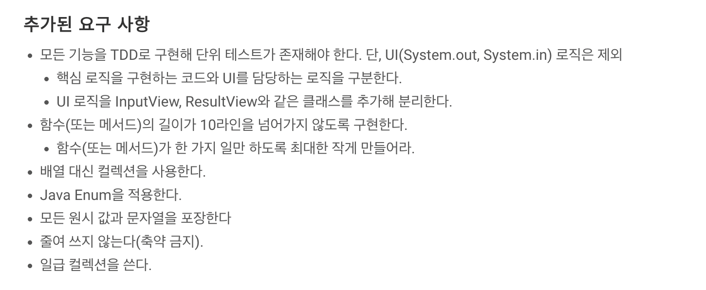
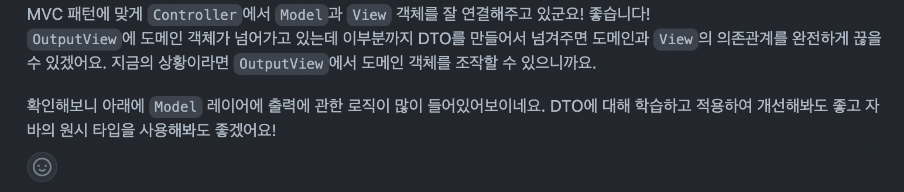
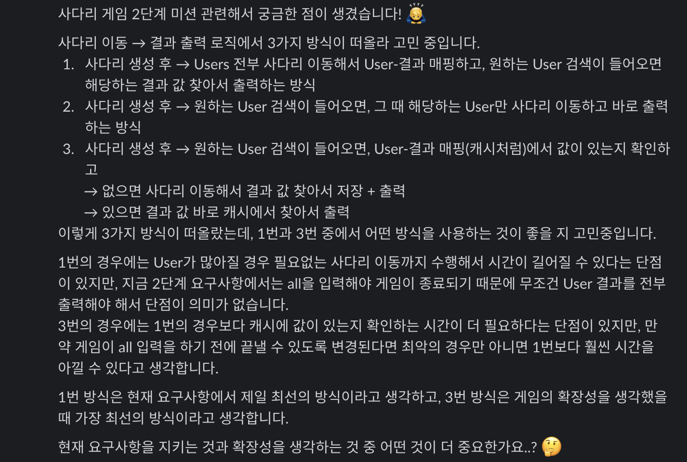
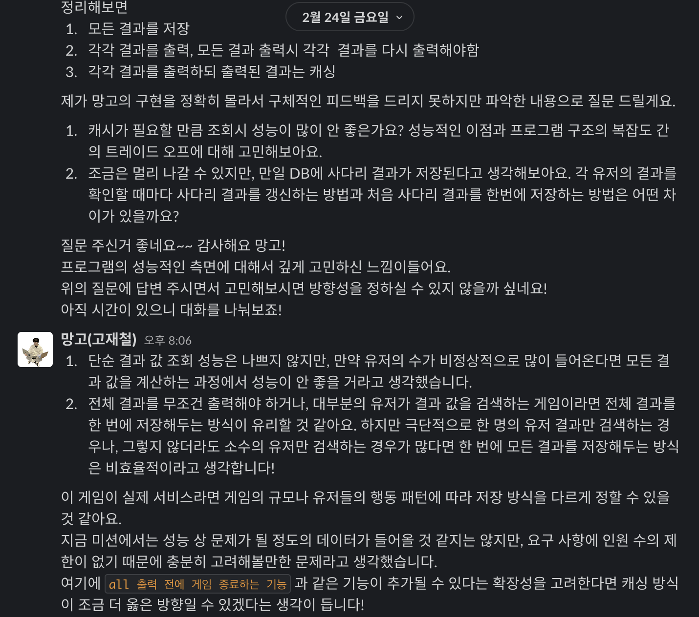

## 🎞 1단계 - 사다리 생성

[1단계 PR](https://github.com/woowacourse/java-ladder/pull/129)  

### 🚀 1단계 기능 요구 사항 정리

- 사람 이름
  - 입력받을 수 있다.
    - 최대5글자까지 부여할 수 있다.
    - 사람 이름은 쉼표(,)를 기준으로 구분한다.
    - 영문만 입력받을 수 있다.
  - 출력 형식에 맞게 변환하여 저장한다.
    - 길이 제한에 따라 빈칸을 추가해 저장한다.
- 사다리 게임
  - 사다리 높이를 입력받을 수 있다.
    - 높이는 숫자여야 한다.
    - 숫자 제한: 음이 아닌 정수
  - 라인을 추가할 수 있다.
    - 추가되는 라인의 위치는 랜덤으로 결정된다.
    - 인접한 라인은 서로 겹치지 않도록 해야 한다.
      - ex) |-----|-----| 모양과 같이 가로 라인이 겹치는 경우
  - 폭을 조정할 수 있다.
      - 이름 길이 제한 기준을 따른다.
          - ex) 최대 5글자까지 부여 가능할 때, 사다리 폭은 5이다.
  - 출력할 수 있다. 
    - 사람 이름도 같이 출력한다.

### 🚀 1단계 리팩토링 요구 사항 정리

- DTO 사용
- User 생성에 대한 예외 처리 문구 출력하도록 변경
- createLadder() 메서드 -> Ladder 생성자로 위치 이동
- points 네이밍 변경
- isContinuousTrue()에서 index를 직접 넘겨주지 않도록 변경
- isContinuousTrue()에서 RandomNumberGenerator 객체 생성 위치 변경
- LineStatus enum을 domain 패키지에서 view 패키지로 이동
- domain 패키지 내부에 하위 패키지 두기
- 이름에 빈칸 추가하는 로직을 → 출력에 대한 부분으로 옮기기
- FixedNumberGenerator 클래스를 테스트 패키지로 이동
- NumberGenerator에서 BooleanGenerator로 네이밍 변경
- 사용하지 않는 코드 삭제
  - 사용하지 않는 import문 삭제
  - InputVerifier 삭제
  - 중복된 테스트 삭제
- 테스트 파일이 테스트하는 객체와 동일한 이름의 패키지에 있도록 패키지 변경

---

### ✅ TDD!

이번 프로그래밍 요구 사항에는  
`모든 기능을 TDD로 구현해 단위 테스트가 존재해야 한다. 단, UI(System.out, System.in) 로직은 제외`  
라는 요구 사항이 추가되어서 TDD로 미션을 진행했다.  

TDD를 위해  
1. 실패하는 테스트를 구현  
2. 테스트를 통과하도록 프로덕션 코드에서 기능을 구현  
3. 코드 리팩토링  
위 과정을 거쳐가며 구현했다.  


개인적으로 아직 TDD가 좋은 개발 방법인지는 모르겠다.  
일반적인 인간의 사고 방식과는 반대로 되어 있어서 이해하기 힘들다는 생각이 들기도 하고, 그래서인지 구현 후 테스트 작성을 하는 방식보다 더 시간이 오래걸렸다.  

그렇다고 장점이 아예 없다고 생각하지는 않는다.  

우선, 가장 큰 장점은 테스트를 강제하기 때문에 테스트 커버리지가 높아진다는 점.  
기능 구현 후 단위 테스트를 작성하는 방식으로 해도 되지만, 아직은 익숙하지 않아서인지 단위 테스트를 작성하지 않고 수동 테스트를 통해 확인하고 넘어가는 경우가 많다. 서비스가 커지면 수동 테스트보다 단위 테스트를 통해 테스트를 하는 게 효율이 좋다고 생각하는데, 이 때 TDD로 개발하면 단위 테스트 작성을 강제할 수 있어서 좋다고 생각한다.  

또한 기능 구현 후 단위 테스트를 작성하는 방식은 이미 구현한 기능을 바탕으로 테스트 하게 되어서 예상 가능한 테스트만 하는 현상이 생길 수 있지만, 테스트 작성 후에 기능을 구현하면 이를 방지할 수 있다는 장점도 있다. (베로와의 대화에서 발췌,,)

따라서 TDD도 각자 기준을 정해두는 것이 좋다고 생각한다.  
지금은 학습 단계여서 100% TDD로 구현하고 있지만, 실제 서비스를 구현할 때는 TDD의 장단점을 잘 구분해서 상황에 맞게 사용해야 한다고 생각한다.

### ✅ 모든 원시 값과 문자열을 포장하라



이번 미션에는 여러 요구 사항이 추가되었는데 이 중에는 `모든 원시 값과 문자열을 포장한다`와 `일급 컬렉션을 쓴다`라는 객체지향 생활 체조 원칙 내용들도 포함되어 있었다.  

```java
public class User {
    private final Name name;
    private final Position position;

    public User(String name, int position) {
        this.name = new Name(name);
        this.position = new Position(position);
    }
    ...
}
```

그래서 위 코드와 같이 원시 값들을 포장하는 방식으로 구현했다.  

단순히 아래와 같이 원시 값을 필드로 가져도 되지만  

```java
private final String name;
private final int position;
```

`Name`과 `Position` 클래스를 새로 만들어서 각각의 역할과 책임을 따로 관리하도록 했다.  

처음에는 단순히 요구 사항이기 때문에 요구 사항을 만족시키기 위해 이렇게 구현했지만, 계속 미션을 진행하면서 코드가 길어지는 걸 보니 왜 이런 방식을 추구하는지 이해할 수 있었다.  

```java
public class Name {
    private static final int MIN_NAME_LENGTH = 1;
    public static final int MAX_NAME_LENGTH = 5;
    public static final String NAME_LENGTH_ERROR_MESSAGE =
            "[ERROR] 사람 이름은 " + MIN_NAME_LENGTH + "~" + MAX_NAME_LENGTH + "글자로 입력해 주세요.";
    public static final String NAME_FORMAT_ERROR_MESSAGE = "[ERROR] 사람 이름은 영문자만 가능합니다.";
    private static final String NAME_REGEX_FORMAT = "^[a-zA-z]*$";

    private final String name;

    public Name(String name) {
        validateNameLength(name);
        validateNameFormat(name);
        this.name = name;
    }

    private void validateNameLength(String name) {
        if (isValidLength(name)) {
            throw new IllegalArgumentException(NAME_LENGTH_ERROR_MESSAGE);
        }
    }

    private boolean isValidLength(String name) {
        return name.length() < MIN_NAME_LENGTH || name.length() > MAX_NAME_LENGTH;
    }

    private void validateNameFormat(String name) {
        if (!name.matches(NAME_REGEX_FORMAT)) {
            throw new IllegalArgumentException(NAME_FORMAT_ERROR_MESSAGE);
        }
    }

    public String getName() {
        return name;
    }
}
```

위 코드처럼 검증에 대한 메서드가 추가되니 `Name` 클래스에 대한 코드가 점점 길어졌다.  
검증에 대한 일 뿐만 아니더라도 추후에 다른 메서드가 추가될 수 있다는 확장성을 고려한다면, 이렇게 원시값을 포장하는 것이 좋다고 생각한다.  

또한 `Name` 뿐만 아니라 `Position` 클래스도 상황이 비슷하기 때문에, 이런 코드들을 다 `User` 클래스에 두는 것보다는 클래스를 따로 만들어서 관리하는 것이 직관성에도 좋다고 생각한다.  


### ✅ DTO를 사용해보아요



기존 코드에서는 View에 도메인 객체를 직접 넘겨주고 출력하도록 했다.  
하지만 이렇게 하면 View에서 도메인 객체를 조작하는 문제가 생길 수 있어서 이를 방지하기 위해 DTO를 사용해서 도메인과 View 사이의 의존 관계를 끊어보라는 리뷰어의 피드백이 있었고, 이를 바탕으로 다음과 같이 수정했다.  

```java
public class LadderDto {
    private final List<LineDto> lines;

    private LadderDto(List<LineDto> lines) {
        this.lines = lines;
    }

    public static LadderDto from(Ladder ladder) {
        return new LadderDto(ladder.getLines());
    }

    public List<LineDto> getLines() {
        return lines;
    }
}
```

```java
public class LineDto {
    private final List<Boolean> line;

    private LineDto(List<Boolean> line) {
        this.line = line;
    }

    public static LineDto from(Line line) {
        return new LineDto(line.getLine());
    }

    public List<Boolean> getLine() {
        return line;
    }
}
```

이런 방식으로 `LadderDto`, `LineDto`, `PrizesDto`, `UsersDto`를 각각 만들어서 출력을 위해 `OutputView`에 넘겨줄 때, 도메인 객체를 넘기는 것이 아니라 해당하는 DTO 객체를 넘기도록 수정했다.  

---

## 🎞 2단계 - 사다리 게임 실행

[2단계 PR](https://github.com/woowacourse/java-ladder/pull/246)  


### 🚀 2단계 리팩토링 요구 사항 정리

- enum으로 선언한 CarConstant를 Car 클래스 내부로 이동
- enum으로 선언한 InputConstant, OutputConstant를 OutputView 클래스 내부로 이동
- 시도 횟수 검증에 대한 메서드를 Controller에서 Service로 이동
- distance에서 position으로 네이밍 변경
- Car 클래스의 책임 분리
  - Name 클래스 분리
  - Position 클래스 분리
- while문 대신 try-catch문 안에서 반복할 수 있도록 변경
- findWinner 메서드에 대한 책임 이동
- 현재 위치 검증에 대한 메서드 위치 변경
- 자동차 전진을 할 때 전략 패턴을 사용하도록 변경
- 부족한 테스트 코드 작성

---

### ✅ 요구사항과 확장성은 어디까지 고려해야 할까


2단계 미션을 진행하면서 요구사항과 확장성 사이에 어떤 걸 중요하게 여겨야 할지에 대해 고민해보았다.  





사실 정답이 없는 주제지만 그렇기 때문에 나만의 기준을 세우기 위해 고민했고,  
리뷰어와 대화를 나누며 기준을 세워보았다.  

아래는 고민 과정을 담은 학습로그.  
[요구사항과 확장성은 어디까지 고려해야 할까](http://jfelog.netlify.app/wooteco-writing-1/)  

---


## 🔒 Keep

- TDD 적용하기  
- 기능 요구 사항과 구현할 내용을 미리 정리해두고 구현하기  
- 일관성 있게 코드 작성하기  
- 도메인과 뷰 사이의 의존 관계 제거하기  

## 🚧 Problem

- `DTO`에 대해 제대로 이해하고 사용하지 않았음  
- 테스트가 필요하지만 작성하지 않은 부분이 아직 있음  
- 변수 명이나 메서드 명의 네이밍이 명확하지 않음  
- 메서드의 역할과 책임 분리 생각하기

## 🎯 Try

- 메서드의 책임을 고려해 필요한 인자만 전달하기  
- 지난 미션의 피드백도 기억하고 계속 반영하기  
- 테스트 커버리지 100% 가깝게 도전  


```toc
```