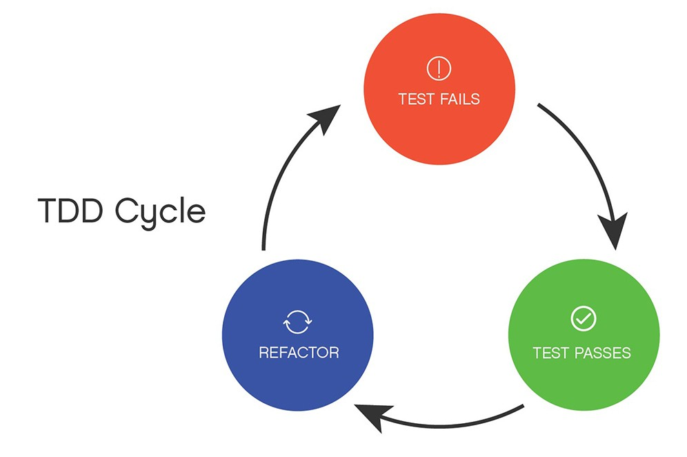

---

## 🎞 1단계 - 사다리 생성

[1단계 PR](https://github.com/woowacourse/java-ladder/pull/129)  

### 🚀 1단계 기능 요구 사항 정리

- 사람 이름
  - 입력받을 수 있다.
    - 최대5글자까지 부여할 수 있다.
    - 사람 이름은 쉼표(,)를 기준으로 구분한다.
    - 영문만 입력받을 수 있다.
  - 출력 형식에 맞게 변환하여 저장한다.
    - 길이 제한에 따라 빈칸을 추가해 저장한다.
- 사다리 게임
  - 사다리 높이를 입력받을 수 있다.
    - 높이는 숫자여야 한다.
    - 숫자 제한: 음이 아닌 정수
  - 라인을 추가할 수 있다.
    - 추가되는 라인의 위치는 랜덤으로 결정된다.
    - 인접한 라인은 서로 겹치지 않도록 해야 한다.
      - ex) |-----|-----| 모양과 같이 가로 라인이 겹치는 경우
  - 폭을 조정할 수 있다.
      - 이름 길이 제한 기준을 따른다.
          - ex) 최대 5글자까지 부여 가능할 때, 사다리 폭은 5이다.
  - 출력할 수 있다. 
    - 사람 이름도 같이 출력한다.

### 🚀 1단계 리팩토링 요구 사항 정리

- DTO 사용
- User 생성에 대한 예외 처리 문구 출력하도록 변경
- createLadder() 메서드 -> Ladder 생성자로 위치 이동
- points 네이밍 변경
- isContinuousTrue()에서 index를 직접 넘겨주지 않도록 변경
- isContinuousTrue()에서 RandomNumberGenerator 객체 생성 위치 변경
- LineStatus enum을 domain 패키지에서 view 패키지로 이동
- domain 패키지 내부에 하위 패키지 두기
- 이름에 빈칸 추가하는 로직을 → 출력에 대한 부분으로 옮기기
- FixedNumberGenerator 클래스를 테스트 패키지로 이동
- NumberGenerator에서 BooleanGenerator로 네이밍 변경
- 사용하지 않는 코드 삭제
  - 사용하지 않는 import문 삭제
  - InputVerifier 삭제
  - 중복된 테스트 삭제
- 테스트 파일이 테스트하는 객체와 동일한 이름의 패키지에 있도록 패키지 변경

---

### ✅ TDD!




### ✅ 모든 원시 값과 문자열을 포장하라


### ✅ DTO를 사용해보아요


---

## 🎞 2단계 - 사다리 게임 실행

[2단계 PR](https://github.com/woowacourse/java-ladder/pull/246)  


### 🚀 2단계 리팩토링 요구 사항 정리

- enum으로 선언한 CarConstant를 Car 클래스 내부로 이동
- enum으로 선언한 InputConstant, OutputConstant를 OutputView 클래스 내부로 이동
- 시도 횟수 검증에 대한 메서드를 Controller에서 Service로 이동
- distance에서 position으로 네이밍 변경
- Car 클래스의 책임 분리
  - Name 클래스 분리
  - Position 클래스 분리
- while문 대신 try-catch문 안에서 반복할 수 있도록 변경
- findWinner 메서드에 대한 책임 이동
- 현재 위치 검증에 대한 메서드 위치 변경
- 자동차 전진을 할 때 전략 패턴을 사용하도록 변경
- 부족한 테스트 코드 작성

---

### ✅ 요구사항과 확장성은 어디까지 고려해야 할까


---


## 🔒 Keep

- TDD 적용하기  
- 기능 요구 사항과 구현할 내용을 미리 정리해두고 구현하기  

## 🚧 Problem

- `DTO`에 대해 제대로 이해하고 사용하지 않았음

## 🎯 Try

- 


```toc
```