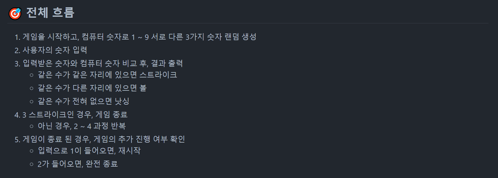
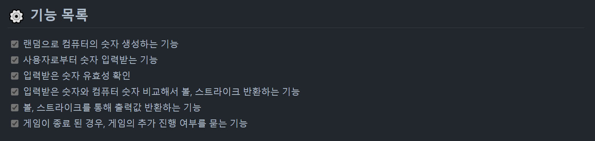
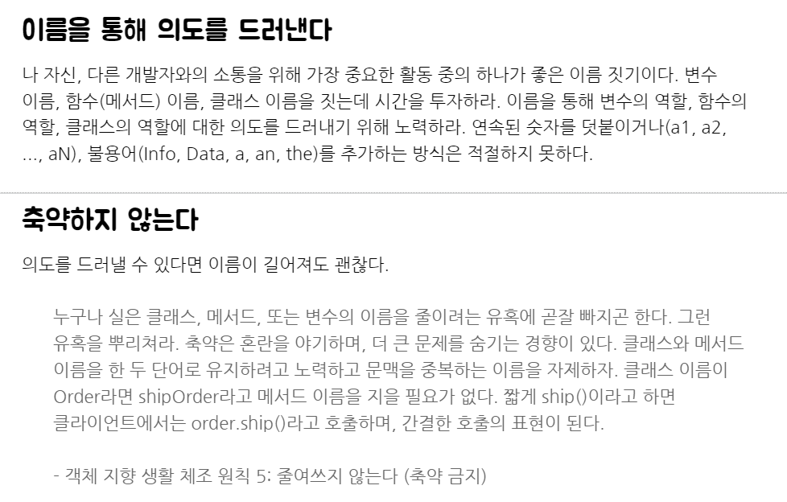
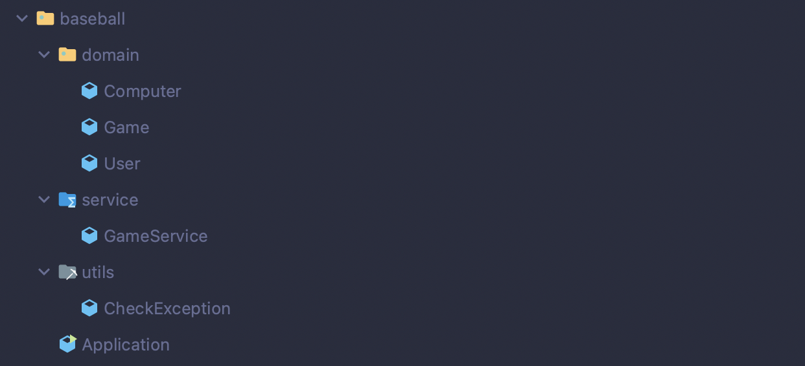
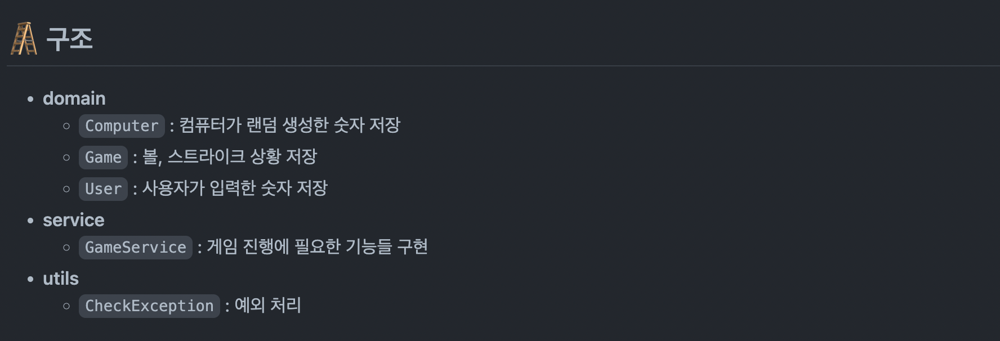

지난 10월 26일부터 우테코 프리코스를 시작했다.  
우아한테크코스 5기에 최종 합격하는 것을 목표로 지원했지만, 아직 자바에 익숙하지 않은 나로서는 프리코스만으로도 많은 것들을 얻어갈 수 있을 거라 생각했다.  

1주차와 2주차를 진행하는 시기에는 다른 면접들이 많이 잡혀있었어서 빠르게 구현만 하고 회고를 쓸 생각은 하지도 못했다.  
하지만 3주차 미션을 다 구현하고 나서는 배운 점들을 꼭 회고로 남겨야겠다는 생각이 들었고, 온보딩이었던 1주차를 제외하고 2주차부터 다시 복기해가며 회고록을 써볼 생각이다.

## 🎞 2주차 미션 소개

[2주차 미션 소개](https://github.com/woowacourse-precourse/java-baseball)  


🚀 기능 요구 사항

기본적으로 1부터 9까지 서로 다른 수로 이루어진 3자리의 수를 맞추는 게임이다.

- 같은 수가 같은 자리에 있으면 스트라이크, 다른 자리에 있으면 볼, 같은 수가 전혀 없으면 낫싱이란 힌트를 얻고, 그 힌트를 이용해서 먼저 상대방(컴퓨터)의 수를 맞추면 승리한다.
    - 예) 상대방(컴퓨터)의 수가 425일 때
        - 123을 제시한 경우 : 1스트라이크
        - 456을 제시한 경우 : 1볼 1스트라이크
        - 789를 제시한 경우 : 낫싱
- 위 숫자 야구 게임에서 상대방의 역할을 컴퓨터가 한다. 컴퓨터는 1에서 9까지 서로 다른 임의의 수 3개를 선택한다. 게임 플레이어는 컴퓨터가 생각하고 있는 서로 다른 3개의 숫자를 입력하고, 컴퓨터는 입력한 숫자에 대한
  결과를 출력한다.
- 이 같은 과정을 반복해 컴퓨터가 선택한 3개의 숫자를 모두 맞히면 게임이 종료된다.
- 게임을 종료한 후 게임을 다시 시작하거나 완전히 종료할 수 있다.
- 사용자가 잘못된 값을 입력할 경우 `IllegalArgumentException`을 발생시킨 후 애플리케이션은 종료되어야 한다.

---

## 👨‍💻 이번 미션을 통해 배운 점

### ✅ 필요한 기능 분리

이전 1주차 온보딩에서도 문제 요구사항에 따라 필요한 기능을 나누고 구현했지만, 1주차 미션은 코딩 테스트 같은 형태의 문제여서 기능 분리에 크게 집중하지 않았다.  

하지만 이번 2주차 미션은 숫자 야구라는 하나의 게임을 구현하는 미션이어서 기능을 분리하는 것에 보다 집중했다.  



우선 미션에서 주어진 기능 요구 사항을 읽고 전체 흐름을 먼저 정리했다.  
그 다음, 정리한 전체 흐름을 바탕으로 필요한 기능 목록을 뽑아내고, 하나씩 순서대로 기능을 구현하고 테스트 코드를 작성하는 방식으로 진행했다.  



기능을 미리 정해두고 맞춰서 구현해서 커밋하는 방식으로 하긴 했지만, 위에서도 보이는 것처럼 아직 기능이 가장 작은 단위로 분리되지는 않았고 유효성 검사에 대한 기능도 적은 상태다.  

가령 위의 경우에서 `입력받은 숫자와 컴퓨터 숫자 비교해서 볼, 스트라이크 반환하는 기능` 같은 경우에는 `숫자를 비교하는 기능`과 `볼, 스트라이크 반환하는 기능`으로 나눌 수 있을 것이다.  

이런 면에서 2주차 미션에서는 필요한 기능을 분리하려고 시도는 했으나,, 아직 완전히 만족스러운 형태로 작게 분리하지는 못해서 아쉬움이 남았었다,,  

---

### ✅ 이름을 통해 의도 드러내기

1주차 미션 공통 피드백 중 하나로 `이름을 통해 의도를 드러낸다`와 `축약하지 않는다`가 있었다.  



기존 1주차 미션이나 평소 코딩 스타일에서도 메서드 명이나 변수 명으로 그 메서드와 변수의 역할을 드러내려고 했었는데, 이 피드백에서 집중했던 점은 `축약하지 않는다`였다.  

평소에는 예를 들어, 사용자 상세 정보를 저장하는 변수면 `userInfo`로 변수 명을 정했었다. 당연히 이렇게 변수의 역할은 드러내면서 최대한 간결하게 이름을 작성하는게 좋다고 생각했기 때문에 이번 피드백은 많이 와닿았다.  
피드백에서 원하는 대로 변수 명을 고친다면 `userInformation`이 될 것이다.  

이름을 축약하는 게 당연하다고 생각했지만 사실 이것도 계속 긴 변수 명을 적기 싫었던 귀찮음에서 온 게 아닐까 다시 생각하게 됐다.  
그래서 2주차 미션부터는 클래스 명, 메서드 명, 변수 명 전부 하나하나 신경써가며 이름을 지었다.  
**축약하지 않고, 최대한 그 역할을 드러내도록!**

---

### ✅ 클래스 구조

필요한 기능들을 정의하고 난 다음에는 전체 **클래스 구조**를 어떻게 설계할지 고민했다.  
미션에서 요구하는 숫자야구 게임 자체가 복잡한 기능들이 필요한 게임이 아니기 때문에 간단하게 기능만 구현할까도 생각했지만, 오히려 간단한 기능들만 필요하다 보니 구조에 더 신경을 써야겠다고 생각했다.  





처음 생각한 방식은 `MVC 패턴`이었다.  
**Spring Boot**를 사용해 프로젝트를 진행하면서 **MVC 패턴**으로 구현한 경험이 있었기 때문에 **MVC 패턴**을 고려했다. 더군다나 저번 카카오 2차 코딩테스트를 준비하면서도 다들 나름 잘했다고 생각이 드는 사람들은 **MVC 패턴**으로 과제를 해결하려고 했던 점들을 보고 나도 저렇게 해봐야지 생각했기 때문에, 이번에는 **MVC 패턴**을 적용해봐야겠다는 생각이 들었다.  

하지만 **MVC 패턴**을 적용해서 클래스 구조를 설계하려고 하니 막막했다.  
지금까지 알고 있는 방식은 **MVC 패턴**이라는 `디자인 패턴`에 대해서 알고 있는 것이 아니라, **Spring**에서 주로 사용하는 `클래스 구조`에 대해서만 알고 있었다는 걸 깨닫게 되었다.  
MVC 패턴이니까 **Model** 부분은 `domain`이라는 패키지 명으로 만들고, `service` 패키지에서 필요한 기능들을 나누고 각 **service**를 호출할 `controller`까지는 음.. 굳이 안만들어도 되겠다고 생각했다. 그리고 **View** 부분도 콘솔 입출력만 필요하니까 굳이 따로 안만들어도 되겠다고 생각했고, 그 결과 위와 같은 구조가 만들어지게 되었다.  

음.. 다 지나고 생각해보니 내가 왜 저랬을까,,  
모르면 찾아보고 했어도 되는데 클래스 구조 설계에 많은 시간을 낭비하자는 생각에 쫓겨 저런 구조를 만들어버렸다.  
내가 지금까지 알고 있다고 생각했던 MVC 패턴은 그저 **Spring**에서 주로 사용하는 구조에 불과했다. `구조`만 알고 있었던거지 `패턴`은 모르고 있었다.  
다행히도 2주차 미션을 끝내고 뭔가 이상하다는 생각이 들었고, 다음 미션부터는 생각을 조금씩 바꾸게 되었다.  
나중에 작성할 3주차, 4주차 회고를 본다면 차츰차츰 나아지는 모습을 볼 수 있을 것이다..^^


---


## 🔒 Keep

- 클래스, 메서드, 변수 명을 지을 때는 **축약하지 않고, 최대한 그 역할을 드러내도록** 짓기  
- `기능 분리` -> `구조 설계` -> `구현` 순서  


## 🚧 Problem

- 기능을 여전히 **더 작은 단위**로 분리할 수 있음  
- **유효성 검사**에 대한 기능이 적음  
- **MVC 패턴**에 대해 잘 모르는 상태로 구조 설계  


## 🎯 Try

- **가장 작은 단위**로 필요한 기능 전부 분리하기  
- 우선 **MVC 패턴**에 대해 공부하고, 제대로 구조 설계하기  

---

[구현 코드 확인](https://github.com/Go-Jaecheol/java-baseball/tree/Go-Jaecheol)  


```toc
```