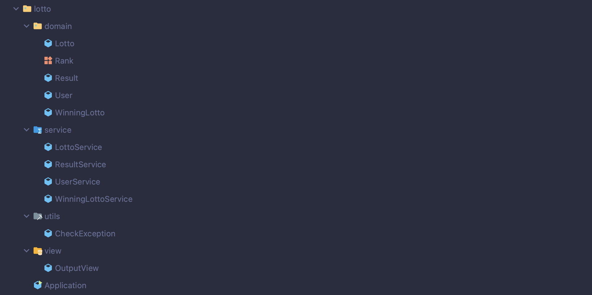
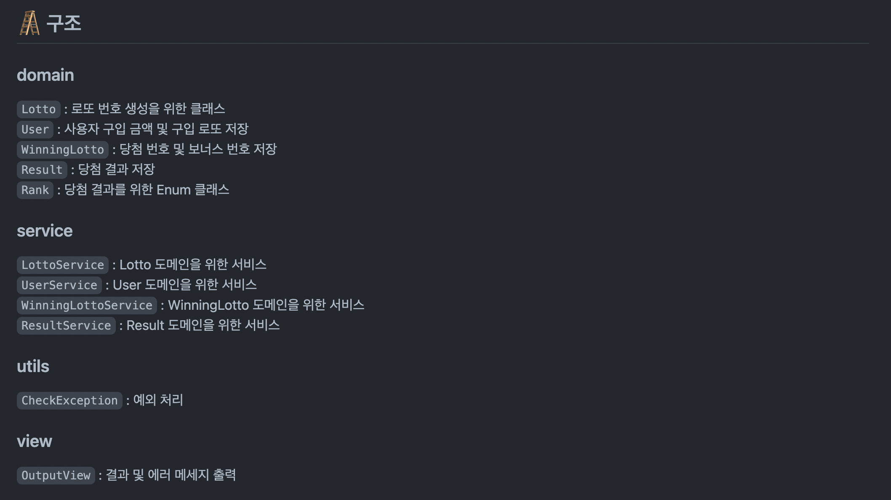
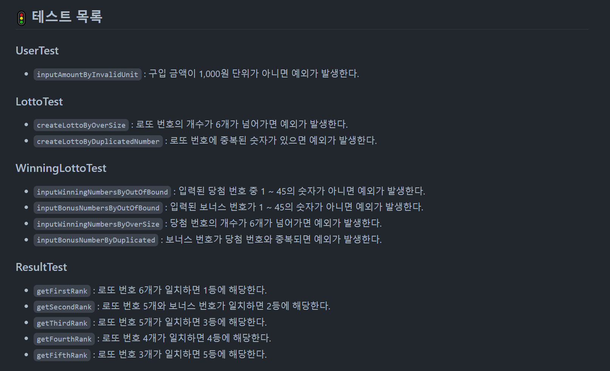

프리코스가 끝나자마자 바로 회고를 작성하려고 했는데 다른 일들을 하다 보니 생각보다 늦어졌다. 예전 프로젝트 회고를 작성하면서도 느꼈지만 블로그 글 쓰는 것부터가 아직 서툴고 회고를 쓰는 데 생각보다 시간이 오래 걸리는 것 같다,, 많이 쓰다 보면 나아지겠지  

2주차 미션이 끝나고 바로 3주차 미션이 시작되었다.  
3주차 미션은 로또 게임 구현으로 이전 미션보다 **기능 요구 사항**이 많아졌고, **프로그래밍 요구 사항**도 많아졌다.


또한, 2주차 미션에서 추가로 다음과 같은 2가지 목표가 추가되었다.  
1. **클래스(객체)를 분리하는 연습**  
2. **도메인 로직에 대한 단위 테스트를 작성하는 연습**  

---

## 🎞 3주차 미션 소개

[3주차 미션 소개](https://github.com/woowacourse-precourse/java-lotto)  


### 🚀 기능 요구 사항

로또 게임 기능을 구현해야 한다. 로또 게임은 아래와 같은 규칙으로 진행된다.

```
- 로또 번호의 숫자 범위는 1~45까지이다.
- 1개의 로또를 발행할 때 중복되지 않는 6개의 숫자를 뽑는다.
- 당첨 번호 추첨 시 중복되지 않는 숫자 6개와 보너스 번호 1개를 뽑는다.
- 당첨은 1등부터 5등까지 있다. 당첨 기준과 금액은 아래와 같다.
    - 1등: 6개 번호 일치 / 2,000,000,000원
    - 2등: 5개 번호 + 보너스 번호 일치 / 30,000,000원
    - 3등: 5개 번호 일치 / 1,500,000원
    - 4등: 4개 번호 일치 / 50,000원
    - 5등: 3개 번호 일치 / 5,000원
```

- 로또 구입 금액을 입력하면 구입 금액에 해당하는 만큼 로또를 발행해야 한다.
- 로또 1장의 가격은 1,000원이다.
- 당첨 번호와 보너스 번호를 입력받는다.
- 사용자가 구매한 로또 번호와 당첨 번호를 비교하여 당첨 내역 및 수익률을 출력하고 로또 게임을 종료한다.
- 사용자가 잘못된 값을 입력할 경우 `IllegalArgumentException`를 발생시키고, "[ERROR]"로 시작하는 에러 메시지를 출력 후 종료한다.

...

### 실행 결과 예시

```
구입금액을 입력해 주세요.
8000

8개를 구매했습니다.
[8, 21, 23, 41, 42, 43] 
[3, 5, 11, 16, 32, 38] 
[7, 11, 16, 35, 36, 44] 
[1, 8, 11, 31, 41, 42] 
[13, 14, 16, 38, 42, 45] 
[7, 11, 30, 40, 42, 43] 
[2, 13, 22, 32, 38, 45] 
[1, 3, 5, 14, 22, 45]

당첨 번호를 입력해 주세요.
1,2,3,4,5,6

보너스 번호를 입력해 주세요.
7

당첨 통계
---
3개 일치 (5,000원) - 1개
4개 일치 (50,000원) - 0개
5개 일치 (1,500,000원) - 0개
5개 일치, 보너스 볼 일치 (30,000,000원) - 0개
6개 일치 (2,000,000,000원) - 0개
총 수익률은 62.5%입니다.
```

---

## 👨‍💻 이번 미션을 통해 배운 점

### ✅ 하나의 함수가 한 가지 기능만 담당하도록

이전 2주차 미션에서도 필요한 기능을 먼저 나누고 구현하는 방식으로 진행했지만, 기능을 충분히 더 작은 단위로 분리할 수 있었기 때문에 아쉬움이 있었다.  

그래서 이번에도 **전체 흐름**을 먼저 정리하고 필요한 **기능 목록**을 하나씩 뽑아내는 방식으로 똑같이 진행하고, 추가로 기능 목록을 뽑아낼 때 흐름 별로 나누어서 설계했다.  


필요한 흐름을 크게 4가지 단계로 나누고, 여기서 해당 단계에 필요한 기능과 예외 처리 부분들을 정리하는 방식으로 설계했다.  
이 때 기능이 최소 단위가 되도록 더 나눌 수 있으면 분리하는 방식으로 진행하며, 이 후 구현 과정에서 하나의 함수가 정말 한 가지 기능만 담당할 수 있도록 했다.  

  

2주차 미션 공통 피드백 중 하나로 `함수가 한 가지 기능을 하는지 확인하는 기준을 세운다`가 있었다.  

기능 목록을 설계할 때, 가장 작은 단위로 기능을 분리하려고 했지만 그래도 여전히 더 분리할 수 있을 수도 있다.  
이를 위해서 15라인 제한을 두었고, 구현 단계에서 만약 함수가 15라인을 넘어가면 기능 설계에 문제가 있었다는 것을 인지할 수 있도록 해 기능 분리와 함수 분리 연습에 많은 도움이 되었다.  


---

### ✅ MVC 패턴..?

[2주차 미션](https://jfelog.netlify.app/wooteco-pre-2/#-%ED%81%B4%EB%9E%98%EC%8A%A4-%EA%B5%AC%EC%A1%B0) 에서도 **MVC 패턴**에 가깝게 클래스 구조를 설계하려고 했지만 이 때는 MVC 패턴이 무엇인지 정확하게 모르고 있었기 때문에 이번 주차 미션에서는 MVC 패턴에 대해 공부한 후, 클래스 구조를 설계했다.  

  

우선 가장 먼저 고치고 싶었던 부분은 사용자에게 보이는 인터페이스를 담당하는 `view` 패키지를 만드는 것이었다.  
**MVC 패턴**에서는 **View**를 통해서 사용자가 요청을 보내면 **Controller**가 **Model**에게 데이터를 받아서 처리하고, 처리한 데이터를 다시 **View**에게 보내서 출력한다.  
그리고 이 미션에서 **View**는 콘솔 창이 담당한다. 그렇기 때문에 콘솔 창에서 받은 요청을 **Controller**에서 **Model**을 통해 데이터를 처리하는데, 이 때 이를 출력하는 것을 담당하는 메서드가 필요하다고 생각했다.  
그래서 `view` 패키지에 `OutputView`라는 클래스를 만들었고, 콘솔 화면에 출력해야 되는 것들을 이 클래스에서 메서드를 만들어서 담당하도록 했다.  

여기서 한 가지 아쉬웠던 점이 있는데, 사용자 입력을 담당하는 `InputView` 클래스는 따로 만들지 않았다는 점이다.  
출력을 담당하는 `OutputView`가 필요하다고 생각했으면 입력을 담당하는 `InputView`도 만들어야지라는 생각이 자연스럽게 들만한데 생각 못했다.. 아니. 굳이 이것까지 만들어야 하나..?라는 생각이 잠시 머리 속에 자리 잡고 있었던 것 같다...  

  

다음으로 클래스 구조 측면에서 바꿨던 점은 **service** 부분이다.  
이전 주차 미션처럼 MVC 패턴 중 **Model**에 해당하는 부분을 `domain` 패키지와 `service` 패키지로 나누어 구현했다.  
`domain` 패키지에서 핵심 비즈니스 로직을 다루고, `service` 패키지에서는 비즈니스 로직에 필요한 작업들을 처리하도록 했다.  
하지만 이번에 달라진 점은 **domain**에 맞춰서 **service**를 분리했다는 점이다.  
이전 주차 미션에서는 비즈니스 로직에 대한 작업들을 처리하는 `service` 클래스를 하나만 만들어서 했지만, 이번 주차 미션에서는 **domain** 별로 나누어서 `service` 클래스를 만들었다.  
**service**를 도메인 로직에 맞춰 분리하여 구현하면서 보다 관리하기 편하게 했고, **Controller** 역할은 기능 범위가 크지 않아서 **main**에 있는 `Application` 클래스에서 담당하도록 했다.  

마지막으로 `domain` 클래스에 값을 저장하는 방법도 바꿨다.  
이전 주차 미션에서는 **setter**를 사용하여 값을 저장하는 방식을 사용했는데, **setter**를 사용하면 사용 의도를 알기 어렵고 값의 일관성을 유지하기 어렵다는 단점이 있다. 이런 이유 때문에 **setter** 사용은 지양하고 있고, 그래서 이번 주차에서는 생성자를 사용하는 방식으로 변경했다.  
**Setter 사용 지양**과 관련해서는 추후 따로 포스팅할 예정이다.  

---

### ✅ 도메인 로직에 대한 단위 테스트

2주차 미션에서도 단위 테스트 코드를 작성해서 테스팅을 진행했지만, 이 때는 정말 예제 코드를 따라서 몇 개 끄적여본 수준이었다.  
이번에는 미션 목표에서부터 `도메인 로직에 대한 단위 테스트를 작성하는 연습`이라고 적혀있을 정도로 단위 테스트 구현에 대한 방향성이 제시되어 있었고, 그래서 이에 따라 구현하려고 노력했다.  

  

우선 메인에서 만들어진 **domain** 클래스에 맞춰서 테스트 클래스를 하나씩 만들어 여기에 단위 테스트를 작성했다.  
처음에 나누어둔 기능 목록에 따라 구현을 하기 때문에 **도메인 로직**에 맞춰서 하나씩 구현을 했고, 다음 도메인을 구현하기 전에 만든 도메인에 대한 **단위 테스트**를 진행하고 통과하면 다음 도메인에 대한 기능을 구현하는 방식으로 진행했다.  

하지만 역시 처음 해보는 방식이니 생각대로 되지는 않았다.  
처음에는 한 기능을 구현하고 그 기능에 대한 단위 테스트를 작성하는 방식으로 순조롭게 진행했지만, 나중에는 시간에 쫓기다보니 점점 테스트를 미루고 기능 구현에만 집중하게 되었다..  

그리고 단위 테스트도 보통 예외 상황인 경우에만 집중해서 작성했는데, 이 외에도 여러 예외 상황이나 실제 작동되어야 하는 상황에 대한 테스트도 작성했으면 좋았을 것 같다.  
시간에 쫓겨서 못했다고는 하지만 많이 아쉬운 부분이었다..

---


## 🔒 Keep

- 기능 설계 단계에서부터 **한** 기능이 정말 **하나**의 기능만 담당하도록 하기  
- 함수 **라인 수**에 제한을 두어 함수가 한 가지 기능만 할 수 있도록 하기  
- 비즈니스 로직에 맞춰 domain 정하고, service 분리하기  
- setter 사용 지양하기  


## 🚧 Problem

- 출력을 담당하는 `OutputView`는 구현했지만 입력을 담당하는 부분은 여전히 **service**에서 분리되어 있지 않음  
- **단위 테스트**보다 **기능 구현**에만 집중  
- **다양한 경우**에 대한 **단위 테스트** 부족  


## 🎯 Try

- 입력을 담당하는 `InputView` 클래스도 만들어서 분리하기  
- 한 가지 기능을 구현한 뒤, 그 기능에 대한 **단위 테스트** 바로 작성해서 진행하기  
- **다양한 경우**에 대한 **단위 테스트** 진행하기  


---

[구현 코드 확인](https://github.com/Go-Jaecheol/java-lotto/tree/Go-Jaecheol)  


```toc
```