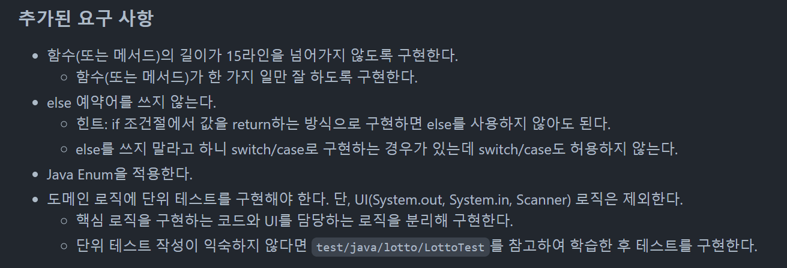
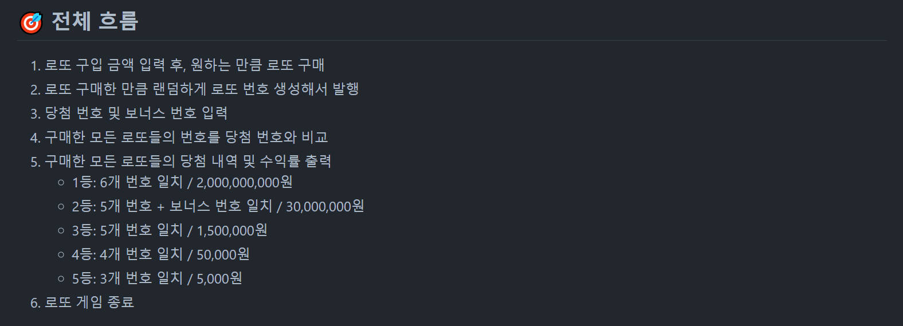
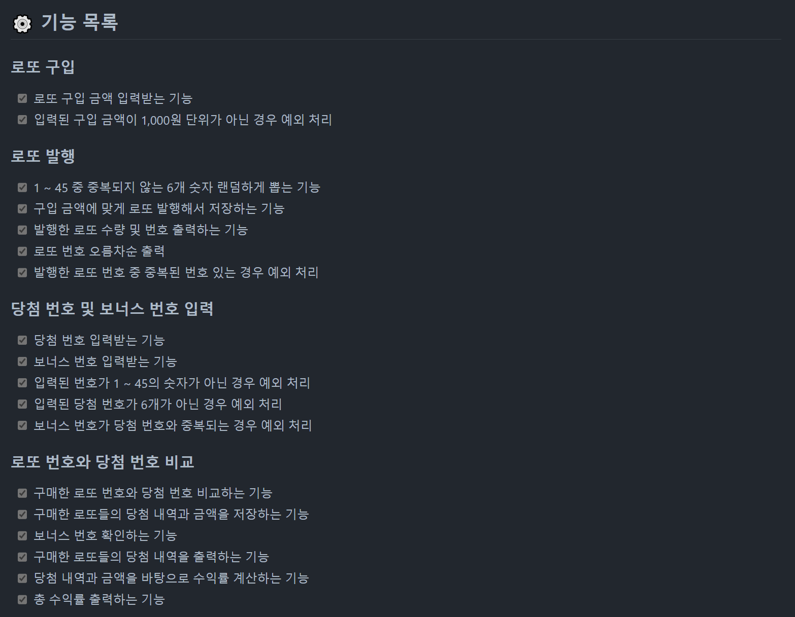
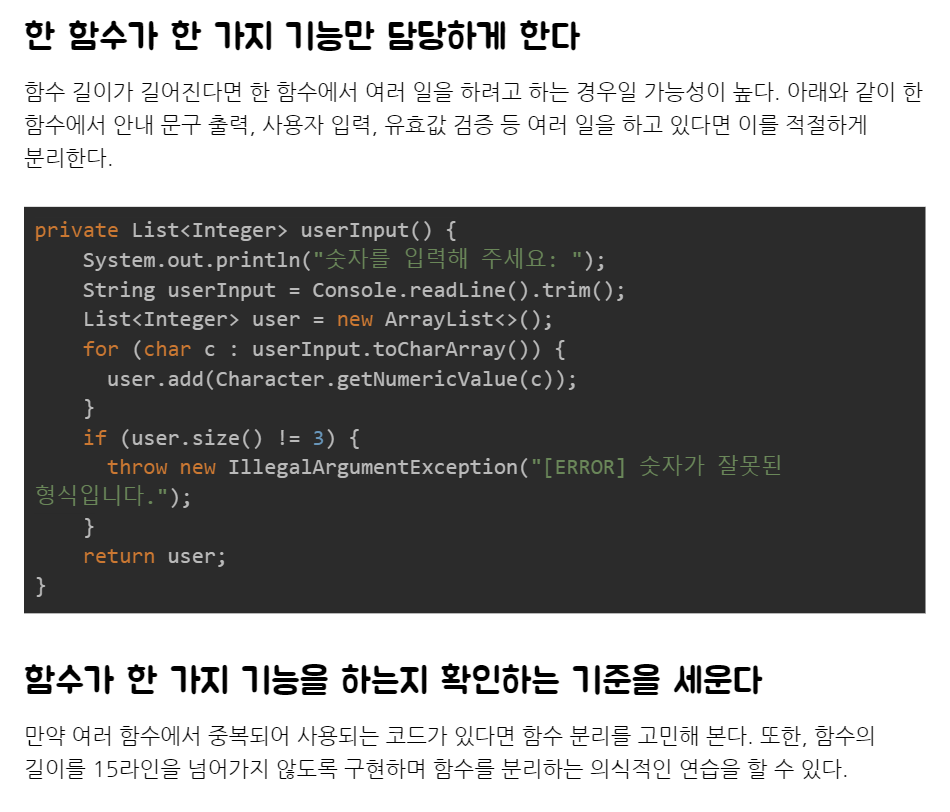

프리코스가 끝나자마자 바로 회고를 작성하려고 했는데 다른 일들을 하다 보니 생각보다 늦어졌다. 예전 프로젝트 회고를 작성하면서도 느꼈지만 블로그 글 쓰는 것부터가 아직 서툴고 회고를 쓰는 데 생각보다 시간이 오래 걸리는 것 같다,, 많이 쓰다 보면 나아지겠지  

2주차 미션이 끝나고 바로 3주차 미션이 시작되었다.  
3주차 미션은 로또 게임 구현으로 이전 미션보다 **기능 요구 사항**이 많아졌고, **프로그래밍 요구 사항**도 많아졌다.



또한, 2주차 미션에서 추가로 다음과 같은 2가지 목표가 추가되었다.  
1. **클래스(객체)를 분리하는 연습**  
2. **도메인 로직에 대한 단위 테스트를 작성하는 연습**  

---

## 🎞 3주차 미션 소개

[3주차 미션 소개](https://github.com/woowacourse-precourse/java-lotto)  


### 🚀 기능 요구 사항

로또 게임 기능을 구현해야 한다. 로또 게임은 아래와 같은 규칙으로 진행된다.

```
- 로또 번호의 숫자 범위는 1~45까지이다.
- 1개의 로또를 발행할 때 중복되지 않는 6개의 숫자를 뽑는다.
- 당첨 번호 추첨 시 중복되지 않는 숫자 6개와 보너스 번호 1개를 뽑는다.
- 당첨은 1등부터 5등까지 있다. 당첨 기준과 금액은 아래와 같다.
    - 1등: 6개 번호 일치 / 2,000,000,000원
    - 2등: 5개 번호 + 보너스 번호 일치 / 30,000,000원
    - 3등: 5개 번호 일치 / 1,500,000원
    - 4등: 4개 번호 일치 / 50,000원
    - 5등: 3개 번호 일치 / 5,000원
```

- 로또 구입 금액을 입력하면 구입 금액에 해당하는 만큼 로또를 발행해야 한다.
- 로또 1장의 가격은 1,000원이다.
- 당첨 번호와 보너스 번호를 입력받는다.
- 사용자가 구매한 로또 번호와 당첨 번호를 비교하여 당첨 내역 및 수익률을 출력하고 로또 게임을 종료한다.
- 사용자가 잘못된 값을 입력할 경우 `IllegalArgumentException`를 발생시키고, "[ERROR]"로 시작하는 에러 메시지를 출력 후 종료한다.

...

### 실행 결과 예시

```
구입금액을 입력해 주세요.
8000

8개를 구매했습니다.
[8, 21, 23, 41, 42, 43] 
[3, 5, 11, 16, 32, 38] 
[7, 11, 16, 35, 36, 44] 
[1, 8, 11, 31, 41, 42] 
[13, 14, 16, 38, 42, 45] 
[7, 11, 30, 40, 42, 43] 
[2, 13, 22, 32, 38, 45] 
[1, 3, 5, 14, 22, 45]

당첨 번호를 입력해 주세요.
1,2,3,4,5,6

보너스 번호를 입력해 주세요.
7

당첨 통계
---
3개 일치 (5,000원) - 1개
4개 일치 (50,000원) - 0개
5개 일치 (1,500,000원) - 0개
5개 일치, 보너스 볼 일치 (30,000,000원) - 0개
6개 일치 (2,000,000,000원) - 0개
총 수익률은 62.5%입니다.
```

---

## 👨‍💻 이번 미션을 통해 배운 점

### ✅ 하나의 함수가 한 가지 기능만 담당하도록

이전 2주차 미션에서도 필요한 기능을 먼저 나누고 구현하는 방식으로 진행했지만, 기능을 충분히 더 작은 단위로 분리할 수 있었기 때문에 아쉬움이 있었다.  

그래서 이번에도 **전체 흐름**을 먼저 정리하고 필요한 **기능 목록**을 하나씩 뽑아내는 방식으로 똑같이 진행하고, 추가로 기능 목록을 뽑아낼 때 흐름 별로 나누어서 설계했다.  





필요한 흐름을 크게 4가지 단계로 나누고, 여기서 해당 단계에 필요한 기능과 예외 처리 부분들을 정리하는 방식으로 설계했다.  
이 때 기능이 최소 단위가 되도록 더 나눌 수 있으면 분리하는 방식으로 진행하며, 이 후 구현 과정에서 하나의 함수가 정말 한 가지 기능만 담당할 수 있도록 했다.  

  

2주차 미션 공통 피드백 중 하나로 `함수가 한 가지 기능을 하는지 확인하는 기준을 세운다`가 있었다.  

기능 목록을 설계할 때, 가장 작은 단위로 기능을 분리하려고 했지만 그래도 여전히 더 분리할 수 있을 수도 있다.  
이를 위해서 15라인 제한을 두었고, 구현 단계에서 만약 함수가 15라인을 넘어가면 기능 설계에 문제가 있었다는 것을 인지할 수 있도록 해 기능 분리와 함수 분리 연습에 많은 도움이 되었다.  


---

### ✅ MVC 패턴..?

...

---

### ✅ 도메인 로직에 대한 단위 테스트

...

---


## 🔒 Keep

- 기능 설계 단계에서부터 **한** 기능이 정말 **하나**의 기능만 담당하도록 하기  
- 함수 **라인 수**에 제한을 두어 함수가 한 가지 기능만 할 수 있도록 하기  


## 🚧 Problem


## 🎯 Try


---

[구현 코드 확인](https://github.com/Go-Jaecheol/java-lotto/tree/Go-Jaecheol)  


```toc
```