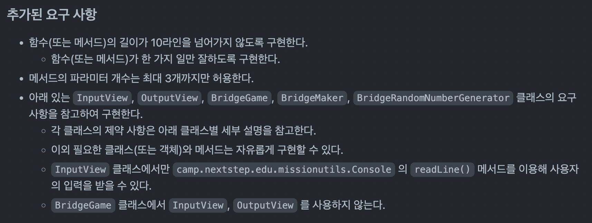
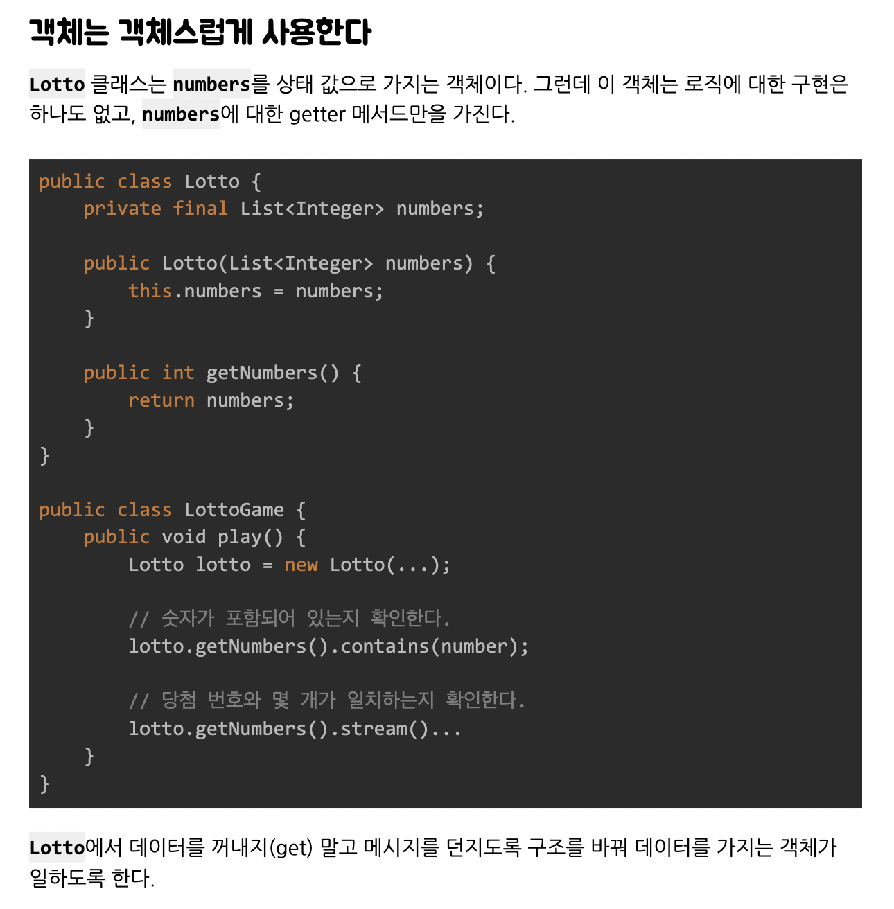
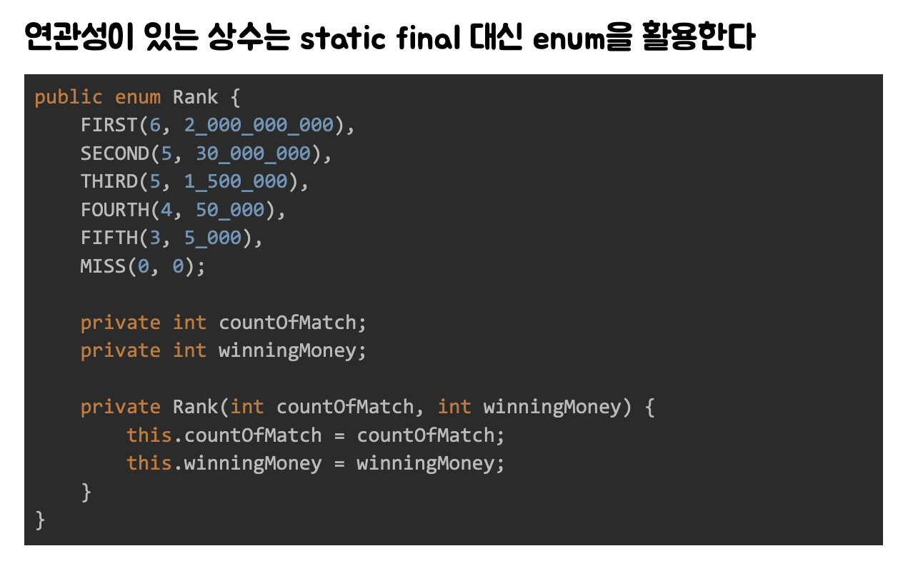

프리코스 끝난지 한달 됐는데 아직 회고 쓰는 사람이 있다..?! 그게 나야  
사실 3주차 회고를 쓰는 중에 프리코스 결과가 발표났다.  

하나도 기대 안하고 있다가 발표 났다는 소식을 듣고 확인했는데, 어떻게 된 건지는 몰라도 됐다,,,  
엄청 당황했지만 바로 힘들게 기차 표 예매하고, 최종 코테 대비하고, 토요일에 최종 코테 치러 서울 갔다 오고 하다 보니 시간이 바쁘게 빠르게 지나갔다,,,  

그리고 솔직히 말하면 프리코스 결과 발표는 하나도 기대 안했지만, 최종 코테는 정말 이게 올해 마지막이라는 마음에 간절해졌었다.  
그러다보니 회고 쓰려고 프리코스 다시 보면 최종 코테에서 못한 것들이 생각나고 집중이 안돼서 회고는 최종 코테 발표날 때까지 넣어두고 다른 일들부터 했다.  
한 달 뒤에 쓰는 회고도 그 때 생각을 다시 떠올리고, 그 때 생각 못했던 것들도 다시 떠올릴 수 있어서 나름 괜찮은 것 같다.  



이번 4주차 미션도 저번 주차 미션보다 **기능 요구 사항**과 **프로그래밍 요구 사항**이 많아졌다.  
특히 함수의 길이가 15라인에서 10라인으로 타이트하게 줄어든 것을 볼 수 있고, 메서드의 파라미터 개수도 3개로 타이트하게 제한했다.  

그리고 이번 4주차 미션의 전체적인 학습 목표는 다음과 같다.  

1. **클래스(객체)를 분리하는 연습**  
2. **리팩터링**  

---

## 🎞 4주차 미션 소개

[4주차 미션 소개](https://github.com/woowacourse-precourse/java-bridge)  


### 🚀 기능 요구 사항

위아래 둘 중 하나의 칸만 건널 수 있는 다리를 끝까지 건너가는 게임이다.
- 위아래 두 칸으로 이루어진 다리를 건너야 한다.
  - 다리는 왼쪽에서 오른쪽으로 건너야 한다.
  - 위아래 둘 중 하나의 칸만 건널 수 있다.
- 다리의 길이를 숫자로 입력받고 생성한다.
  - 다리를 생성할 때 위 칸과 아래 칸 중 건널 수 있는 칸은 0과 1 중 무작위 값을 이용해서 정한다.
  - 위 칸을 건널 수 있는 경우 U, 아래 칸을 건널 수 있는 경우 D값으로 나타낸다.
  - 무작위 값이 0인 경우 아래 칸, 1인 경우 위 칸이 건널 수 있는 칸이 된다.
- 다리가 생성되면 플레이어가 이동할 칸을 선택한다.
  - 이동할 때 위 칸은 대문자 U, 아래 칸은 대문자 D를 입력한다.
  - 이동한 칸을 건널 수 있다면 O로 표시한다. 건널 수 없다면 X로 표시한다.
- 다리를 끝까지 건너면 게임이 종료된다.
- 다리를 건너다 실패하면 게임을 재시작하거나 종료할 수 있다.
  - 재시작해도 처음에 만든 다리로 재사용한다.
  - 게임 결과의 총 시도한 횟수는 첫 시도를 포함해 게임을 종료할 때까지 시도한 횟수를 나타낸다.
- 사용자가 잘못된 값을 입력할 경우 `IllegalArgumentException`를 발생시키고, "[ERROR]"로 시작하는 에러 메시지를 출력 후 그 부분부터 입력을 다시 받는다.
  - `Exception`이 아닌 `IllegalArgumentException`, `IllegalStateException` 등과 같은 명확한 유형을 처리한다.

...

### 실행 결과 예시

```
다리 건너기 게임을 시작합니다.

다리의 길이를 입력해주세요.
3

이동할 칸을 선택해주세요. (위: U, 아래: D)
U
[ O ]
[   ]

이동할 칸을 선택해주세요. (위: U, 아래: D)
U
[ O | X ]
[   |   ]

게임을 다시 시도할지 여부를 입력해주세요. (재시도: R, 종료: Q)
R
이동할 칸을 선택해주세요. (위: U, 아래: D)
U
[ O ]
[   ]

이동할 칸을 선택해주세요. (위: U, 아래: D)
D
[ O |   ]
[   | O ]

이동할 칸을 선택해주세요. (위: U, 아래: D)
D
[ O |   |   ]
[   | O | O ]

최종 게임 결과
[ O |   |   ]
[   | O | O ]

게임 성공 여부: 성공
총 시도한 횟수: 2
```

```
다리 건너기 게임을 시작합니다.

다리의 길이를 입력해주세요.
3

이동할 칸을 선택해주세요. (위: U, 아래: D)
U
[ O ]
[   ]

이동할 칸을 선택해주세요. (위: U, 아래: D)
U
[ O | X ]
[   |   ]

게임을 다시 시도할지 여부를 입력해주세요. (재시도: R, 종료: Q)
Q
최종 게임 결과
[ O | X ]
[   |   ]

게임 성공 여부: 실패
총 시도한 횟수: 1
```

---

## 👨‍💻 이번 미션을 통해 배운 점

### ✅ 요구 사항에 맞게 설계하기

지금까지 미션을 진행하면서 클래스 구조를 어떻게 하면 잘 설계할 수 있을지에 대해 많이 고민했다.  
그래서 지금까지 **MVC 패턴**에 가깝게 미션에 맞는 클래스 구조를 설계했고, 마지막으로 4주차 미션에서는 비슷한 방식으로 설계하되 지난 주차 미션에서 아쉬웠던 점들을 보완하고자 했다.  


4주차 미션에 추가된 프로그래밍 요구 사항에는 각 클래스 별로 제한 사항들이 많이 있었다.  
그 중에서도 `BridgeGame 클래스에서 InputView, OutputView 를 사용하지 않는다.` 이 부분에 주목했다.  
일단 저번 주차 미션에서 아쉬웠던 점 중 하나로 `InputView` 클래스를 만들지 않았다는 점이 있었다. `OutputView` 클래스는 구현했지만 `InputView` 클래스를 구현하지 않았었는데, 이번에는 `InputView` 클래스를 요구 사항에서부터 주었기 때문에 이 점은 쉽게 해결할 수 있었다.  
하지만 지금까지 `InputView`, `OutputView` 클래스의 메서드들을 `service` 클래스에서 사용하고 **Controller**는 따로 구현하지 않는 방식으로 했었는데, 이번에는 요구사항에 `BridgeGame 클래스에서 InputView, OutputView 를 사용하지 않는다.` 이런 문구가 있어서 **Controller**와 **Service**를 확실하게 분리하여 구현하라는 말로 해석했다.  
이전처럼 `InputView`, `OutputView` 클래스의 메서드들은 각 도메인에 해당하는 `service` 클래스에서 호출하여 사용하고, 하나의 `BridgeGame`이라는 **Controller** 클래스에서 각 상황에 필요한 **service** 메서드들을 호출하여 사용하는 방식으로 구현했다.  

또한 이전 미션까지는 잘못된 값을 입력한 경우 **IllegalArgumentException**을 발생시키고, 에러 메세지를 출력한 후 종료하는 방식으로 예외 처리를 했었다.  
하지만 이번 미션부터는 기능 요구사항에서 `사용자가 잘못된 값을 입력할 경우 IllegalArgumentException를 발생시키고, "[ERROR]"로 시작하는 에러 메시지를 출력 후 그 부분부터 입력을 다시 받는다.`라는 방식으로 예외 처리 방식이 바뀌었다.  
그래서 이 부분도 반복문 안에서 try-catch 문을 사용하여 예외 상황이 발생하면 계속 반복하는 방식으로 구현했다.  

---

### ✅ getter를 사용하는 대신 객체에 메시지를 보내자

  

3주차 피드백을 보면 위와 같이 `객체는 객체스럽게 사용한다`라는 피드백이 있다.  
**getter** 사용해서 데이터를 직접 꺼내는 방식을 지양하고 메시지를 직접 던져주는 방식을 지향하자라는 피드백이다.  
피드백으로 이전 주차 미션을 예시로 간단하게 코드를 통해 설명하고 다음의 참고 문서도 제공해주었다.  

참고 : [getter를 사용하는 대신 객체에 메시지를 보내자](https://tecoble.techcourse.co.kr/post/2020-04-28-ask-instead-of-getter/)  

해당 피드백에서는 이전 주차 미션을 예시로 간단하게 코드를 통해 설명해주었지만 메시지를 던져준다는 말이 어떤 방식인지 잘 이해가 되지 않았다. 그래서 위의 링크로 들어가 문서를 참고했다.  
2주차 미션에서 3주차 미션으로 넘어오면서 **setter**를 사용하는 방식을 지양하도록 주의하며 구현했다. 하지만 **getter** 사용은 크게 문제가 되지 않을 거라고 생각했는데 그렇지 않았다.  
**getter**를 사용해서 데이터를 직접 주고 받는 방식을 사용하면, 이 또한 외부에서 값을 변경할 수 있다는 위험성이 조금이나마 생기게 된다.  
이를 보고 피드백과 위 문서에서는 객체스럽지 못하다고 설명하고 있다.  

또한, **getter**를 남용하면 `디미터의 법칙`을 위반할 가능성이 생긴다고 설명하고 있다.  
`디미터의 법칙`은 다른 객체가 어떤 데이터를 가지고 있는지 서로 모르게 하여 객체 간의 결합도를 낮춰야 한다는 법칙이다.  
그렇기 때문에 **getter**를 사용해서 데이터를 직접 주고 받는 방식보다는 필요한 메시지만 주고 받는 메서드를 만들어서 이를 호출하는 방식으로 구현해야 `디미터의 법칙`을 위반하지 않게 구현할 수 있을 것이다.  

따라서 이번 미션에서는 최대한 **getter**를 지양하는 방향으로 주의하며 객체를 객체스럽게 구현하고자 했다.  

---

### ✅ Enum!!

  

이전 주차 미션에서도 Enum을 사용했지만 그 때는 처음 접하는 거라 어떤 상황에서 사용해야 하는지, 어떻게 사용해야 하는지 잘 모르는 상태로 사용했다.  
그렇기 때문에 이번 미션에서는 Enum에 대해 정리된 여러 문서들을 참고해서 Enum에 대해 알아본 후 구현했다.  

우선 이번 미션에서는 다리를 생성하기 위해 `BridgeNumberGenerator`를 사용하는데 여기서는 0과 1 중 랜덤한 정수 값이 반환된다.  
그러면 이 정수 값들을 저장해서 생성된 다리 정보를 저장해야 하는데 처음 요구 사항에서 주어진 `makeBridge` 메서드의 반환 값은 `List<String>`이다.  
따라서 랜덤 생성된 정수 값을 문자열로 반환해서 저장하는 과정이 필요했고, 이 과정을 Enum을 사용하여 해결하면 되겠다고 생각했다.  

**1**이면 `"U"`, **0**이면 `"D"`로 반환해주면 됐기 때문에 이 값들을 각각 매핑해주고 필드 값들을 추가했다.  

```java
public enum Position {
    UP(1, "U"),
    DOWN(0, "D");

    private final int positionNumber;
    private final String positionValue;

    Position(int positionNumber, String positionValue) {
        this.positionNumber = positionNumber;
        this.positionValue = positionValue;
    }
```

다음으로 이 `positionNumber`를 `positionValue`로 변환해주는 기능이 필요했는데, 다음과 같은 메서드를 만들고 **stream**을 이용해 값을 반환하도록 했다.  

```java
public static String convertNumberToValue(int number) {
    return Arrays.stream(Position.values())
            .filter(position -> position.positionNumber == number)
            .findAny()
            .orElseThrow(() -> new IllegalArgumentException("[ERROR] 0 또는 1의 값만 가능합니다."))
            .positionValue;
}
```

또한 게임의 성공 여부를 출력하는 부분에서도 불필요한 **if**문이 반복되어서 이를 해결하기 위해 **Enum**을 사용해야겠다고 생각해 리팩토링했다.  

```java
private static void printIsSuccess(boolean status) {
    if (status) {
        System.out.println("게임 성공 여부: 성공");
    }
    if (!status) {
        System.out.println("게임 성공 여부: 실패");
    }
}
```

위와 같이 `status` 불리언 값에 따라 출력 값이 달라지는 경우였다.  
하지만 이렇게 **if**문을 나눠서 사용하는 것은 **else** 예약어를 사용하지 말라는 요구 사항에도 맞지 않다고 생각했고, **Enum**을 사용해 해결할 수 있을 거라 생각했다.  

```java
public enum Status {
    SUCCESS(true, "성공"),
    FAIL(false, "실패");

    private final boolean check;
    private final String message;

    Status(boolean check, String message) {
        this.check = check;
        this.message = message;
    }

    public static String convertCheckToMessage(boolean check) {
        return Arrays.stream(Status.values())
                .filter(status -> status.check == check)
                .findAny()
                .orElseThrow(() -> new IllegalArgumentException())
                .message;
    }
}
```

앞선 `Position` **enum 클래스**와 거의 비슷하게 `Status` **enum 클래스**를 만들고,  
**boolean** 값을 **String** 값으로 변환해주는 메서드도 만들었다.  

```java
private static void printIsSuccess(boolean status) {
    System.out.println("게임 성공 여부: " + Status.convertCheckToMessage(status));
}
```

이를 이용해 위에서 **if**문이 반복되어 문제가 되었던 코드도 한 줄로 깔끔하게 리팩토링 할 수 있었다.  

---


## 🔒 Keep

- **요구 사항**을 반영하면서 **MVC 패턴**에 가깝게 설계하기  
- **getter**를 사용하는 대신에 **필요한 메시지**만 주고 받는 메서드를 만들어서 사용하기  
- 불필요하게 if문이 반복되는 코드가 있으면 **Enum**을 이용해 리팩토링하기  

## 🚧 Problem

- 설계와 구현은 열심히 했지만 **다양한 상황**에 대한 **테스트 코드** 작성이 아직 부족함  
- 여전히 **getter**가 필요하다고 판단해서 사용한 곳들이 있는데, 이 때 외부에서 **값이 변경될 가능성**이 있음  
- `OutputView`에 단순하게 정해진 문자열만 출력하면 되는 메서드들이 있음(**Enum**을 사용하면 관리하기 보다 편할 것 같음)  

## 🎯 Try

- **테스트 코드** 작성에도 집중하자  
- getter 사용이 필요한 경우에는 `Collections.unmodifiableList()` 같은 **Unmodifiable Collection**을 사용하자  
- 정해진 문자열을 출력하는 부분도 **Enum** 사용 고려해보자  

---

[구현 코드 확인](https://github.com/Go-Jaecheol/java-bridge/tree/Go-Jaecheol)  


```toc
```