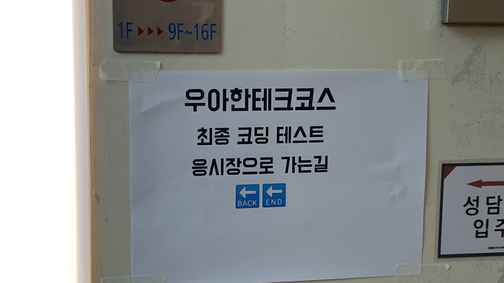
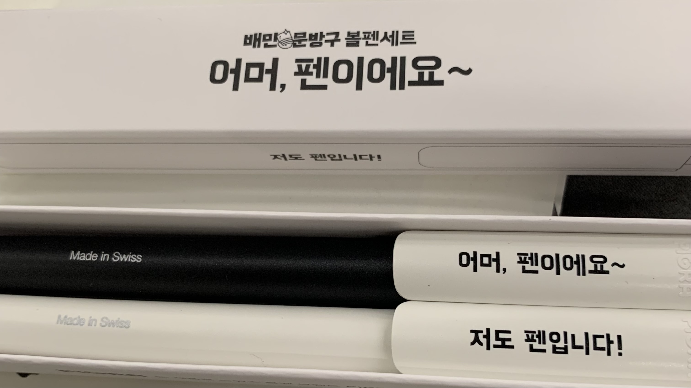
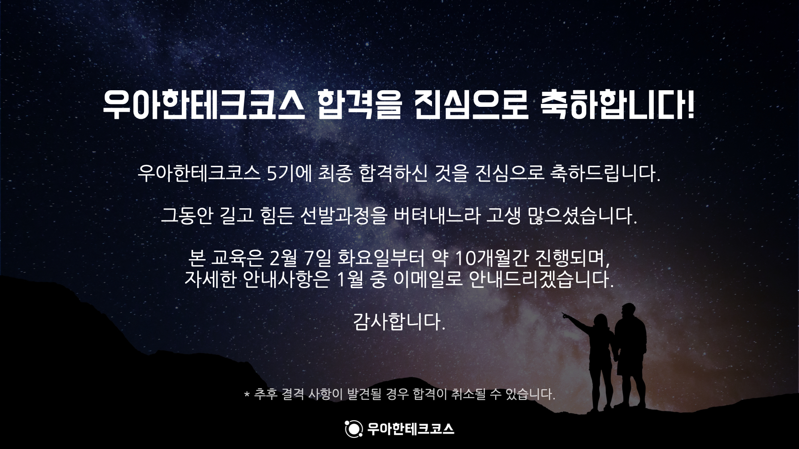

우테코 프리코스 그리고 최종 코테가 끝난지도 한달이 지났다.  
다시 한 달 전의 기억을 살려서 최종 코딩 테스트 후기를 써보려고 한다.  
지금까지 썼던 회고와는 다르게 일기 느낌으로다가,,  

## 👏 프리코스가 끝나고 최종 코테까지

11월 23일.  
4주 동안의 프리코스 과정이 끝났다.  

프리코스가 끝나고 바로 들었던 생각은 '떨어져도 괜찮을 것 같다'였다.  
자바를 싫어하고 자바에 대해서 1학년 수준의 기초 밖에 모르는 상태에서 시작했던 프리코스였기 때문에 이미 이 4주 동안의 프리코스 과정만으로도 많은 것들을 배웠다는 생각이 들었다. 게다가 프리코스를 진행하면서 각 주차가 끝나고 다른 사람들의 코드를 봤을 때, 나랑은 완전 차원이 다르게 잘하는 사람이 많구나라고 생각했다. 각 주차가 끝나고 쓰는 소감문도 정말 간단하게 해당 주차에 새롭게 배운 핵심 내용들만 적었던 나로서는 '나보다 더 간절한 사람이 붙겠지'라는 생각만 들었다.  

그리고 12월 14일 1차 심사 결과가 나왔다.  


그렇게 큰 기대를 하지 않은 채 메일로 결과를 확인했다.  
'축하드립니다'라는 문구를 확인하고 얼떨떨해서 메일을 계속 다시 읽다가 정신 차리고 기차 표부터 구했다.  
당장 바로 3일 뒤였기 때문에 아침 일찍 기차로 표를 겨우 구하고 이제 내가 어떻게 붙은 건지 생각해봤다.  

사실 이건 아직도 의문이다.  
비전공자를 우선으로 한다는 말도 조금씩 나왔었고 소감문도 평가 요소에 포함된다는 말도 있는 등 여러 방면에서 나에게 이득이 되는 평가 요소는 많지 않았다. 그래서 내가 어떻게 합격하게 되었는지 정확히 알 수 없었다.  
하지만 조금이나마 추측해보자면, 우테코에서 원하는 방향과 내가 미션을 해결하면서 찾고자 했던 방향이 비슷했던 것 같다.  
구현하기 전에 클래스 구조를 설계하는 과정을 우선시 하고, 미션 요구사항을 중요하게 생각하는 등 이런 생각이 우테코에서 원하는 프리코스 목표와 비슷했지 않을까. 그리고 다른 사람들이 보기에는 나도 다른 사람들처럼 간절해보이지 않았을까. 그렇게 생각한다.  

---

## 👋 최종 코딩 테스트 시작!

12월 17일.  
아침 일찍 KTX를 타고 서울로 갔다.  

도착해서 점심을 먹고 선릉역에 도착해서 선릉 캠퍼스로 가는 길은 떨리기보다는 설렜다.  
보통 이런 시험을 앞두고 많이 긴장하는 타입이지만 왠지 모르게 이 날은 설렜다.  
기대도 안하고 있던 시험이어서 보너스로 기회가 주어졌다는 생각이 커서인지 긴장하는 마음 하나 없이 도착했고, 오히려 유튜브로만 보던 코치님들을 보니 반가운 마음이 들었다.  



도착해서 가장 놀랐던 점은 엄청 자유로운 환경이라는 점이었다. 코테 중간에 자유롭게 화장실 이용은 물론이고 준비된 간식들을 가져와서 먹거나 구경하는 것도 가능해서 놀랐다,,  
당연히 노트북 거치대나 마우스, 키보드 사용이 안될 거라 생각하고 안가져갔는데 사용 가능했다,,,

그리고 13시부터 점심 메뉴 추천이라는 주제의 최종 코딩 테스트가 시작되었다.  

---

## 🎞 최종 코딩 테스트 미션 소개

[최종 코딩 테스트 미션 소개](https://github.com/woowacourse-precourse/java-menu)  


### 🚀 기능 요구 사항

한 주의 점심 메뉴를 추천해 주는 서비스다.

- 코치들은 월, 화, 수, 목, 금요일에 점심 식사를 같이 한다.
- 메뉴를 추천하는 과정은 아래와 같이 이뤄진다.
  1. 월요일에 추천할 카테고리를 무작위로 정한다.
  2. 각 코치가 월요일에 먹을 메뉴를 추천한다.
  3. 화, 수, 목, 금요일에 대해 i, ii 과정을 반복한다.
- 코치의 이름은 최소 2글자, 최대 4글자이다.
- 코치는 최소 2명, 최대 5명까지 식사를 함께 한다.
- 각 코치는 최소 0개, 최대 2개의 못 먹는 메뉴가 있다. (`,` 로 구분해서 입력한다.)
  - 먹지 못하는 메뉴가 없으면 빈 값을 입력한다.
  - 추천을 못하는 경우는 발생하지 않으니 고려하지 않아도 된다.
- 한 주에 같은 카테고리는 최대 2회까지만 고를 수 있다.
- 각 코치에게 한 주에 중복되지 않는 메뉴를 추천해야 한다.
  - 예시)
    - 구구: 비빔밥, 김치찌개, 쌈밥, 규동, 우동 → 한식을 3회 먹으므로 불가능
    - 토미: 비빔밥, 비빔밥, 규동, 우동, 볶음면 → 한 코치가 같은 메뉴를 먹으므로 불가능
    - 제임스: 비빔밥, 김치찌개, 스시, 가츠동, 짜장면 → 매일 다른 메뉴를 먹으므로 가능
    - 포코: 비빔밥, 김치찌개, 스시, 가츠동, 짜장면 → 제임스와 메뉴가 같지만, 포코는 매번 다른 메뉴를 먹으므로 가능
- 메뉴 추천을 완료하면 프로그램이 종료된다.
- 사용자가 잘못된 값을 입력할 경우 `IllegalArgumentException`를 발생시키고, "[ERROR]"로 시작하는 에러 메시지를 출력 후 그 부분부터 입력을 다시
  받는다.
  - `Exception`이 아닌 `IllegalArgumentException`, `IllegalStateException` 등과 같은 명확한 유형을 처리한다.

...

### 실행 결과 예시

```
점심 메뉴 추천을 시작합니다.

코치의 이름을 입력해 주세요. (, 로 구분)
토미,제임스,포코

토미(이)가 못 먹는 메뉴를 입력해 주세요.
우동,스시

제임스(이)가 못 먹는 메뉴를 입력해 주세요.
뇨끼,월남쌈

포코(이)가 못 먹는 메뉴를 입력해 주세요.
마파두부,고추잡채

메뉴 추천 결과입니다.
[ 구분 | 월요일 | 화요일 | 수요일 | 목요일 | 금요일 ]
[ 카테고리 | 한식 | 한식 | 일식 | 중식 | 아시안 ]
[ 토미 | 쌈밥 | 김치찌개 | 미소시루 | 짜장면 | 팟타이 ]
[ 제임스 | 된장찌개 | 비빔밥 | 가츠동 | 토마토 달걀볶음 | 파인애플 볶음밥 ]
[ 포코 | 된장찌개 | 불고기 | 하이라이스 | 탕수육 | 나시고렝 ]

추천을 완료했습니다.
```

---

## 🙏 최종 코딩 테스트 후기



우선 최종 코테도 기존 프리코스 미션과 비슷하게 진행되었다.  
크게 추가된 프로그래밍 요구사항은 없었고 오히려 프로그래밍 요구사항에서는 10라인 제한에서 15라인 제한으로 완화되거나 파라미터 개수 제한이 사라지는 등 전체적으로 완화되었다.  
다만, 기능 요구사항은 개인적으로 프리코스 때보다 복잡해졌다는 생각이 들었다.  
필요한 기능이 전체적으로 많아졌고, 특히 클래스 구조를 설계하는데 살짝 꼬였었다. 항상 구조 설계를 먼저하고 그 구조에 맞춰서 기능 요구사항 순서대로 구현을 시작했는데 설계에서 한 번 꼬이니까 당황했고 평소보다 더 시간이 걸렸다.  

구현 자체는 프리코스 미션들 난이도랑 크게 다르지 않았고 지금까지 해왔던 방식 그대로 구현했다.  
하지만 중간에 구조를 살짝 다시 바꾸는 등 시간이 조금 걸렸고, 그래서 전체 5시간 중에서 4시간 반 정도 지났을 때 쯤 전체 구현을 완료했고 기본 테스트를 통과할 수 있었다.  

20분 정도 남아서 부랴부랴 제출 페이지에 제출하고 리팩토링을 시작했다.  
프리코스 마지막 미션에서는 프로그래밍 요구사항 중에 `메서드 파라미터는 3개로 제한한다`라는 요구사항이 있었기 때문에 이번에도 이 요구사항을 지키려고 노력했는데 이 요구사항을 지키지 못한 메서드를 하나 발견했다.  
하지만 이를 고치려면 클래스를 하나 나눠야했었는데, 이 때 쯤 남은 시간이 10분 정도 밖에 안남았고 이번 요구사항 중에는 없었기 때문에 찝찝하지만 넘기기로 했다..  

또한 이번 요구사항 중에는 테스트 관련 요구사항이 없었고, 최종 코테 시작 전에 `안 돌아가는 프로그램보다 돌아가는 쓰레기가 낫다.`라는 말이 있었기 때문에 평소에는 기능 하나를 구현하면 그 기능에 대한 단위 테스트를 만들고 넘어갔지만 이번에는 우선 구현에만 집중했다.  
생각보다 구현에 시간이 오래걸려서 단위 테스트를 하나도 만들지 못하고 제출했는데 이 점이 코딩 테스트가 끝나고도 남은 2주 동안 가장 마음에 걸렸었다,,  

---

구현은 다 완료했고 돌아가는 쓰레기라도 만들었기 때문에 전체적으로 만족했다.  
하지만 단위 테스트를 하나도 만들지 못한 점과 리팩토링을 제대로 하지 못한 점은 끝나고도 마음에 걸렸다.  
특히 끝나고 나가는 길에 구현이 끝나고도 2시간이나 남았다는 사람의 말을 듣고 엄청 충격이었다,, 이런 괴물들과 같은 선 상에 섰던 것만으로도 만족스럽다는 생각을 하며 2주를 기다렸다.  

12월 28일.
결과 발표를 기다리다가 너무 긴장될 것 같아서 아무 생각 안하려고 한 시간 전부터 롤이나 했다,,  
신기하게도 발표 1분 전에 게임이 끝나서 로그인 하고 메일을 확인했는데  



합격이었다..  
정말 2022년 마지막이라고 생각했던 라스트 댄스가 성공해서 너무 기뻤고 믿기지 않았다.  
단위 테스트랑 리팩토링이 부족해서 남들보다 기준치에 약간 밀리지 않을까 걱정했었는데 아마 이번에도 내가 생각했던 방향과 우테코가 원했던 방향이 맞았던 것 아닐까 생각한다.  
기초부터 탄탄히 설계를 잘한 다음에 돌아가는 쓰레기를 만들어 놓으면, 그 다음 과정은 우테코에서 가르치겠다는 그런 뜻이 아닐까  

---

[구현 코드 확인](https://github.com/Go-Jaecheol/java-menu/tree/Go-Jaecheol)  


```toc
```