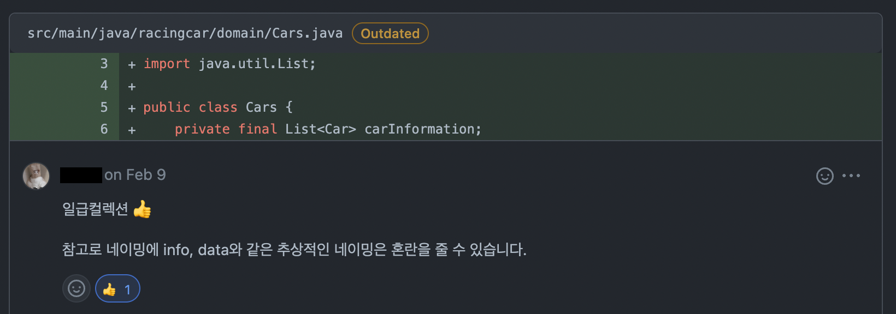
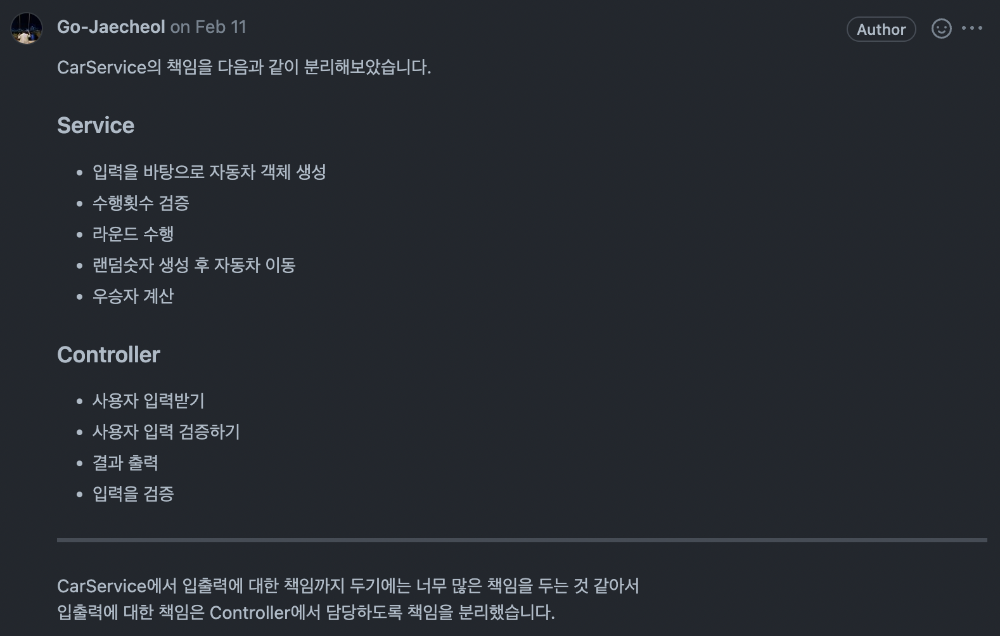
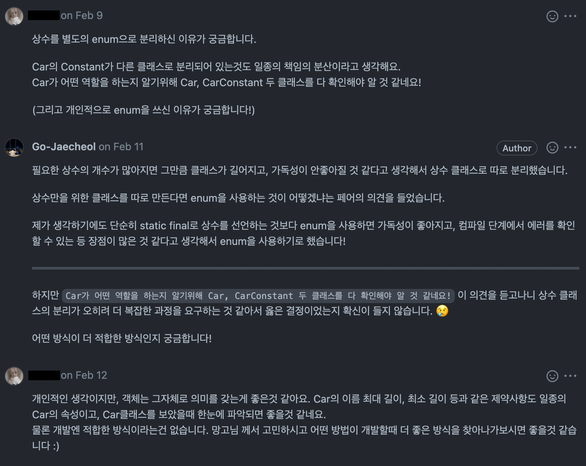
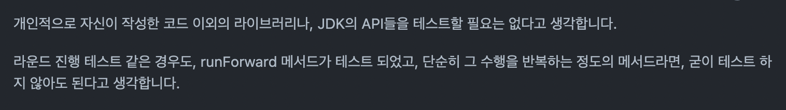

우테코를 시작한지 한 달.. 드디어 여유가 생겼다.  
생각보다 빠르게 한 달이 지나갔다. 미션 회고도 쓰고 여러 블로그 글도 쓰고 싶었지만, 미션 진행하고 우테코 생활 적응하는 것만으로도 바빠서 못하고 있었다. 사실 글 쓸 때 쓰고 지우고 고민하느라 시간이 많이 걸리는 게 한 몫 했다ㅎ,,  
이미 `자동차 경주` 미션과 `사다리 타기` 미션을 끝내고 `블랙잭` 미션을 진행하고 있지만 늦게나마 지난 미션들을 회고해보려 한다.  

자동차 경주 미션은 우테코에 들어와서 진행한 첫 미션이다.  
모든 미션은 2개의 단계로 나뉘는데, 1단계는 페어 프로그래밍으로 진행하고 2단계는 혼자서 진행한다. 각 단계가 끝나면 리뷰어에게 코드 리뷰를 받고, 피드백을 반영하여 머지 되면 다음 단계를 진행하는 방식으로 한다.  

사실 처음 미션을 시작하기 전에는 페어 프로그래밍이 무서웠다.  
하나의 노트북으로 같이 페어 프로그래밍을 진행하면 내 실력이 낱낱이 드러날까봐 그게 무서웠다. 물론 지금도 어떤 페어와 매칭이 될지 미션이 시작하기 전에는 떨리긴 하지만 막상 시작하면 생각했던 것만큼 힘들진 않았다. 같이 했던 페어들이 엄청 편하게 대해줬고 새로운 의견을 얘기할 때도 항상 다른 의견은 없는지 배려해줘서 편하게 페어 프로그래밍을 할 수 있었다.^^  

---

## 🎞 1단계 - 자동차 경주 구현

[1단계 PR](https://github.com/woowacourse/java-racingcar/pull/520)  

### 🚀 1단계 기능 요구 사항 정리

- 자동차 이름 입력
  - 자동차 이름 입력 문구 출력하는 기능
  - 자동차 이름 입력받는 기능
  - 문자열을 쉼표(,)로 구분하여 배열로 저장하는 기능
    - 각 자동차의 이름이 5자 이하인지 확인하는 기능
    - 자동차의 이름이 영어 대소문자, 숫자가 아닌 경우 예외 처리

- 시도할 횟수 입력
  - 시도할 횟수 입력 문구 출력하는 기능
  - 시도할 횟수 입력받는 기능
    - 숫자가 아닌 경우 예외 처리
    - 0 이하의 숫자가 입력될 경우 예외 처리

- 게임 실행
  - 실행 결과 문구 출력하는 기능
  - 입력된 횟수 만큼 라운드를 반복하는 기능
  - 자동차의 시작 위치가 0이 아닌 경우 예외 처리
  - 자동차의 현재 위치가 해당 라운드보다 큰 경우 예외 처리

- 라운드 실행
  - 각 자동차 마다 0 ~ 9 사이의 random 값 구하는 기능
  - random 값이 4 이상인지 확인하는 기능
  - random 값이 4 이상이면 해당 자동차의 이동 거리를 증가시키는 기능
  - 각 라운드의 실행 결과를 출력하는 기능

- 결과
  - 최종 이동 결과를 출력하는 기능
  - 가장 이동 거리가 큰 자동차를 찾는 기능
  - 우승자를 출력하는 기능

---

### ✅ 일급 컬렉션 사용



미션을 시작하기 전에는 나도 페어도 `일급 컬렉션`이 뭔지 몰랐다.  
일급 컬렉션이 뭔지 모르니 일급 컬렉션을 써야겠다는 생각도 하진 못했고, 그냥 단순하게 구현해야겠다고 생각하고 구현했다.  

그러다가 자동차의 이름과 진행 상황(자동차 위치)을 어떻게 저장할지에 대해 페어랑 고민하게 됐다.  
처음에는 **HashMap**으로 자동차 이름이랑 진행 상황들을 저장해야겠다고 생각했다.  
그러면 `Car`라는 클래스에서 이름이랑 위치를 가지도록 하고, `Car`들을 **List**로 저장해두는 방식이 더 깔끔하지 않을까?  
어, 이게 `일급 컬렉션`인가???  
이렇게 페어랑 고민하는 과정을 거쳤고, 일급 컬렉션이 뭔지 알게 되었다.  

이번 미션에서 가장 많이 배웠고 뿌듯하다고 생각한 부분이다.  
일급 컬렉션이 뭔지 알고 적용했다는 점도 중요하지만, 사용해야 하는 이유를 직접 페어랑 고민하며 찾아가는 과정을 거쳤다는 점이 뿌듯했다.  
한 단계 더 성장했다는 느낌을 직접 받을 수 있었고, 이런 부분이 페어 프로그래밍을 하는 가장 큰 이유라고 생각한다.  


### ✅ MVC 패턴에서 Controller의 역할

**MVC 패턴**을 사용하고, **Controller**와 **Service**를 나누도록 구현했다.  
하지만 여전히 **Controller**나 **Service**의 제대로 된 역할을 알지 못한 채 구현했다.  

처음에는 **Service**에서 진행에 관한 기능도 다 담당하고, 입출력에 대한 책임도 담당하도록 했다.  
이렇게 했을 때 문제점은 **Service**가 **View**와 관계를 가지고 서로 의존하게 된다.  
여기서 **Service**는 **MVC 패턴**에서 **Model**의 역할을 분리한 계층 중 하나다.  
**MVC 패턴**에서는 **Model**과 **View**가 직접 소통하지 않고 **Controller**를 거쳐서 소통한다. 그게 **Controller**의 역할이다.  
하지만 이렇게 되면 **Service**가 **View**와 소통하며 **Controller**의 역할을 하게 되고, **Controller**가 필요 없어진다.  



`그러면 Service가 너무 많은 책임을 가지지 않을까요?`  
라는 피드백을 받았고, 기존 코드에 문제점이 있다는 사실과 내가 **MVC 패턴**을 잘못 알고 있었다는 사실도 인지할 수 있었다.  


### ✅ 상수를 별도의 enum으로 분리한 이유

```java
public enum CarConstant {
    NAME_MAX_LENGTH(5),
    NAME_MIN_LENGTH(0);

    private final int number;

    CarConstant(int number) {
        this.number = number;
    }

    public int getNumber() {
        return number;
    }
}
```

처음에는 이렇게 `CarConstant`와 같이 상수를 **enum**으로 모아두고 사용했다.  
하지만 상수를 **enum**으로 분리한 이유를 묻는 피드백을 받았고, **enum**으로 분리할 때와 안할 때 차이점을 고민해보았다.  

우선 **enum**을 사용한 가장 큰 이유는 가독성 때문이다.  
필요한 상수의 개수가 많아지면 그만큼 클래스가 길어지고, 가독성이 안좋아질 것 같다고 생각해서 상수 클래스로 따로 분리하기로 결정했다.  
상수만을 위한 클래스를 따로 만든다면 **enum**을 사용하는 것이 어떻겠냐고 페어가 의견을 제시했고, 단순히 **static final**로 상수를 선언하는 것보다 **enum**을 사용하면 가독성도 좋아지고 컴파일 단계에서 에러를 확인할 수 있는 등 장점이 많은 것 같다고 생각해서 **enum**을 사용하기로 했다.  

하지만 리뷰어의 피드백 중에 다음과 같은 의견이 있었다.  
`Car가 어떤 역할을 하는지 알기위해 Car, CarConstant 두 클래스를 다 확인해야 알 것 같네요!`  
이 의견을 듣고나니 상수 클래스의 분리가 오히려 더 복잡한 과정을 요구하는 것 같다는 생각이 들었다.  
객체는 그 자체로 의미를 갖는 게 좋은데, `Car`의 이름 최대 길이, 최소 길이 등과 같은 제약 사항도 일종의 `Car`의 속성이고 `Car` 클래스를 보았을 때 한눈에 파악되면 좋을 것 같다는 의견이었다.  

**enum**을 사용하기로 마음 먹은 가장 큰 이유가 가독성 때문이었는데, 과연 **enum**을 사용하지 않으면 가독성이 떨어질까??  
리뷰어의 의견을 보고 다시 한 번 고민해보니 어떤 방식이 더 나은지 결정할 수 있었다.  



---

## 🎞 2단계 - 자동차 경주 리팩터링

[2단계 PR](https://github.com/woowacourse/java-racingcar/pull/634)  


### 🚀 2단계 리팩토링 요구 사항 정리

- enum으로 선언한 CarConstant를 Car 클래스 내부로 이동
- enum으로 선언한 InputConstant, OutputConstant를 OutputView 클래스 내부로 이동
- 시도 횟수 검증에 대한 메서드를 Controller에서 Service로 이동
- distance에서 position으로 네이밍 변경
- Car 클래스의 책임 분리
  - Name 클래스 분리
  - Position 클래스 분리
- while문 대신 try-catch문 안에서 반복할 수 있도록 변경
- findWinner 메서드에 대한 책임 이동
- 현재 위치 검증에 대한 메서드 위치 변경
- 자동차 전진을 할 때 전략 패턴을 사용하도록 변경
- 부족한 테스트 코드 작성

---

### ✅ 전략 패턴 사용

랜덤 값 테스트를 위해 전략 패턴을 사용했다.  

```java
public interface MoveStrategy {
    boolean isMovable();
}
```

먼저 `MoveStrategy`라는 interface를 만들고, 목적에 맞게 이를 구현하는 `RandomMoveStrategy`와 `FixedMoveStrategy` 클래스를 만들었다.

```java
public class RandomMoveStrategy implements MoveStrategy {
    private static final int RANDOM_NUMBER_BOUNDARY = 10;

    @Override
    public boolean isMovable() {
        Random random = new Random();
        return random.nextInt(RANDOM_NUMBER_BOUNDARY) >= Car.FORWARD_BOUNDARY;
    }
}
```

`RandomMoveStrategy`에서는 랜덤 값을 생성해서 해당 랜덤 값이 4 이상이면 `isMovable` 메서드에서 ***true***를 반환하고, 3 이하면 ***false***를 반환하도록 구현했다.  

```java
public class FixedMoveStrategy implements MoveStrategy {
    private final int number;

    public FixedMoveStrategy(int number) {
        this.number = number;
    }

    @Override
    public boolean isMovable() {
        return number >= Car.FORWARD_BOUNDARY;
    }
}
```

`FixedMoveStrategy`에서는 특정 값을 파라미터로 받고, 해당 값이 4 이상이면 `isMovable` 메서드에서 ***true***를 반환하고, 3 이하면 ***false***를 반환하도록 구현했다.  

```java
public void run() {
    RandomMoveStrategy randomMoveStrategy = new RandomMoveStrategy();
    OutputView.printResultMessage();
    for (int i = 1; i <= tryCount; i++) {
        carService.runRound(randomMoveStrategy, i);
        OutputView.printRoundResult(carService.getCarsStatus());
    }
}
```

이를 통해 프로덕션 코드에서는 `RandomMoveStrategy`를 사용해서 랜덤 값을 생성하도록 하고, 테스트 코드에서는 `FixedMoveStrategy`를 사용해서 랜덤 값이 아닌 특정 값으로 테스트를 할 수 있도록 변경했다.


### ✅ 테스트는 어느 수준까지 고려해야 할까

`입력 문자열을 split()으로 잘 분리가 되는지`, `random()에서 boundary에 맞게 랜덤 값이 잘 생성되는지`  
이런 테스트들도 고려해야 할까??  
`split()`이나 `random()`은 자바에서 제공하는 함수들인데 이런 것들도 믿지 못하고 테스트를 만들어야 할까라는 의문이 들었다.  
또한, 지금 구현한 코드에서 `runRound` 메서드는 `cars` 객체를 돌면서 각각 `runForward` 메서드를 실행하는 기능만 하고 있다.  
이런 경우에 `runForward` 메서드에 대한 테스트를 구현했다면 `runRound` 메서드에 대한 테스트도 과연 필요할까..?  

이에 대한 리뷰어의 피드백은 다음과 같았다.  



적극 공감한다.  
이 외에도 자신이 생각하기에 신뢰가 간다면 테스트는 필요없다고 생각한다.  
물론 단순히 귀찮아서 만들지 않는 건 안된다.  
항상 자신만의 기준을 가지자!  


---


## 🔒 Keep

- `일급 컬렉션` 사용하기  
- 남들이 다 사용하는 기술이 있더라도 그 기술을 사용하지 않았을 때 단점과 장점을 직접 부딪혀보면서 알아보기  
- **매직 넘버** 상수화  
- **기능 요구 사항** 구체적으로 작성하기  
- `VO` 클래스 분리하기  

## 🚧 Problem

- `MVC 패턴`과 `전략 패턴`을 사용했지만 아직 깊게 공부하고 사용하진 않았음  
- 모든 요구 사항에 대한 **테스트** 부족  
- **객체 책임 분리**가 아직 명확하지 않음  

## 🎯 Try

- 하나를 하더라도 그 행동에 대한 이유를 생각하고 행동하자  
- 모든 요구 사항에 대한 **테스트 코드**를 작성하도록 신경 쓰자  
- **객체 책임 분리**에 집중해서 설계하기  
- `TDD` 방식으로 개발해보기  


```toc
```